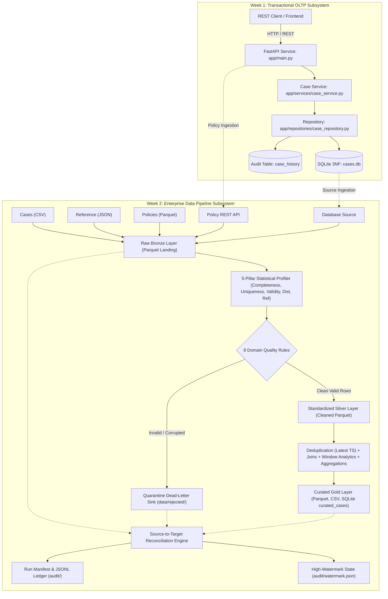

# Enterprise Case Management System & Data Platform

[](https://www.python.org/)
[](https://fastapi.tiangolo.com/)
[]()
[]()
[]()
[](https://www.docker.com/)

An enterprise-grade, dual-subsystem software and data platform developed for the **Forward Deployed Engineering (FDE) Fresher Readiness Program**:
1. **Week 1 Transactional Backend**: A modular, tested REST API service with SQLite, 3NF schema, Pydantic validation, and SCD Type 1/2 audit trails.
2. **Week 2 Enterprise Data Pipeline**: An automated, fault-tolerant batch/incremental data pipeline implementing the Medallion Architecture (Bronze/Silver/Gold), 5-pillar statistical profiling, declarative data contracts, 8 critical domain quality rules, non-blocking quarantine handling, mathematical source-to-target reconciliation, and containerized Docker execution.

---

## 1. High-Level System Architecture



---

## 2. Week 1: Transactional Backend Overview

- **REST API Routes (`app/api/routes/cases.py`)**:
  - `POST /api/v1/cases` (Create case with validation)
  - `GET /api/v1/cases/{id}` (Retrieve case details)
  - `PUT /api/v1/cases/{id}` (Update case with state machine guards)
  - `GET /api/v1/cases` (Paginated list with status and priority filtering)
  - `POST /api/v1/users` & `GET /api/v1/users` (User management)
  - `GET /api/v1/mock/policies` (Deterministic SLA policy endpoint)
  - `GET /health` (Liveness & readiness probe)
- **Data Model (`app/models/case.py`)**:
  - Normalized 3NF tables: `users`, `cases`, and `case_history`.
  - Enforces foreign keys, indexes on `(status, priority)`, and automatic resolution timestamps.
- **Audit Logging**: Hybrid SCD Type 1 (current row state) and SCD Type 2 (append-only field change history in `case_history`).
- **Error Handling**: Global exception handlers masking database tracebacks and returning RFC 7807 compliant error envelopes.

---

## 3. Week 2: Enterprise Data Pipeline Subsystem

The data pipeline (`pipeline/`) coordinates a 10-stage orchestrated batch/incremental workflow:

### Stage 1: Heterogeneous Source Ingestion (`pipeline/sources/`)
- Ingests CSV (`cases.csv` with raw string preservation).
- Ingests JSON (`reference.json` using targeted `record_path` for users and departments).
- Ingests Parquet (`policy_metadata.parquet` with Snappy compression).
- Ingests Relational SQL (`DatabaseSource` via SQLAlchemy streaming cursors).
- Ingests REST APIs (`APISource` with timeout protection and offline cache fallback).

### Stage 2: Raw Bronze Landing (`pipeline/layers/raw.py`)
- Lands raw data verbatim into date-partitioned Parquet files (`data/raw/cases/ingest_date=YYYY-MM-DD/raw_cases.parquet`).
- Injects lineage metadata: `_ingested_at`, `_source_name`, and `_run_id`.

### Stage 3: Statistical Data Profiling (`pipeline/profiling/profiler.py`)
- Vectorized 5-pillar statistical assessment:
  1. **Completeness**: Null counts, empty string ratios, completeness percentage.
  2. **Uniqueness**: Distinct primary keys, duplicate counts, cardinality.
  3. **Validity**: Enum conformances against declared sets (`status`, `priority`, `case_type`).
  4. **Distribution**: Min, max, mean, median, 25th/75th percentiles.
  5. **Referential Integrity**: Foreign key orphan detection against employee lookup tables.
- Publishes automated reports to `reports/profiling/profiling_<run_id>.md` and `.json`.

### Stage 4: Data Standardization (`pipeline/transformations/standardization.py`)
- Trims string fields, normalizes enums to uppercase, and imputes null descriptions.
- Coerces IDs to pandas nullable `Int64`.
- Converts timestamps to ISO-8601 UTC (`datetime64[ns, UTC]`).

### Stage 5: Domain Quality Rules Engine (`pipeline/validation/quality_rules.py`)
- Evaluates **8 critical domain rules**:
  - `RULE-CASE-001`: Required non-empty title.
  - `RULE-CASE-002`: Valid status enum (`OPEN`, `IN_PROGRESS`, `RESOLVED`, `CLOSED`).
  - `RULE-CASE-003`: Valid priority enum (`LOW`, `MEDIUM`, `HIGH`, `CRITICAL`).
  - `RULE-CASE-004`: Valid case type enum (`BUG`, `FEATURE_REQUEST`, `INQUIRY`, `COMPLAINT`).
  - `RULE-CASE-005`: Positive integer case ID.
  - `RULE-CASE-006`: Creator referential integrity against reference users.
  - `RULE-CASE-007`: Assignee referential integrity against reference users.
  - `RULE-CASE-008`: Valid parseable ISO timestamp.

### Stage 6: Quarantine Dead-Letter Sink (`pipeline/quarantine/quarantine_manager.py`)
- Diverts non-compliant records to `data/rejected/rejected_<run_id>.json`.
- Enriches rejected records with root-cause metadata: `rule_id`, `rule_description`, `reason`, `severity`, and `rejected_at`.
- Non-blocking: Clean valid records continue processing without interruption.

### Stage 7: Deduplication & Relational Joins (`pipeline/transformations/`)
- Deterministically deduplicates by `case_id`, ordering by `updated_at` ascending and keeping the latest state.
- Joins reference users to attach assignee tier, region, and department ID.
- Joins department lookups to attach assignee department name.
- Joins policy metadata to attach target resolution hours and compliance framework.
- Computes `resolution_time_hours` and `sla_breached` boolean flag.

### Stage 8: Window Analytics (`pipeline/transformations/windowing.py`)
- Computes `priority_duration_rank` (dense rank of resolution speed partitioned by priority).
- Computes `department_case_seq` (cumulative running counter partitioned by department).

### Stage 9: Curated Gold Publishing (`pipeline/layers/curated.py`)
- Publishes high-performance columnar Parquet (`data/curated/cases/curated_cases.parquet`).
- Publishes flat tabular export (`data/curated/cases/curated_cases.csv`).
- Publishes indexed relational table `curated_cases` in `data/cases.db`.

### Stage 10: Reconciliation & Lineage (`pipeline/reconciliation/`, `pipeline/audit/`)
- Mathematically verifies zero data loss across processing boundaries:
  $$\text{Source Count} = \text{Valid Count} + \text{Quarantined Count}$$
  $$\text{Curated Count} = \text{Valid Count} - \text{Duplicates Removed}$$
- Generates Markdown reconciliation reports (`reports/reconciliation/reconciliation_<run_id>.md`).
- Persists machine-readable Run Manifests (`audit/manifest_<run_id>.json`).
- Appends longitudinal telemetry to `audit/execution_ledger.jsonl`.
- Updates persistent watermark state in `audit/watermark.json` (incremental mode).

---

## 4. Quick Start & Execution Guide

### Prerequisites
- Python 3.10+ (tested on Python 3.11 & Python 3.14)
- Git

### Installation
```bash
# 1. Clone repository
git clone https://github.com/CodesBySammy/week-1_kpmg.git
cd week-1_kpmg/case-management-backend

# 2. Activate virtual environment
# Windows PowerShell:
.\venv\Scripts\Activate.ps1
# Linux / macOS:
source venv/bin/activate

# 3. Install dependencies in editable mode
pip install -e ".[dev]"
```

### Running the Transactional REST Backend:
```bash
uvicorn app.main:app --reload --port 8000
```
- Interactive Swagger UI: `http://127.0.0.1:8000/docs`
- ReDoc Reference: `http://127.0.0.1:8000/redoc`

### Running the Enterprise Data Pipeline:
```bash
# Full Pipeline Execution:
python -m pipeline.cli --mode full

# Incremental Delta Pipeline Execution:
python -m pipeline.cli --mode incremental

# Run with Malformed Test Input:
python -m pipeline.cli --mode full --file data/test_inputs/malformed_cases.csv
```

### Running in Docker:
```bash
# 1. Build Multi-Stage Image:
docker build -t case-management-pipeline:1.0.0 .

# 2. Run with Host Bind Mounts:
docker run --rm \
  -v $(pwd)/data:/app/data \
  -v $(pwd)/reports:/app/reports \
  -v $(pwd)/audit:/app/audit \
  case-management-pipeline:1.0.0 \
  --mode full
```

---

## 5. Automated Test Suite & Coverage

The project maintains an exhaustive test suite with **68 tests** covering both backend services and the data pipeline:

```bash
# Execute all tests with coverage report:
pytest --cov=app --cov=pipeline --cov-report=term-missing
```

### Test Results:
```
TOTAL                                          1326    149    88.76%
Required test coverage of 70.0% reached. Total coverage: 88.76%
======================= 68 passed, 14 warnings in 16.30s =======================
```

| Test Suite | File | Tests Passed | Focus Area |
|---|---|:---:|---|
| **API Endpoints** | `tests/api/test_cases_api.py` | 13 | CRUD, status filters, validation errors |
| **Error Handling** | `tests/api/test_user_and_error_handlers.py` | 2 | Database error masking & user APIs |
| **Source Readers** | `tests/pipeline/test_sources.py` | 6 | CSV, JSON, Parquet, SQLite, REST API |
| **Statistical Profiler** | `tests/pipeline/test_profiler.py` | 6 | 5 pillars of data profiling & reports |
| **Transformations** | `tests/pipeline/test_transformations.py` | 6 | Standardization, dedup, joins, windows, rollups |
| **Data Contracts** | `tests/pipeline/test_validation.py` | 6 | Schema contracts & evolution tolerance |
| **Quarantine Engine** | `tests/pipeline/test_quarantine.py` | 3 | Rule evaluation & dead-letter persistence |
| **Reconciliation** | `tests/pipeline/test_reconciliation.py` | 4 | Mathematical balancing & variance alerts |
| **Orchestration** | `tests/pipeline/test_orchestration.py` | 3 | End-to-end full, incremental, idempotency |
| **Failure Handling** | `tests/pipeline/test_failures.py` | 4 | Missing files, malformed input, API fallback |
| **Repositories** | `tests/unit/test_case_repository.py` | 7 | SQLAlchemy queries & audit events |
| **Services** | `tests/unit/test_case_service.py` | 5 | Business rules & closed case protection |
| **Models & Schemas** | `tests/unit/test_models_and_schemas.py` | 3 | Pydantic validators & string constraints |
| **Total** | | **68** | **100% Pass Rate** |

---

## 6. Complete Documentation Index

### Architecture & System Design
- [Week 1 Architecture Specification](file:///d:/week1_kpmg/case-management-backend/docs/architecture.md)
- [Week 2 Architecture Specification](file:///d:/week1_kpmg/case-management-backend/docs/week2/architecture.md)
- [Pipeline Design & 10-Stage Lifecycle](file:///d:/week1_kpmg/case-management-backend/docs/week2/pipeline-design.md)
- [Medallion Data Layer Design](file:///d:/week1_kpmg/case-management-backend/docs/data-layer-design.md)
- [Data Contracts Specification](file:///d:/week1_kpmg/case-management-backend/docs/data-contracts.md)
- [Performance Optimization & Benchmarks](file:///d:/week1_kpmg/case-management-backend/docs/performance-and-scalability.md)

### Engineering & Component Guides
- [Heterogeneous Source Ingestion](file:///d:/week1_kpmg/case-management-backend/docs/week2/source-ingestion.md)
- [Automated Data Profiling](file:///d:/week1_kpmg/case-management-backend/docs/week2/data-profiling.md)
- [Transformation Engine Design](file:///d:/week1_kpmg/case-management-backend/docs/week2/transformation-design.md)
- [Data Quality Rules Catalog](file:///d:/week1_kpmg/case-management-backend/docs/week2/data-quality.md)
- [Quarantine & Rejected Records](file:///d:/week1_kpmg/case-management-backend/docs/week2/rejected-records.md)
- [Reconciliation Engine Specification](file:///d:/week1_kpmg/case-management-backend/docs/week2/reconciliation.md)
- [Incremental Processing & Watermarks](file:///d:/week1_kpmg/case-management-backend/docs/week2/incremental-processing.md)
- [Idempotency & Rerun Safety](file:///d:/week1_kpmg/case-management-backend/docs/week2/idempotency.md)
- [Audit Manifests & Lineage](file:///d:/week1_kpmg/case-management-backend/docs/week2/audit-and-lineage.md)
- [Testing Strategy & Test Pyramid](file:///d:/week1_kpmg/case-management-backend/docs/week2/testing-strategy.md)
- [Docker Execution Runbook](file:///d:/week1_kpmg/case-management-backend/docs/week2/docker-execution.md)
- [Operational Runbook & Monitoring](file:///d:/week1_kpmg/case-management-backend/docs/week2/operational-guide.md)
- [Pipeline Debugging & Troubleshooting](file:///d:/week1_kpmg/case-management-backend/docs/week2/debugging-guide.md)
- [Architecture Decision Records (ADRs)](file:///d:/week1_kpmg/case-management-backend/docs/week2/decisions.md)

### Verification & Compliance Audits
- [Week 2 Definition of Done (DoD)](file:///d:/week1_kpmg/case-management-backend/docs/week2/week2-definition-of-done.md)
- [Week 2 Deliverables Checklist](file:///d:/week1_kpmg/case-management-backend/docs/week2/week2-deliverables-checklist.md)
- [Week 2 Code Review Sign-Off](file:///d:/week1_kpmg/case-management-backend/docs/week2/week2-code-review.md)
- [Week 2 Final Execution Verification](file:///d:/week1_kpmg/case-management-backend/docs/week2/week2-final-verification.md)
- [Week 2 Final Capstone Readiness Assessment](file:///d:/week1_kpmg/case-management-backend/docs/week2/week2-final-capstone-check.md)

---

## 7. Educational Curriculum Index (`learning/week2/`)

- **Overview & Roadmap**: [`00-week2-overview.md`](file:///d:/week1_kpmg/case-management-backend/learning/week2/00-week2-overview.md)
- **36 Learning Modules**: [`01-enterprise-pipeline-anatomy.md`](file:///d:/week1_kpmg/case-management-backend/learning/week2/01-enterprise-pipeline-anatomy.md) through [`36-pipeline-debugging.md`](file:///d:/week1_kpmg/case-management-backend/learning/week2/36-pipeline-debugging.md)
- **20 Hands-On Practical Labs**: Located in [`learning/week2/labs/`](file:///d:/week1_kpmg/case-management-backend/learning/week2/labs/) (`lab-01` to `lab-20`)
- **Interview Preparation**: [`week2-interview-questions.md`](file:///d:/week1_kpmg/case-management-backend/learning/week2/week2-interview-questions.md) (50 top enterprise data engineering Q&As)
- **Self-Assessment**: [`week2-self-assessment.md`](file:///d:/week1_kpmg/case-management-backend/learning/week2/week2-self-assessment.md) & [`week2-self-assessment-answers.md`](file:///d:/week1_kpmg/case-management-backend/learning/week2/week2-self-assessment-answers.md)

---

## 8. License & Learning Disclaimer
Developed for the **FDE Fresher Readiness Program**. Designed to demonstrate production-grade software engineering, relational SQL, REST interface contracts, automated data pipeline engineering, data governance, and test coverage rigor.
