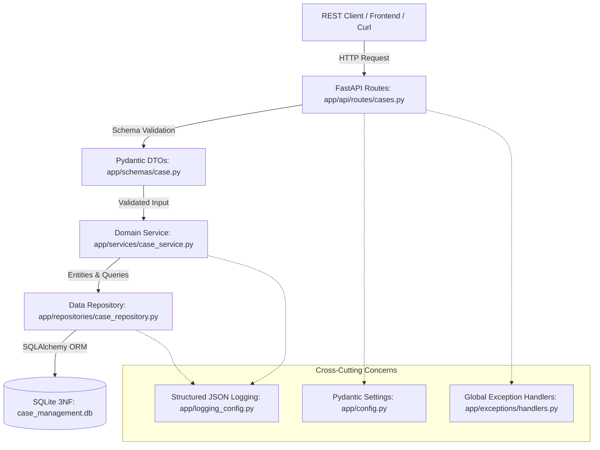

# Case Management Backend — Week 1 Production Service

[](https://www.python.org/)
[](https://fastapi.tiangolo.com/)
[]()
[]()
[]()

An enterprise-grade, modular, and fully tested Case Management REST backend built with **FastAPI**, **SQLAlchemy**, and a 3NF normalized **SQLite** relational database. Developed as the foundational deliverable for **Week 1 of the Forward Deployed Engineering (FDE) Fresher Readiness Program**.

---

## 1. What the Service Does
The Case Management Backend provides a secure, audited transactional service for enterprise issue tracking, support ticketing, and defect resolution:
- **Creates Cases**: Validates incoming client payloads, enforces business ownership, and generates auto-incremented primary keys.
- **Retrieves Cases**: Fast, indexed single-case retrieval and paginated list queries with status and priority filtering.
- **Updates Cases**: Validates partial updates, transitions status, stamps resolution timestamps, and prohibits mutations on closed cases.
- **Audit Trails**: Automatically logs every field change into an append-only `case_history` table for SOC 2 compliance and SLA analytics.
- **Zero-Leak Error Handling**: Masks raw database driver tracebacks from clients while emitting structured JSON logs for internal diagnostics.

---

## 2. Architecture & Layering

The application strictly adheres to Clean Architecture and the Single Responsibility Principle:



### Directory Structure:
```text
case-management-backend/
│
├── app/
│   ├── __init__.py               # Top-level application package
│   ├── main.py                   # FastAPI application assembly & lifespan
│   ├── config.py                 # Pydantic Settings & environment variables
│   ├── logging_config.py         # Structured JSON logging formatter
│   ├── api/                      # Presentation Layer (HTTP controllers)
│   │   ├── __init__.py
│   │   └── routes/
│   │       ├── __init__.py
│   │       └── cases.py          # FastAPI routes & HTTP status codes
│   ├── schemas/                  # Data Transfer Objects (DTOs)
│   │   ├── __init__.py
│   │   └── case.py               # Pydantic request/response schemas
│   ├── models/                   # Relational Persistence Layer
│   │   ├── __init__.py
│   │   └── case.py               # SQLAlchemy ORM table definitions
│   ├── services/                 # Domain / Business Logic Layer
│   │   ├── __init__.py
│   │   └── case_service.py       # Domain rules & state transitions
│   ├── repositories/             # Data Access Layer (DAL)
│   │   ├── __init__.py
│   │   └── case_repository.py    # Isolated queries & transaction rollbacks
│   ├── database/                 # Infrastructure
│   │   ├── __init__.py
│   │   └── session.py            # SQLAlchemy Engine & Session provider
│   └── exceptions/               # Domain Exceptions & Error Handlers
│       ├── __init__.py           # Custom exception definitions
│       └── handlers.py           # Global exception-to-JSON handlers
│
├── tests/
│   ├── conftest.py               # Shared fixtures & test database isolation
│   ├── unit/                     # Fast unit tests with mocks
│   │   ├── test_case_service.py
│   │   ├── test_case_repository.py
│   │   └── test_models_and_schemas.py
│   └── api/                      # HTTP integration tests
│       ├── test_cases_api.py
│       └── test_user_and_error_handlers.py
│
├── sql/
│   ├── schema.sql                # 3NF database schema with foreign keys
│   ├── seed.sql                  # Realistic sample data (users, cases, history)
│   ├── queries.sql               # Joins, CTEs, and Window Function queries
│   └── transaction_examples.sql  # ACID transaction & rollback demonstrations
│
├── learning/                     # 31 Comprehensive Fresher Learning Modules
│   ├── 00-week1-overview.md through 26-debugging-methodology.md
│   ├── git-lab.md                # Hands-on Git branching & merge conflict lab
│   ├── debugging-lab.md          # 6 Real failure forensic scenarios
│   ├── week1-interview-questions.md
│   ├── week1-self-assessment.md
│   └── week1-self-assessment-answers.md
│
├── docs/                         # Technical Architecture & Verification Suite
│   ├── architecture.md
│   ├── database-design.md
│   ├── api-specification.md
│   ├── testing-strategy.md
│   ├── logging-and-error-handling.md
│   ├── git-workflow.md
│   ├── debugging-guide.md
│   ├── decisions.md              # Architecture Decision Records (ADRs)
│   ├── openapi.json              # Exported OpenAPI 3.1 schema
│   ├── week1-requirement-traceability.md
│   ├── week1-definition-of-done.md
│   ├── week1-deliverables-checklist.md
│   ├── final-code-review.md
│   └── final-capstone-check.md
│
├── .env.example                  # Safe configuration template (committed)
├── .gitignore                    # Comprehensive ignore rules (committed)
├── pyproject.toml                # Dependencies, pytest, and coverage config
├── WEEK1-STUDY-PLAN.md           # 5-day structured fresher learning path
└── README.md                     # This document
```

---

## 3. Prerequisites
- **Python**: Version `3.10` or higher (`python --version`)
- **Git**: Version `2.30` or higher (`git --version`)
- **Operating System**: Windows, macOS, or Linux

---

## 4. Quick-Start Setup Runbook

Follow these exact steps from a clean terminal:

### Step 1: Clone the Repository & Enter Directory
```bash
cd case-management-backend
```

### Step 2: Create and Activate Virtual Environment
```bash
# On Windows (PowerShell):
python -m venv venv
.\venv\Scripts\Activate.ps1

# On macOS / Linux:
python3 -m venv venv
source venv/bin/activate
```

### Step 3: Install Dependencies
```bash
pip install --upgrade pip
pip install -e ".[dev]"
```

### Step 4: Configure Environment Variables
Copy the committed `.env.example` template to `.env`:
```bash
# Windows (PowerShell):
Copy-Item .env.example .env

# macOS / Linux:
cp .env.example .env
```

---

## 5. Database Initialization & Seeding

The application automatically creates all tables on startup. If you want to populate the database with realistic sample users, cases, and audit history for manual testing:

```bash
python -c "
import sqlite3
conn = sqlite3.connect('case_management.db')
with open('sql/schema.sql') as f: conn.executescript(f.read())
with open('sql/seed.sql') as f: conn.executescript(f.read())
conn.close()
print('Database successfully initialized and seeded!')
"
```

---

## 6. Running the Application Locally

Start the development server with auto-reload:
```bash
uvicorn app.main:app --reload --host 127.0.0.1 --port 8000
```

### Access Points:
- **Service Health Check**: `http://127.0.0.1:8000/health`
- **Interactive Swagger UI**: `http://127.0.0.1:8000/docs`
- **ReDoc Technical Reference**: `http://127.0.0.1:8000/redoc`
- **Raw OpenAPI 3.1 JSON**: `http://127.0.0.1:8000/openapi.json`

---

## 7. Running Automated Tests & Coverage

Execute the test suite using pytest:

```bash
# Run all 30 tests in verbose mode:
python -m pytest -v

# Run with line coverage report:
python -m pytest -v --cov=app --cov-report=term-missing

# Run with HTML coverage report (opens in browser):
python -m pytest --cov=app --cov-report=html
```

### Verified Test Summary:
- **Total Tests**: **30 Passed (100% pass rate)**
- **Test Speed**: **1.26 seconds**
- **Statement Coverage**: **95.13%** (Quality gate threshold is >= 70.0%)

---

## 8. Representative API Requests (cURL / PowerShell)

### 1. Health Check:
```bash
curl -X GET "http://127.0.0.1:8000/health"
```

### 2. Create a Case (`POST /api/v1/cases` -> `201 Created`):
```bash
curl -X POST "http://127.0.0.1:8000/api/v1/cases" \
  -H "Content-Type: application/json" \
  -d '{
    "title": "API Gateway Connection Refused",
    "description": "Downstream microservice connection drops intermittently.",
    "priority": "HIGH",
    "case_type": "BUG",
    "created_by": 1
  }'
```

### 3. Retrieve a Case (`GET /api/v1/cases/1` -> `200 OK`):
```bash
curl -X GET "http://127.0.0.1:8000/api/v1/cases/1"
```

### 4. Update a Case (`PUT /api/v1/cases/1` -> `200 OK`):
```bash
curl -X PUT "http://127.0.0.1:8000/api/v1/cases/1" \
  -H "Content-Type: application/json" \
  -d '{
    "status": "IN_PROGRESS",
    "priority": "CRITICAL"
  }'
```

### 5. Test Request Validation Rejection (`POST` -> `422 Unprocessable Entity`):
```bash
curl -X POST "http://127.0.0.1:8000/api/v1/cases" \
  -H "Content-Type: application/json" \
  -d '{"title": "", "created_by": 0}'
```

---

## 9. Troubleshooting & FAQ

| Symptom | Cause | Solution |
|---|---|---|
| `Port 8000 is already in use` | Background process running on port 8000 | Kill process or launch on alternate port: `uvicorn app.main:app --port 8001` |
| `database is locked` | Uncommitted write transaction in SQLite | Ensure `db.rollback()` is executed on errors. Restart Uvicorn server. |
| `HTTP 422 Validation Error` | Missing field or invalid type in request | Check `"details"` array in response JSON. Verify types in `/docs`. |
| `HTTP 404 USER_NOT_FOUND` | Referenced `created_by` or `assigned_to` does not exist | Create user via `POST /api/v1/users` first or use seed IDs (1 to 5). |

---

## 10. License & Learning Disclaimer
Developed for the **FDE Fresher Readiness Program**. Designed to demonstrate production-grade software engineering, relational SQL, REST interface contracts, and automated testing rigor.
