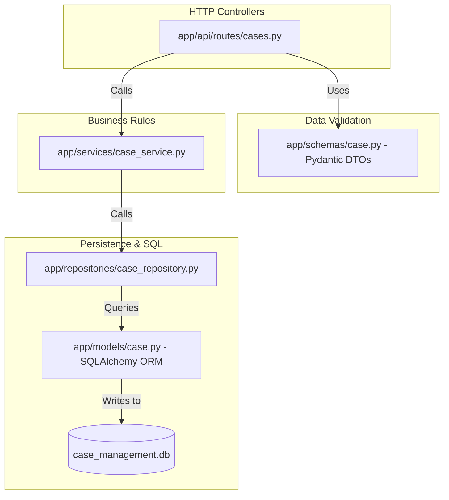
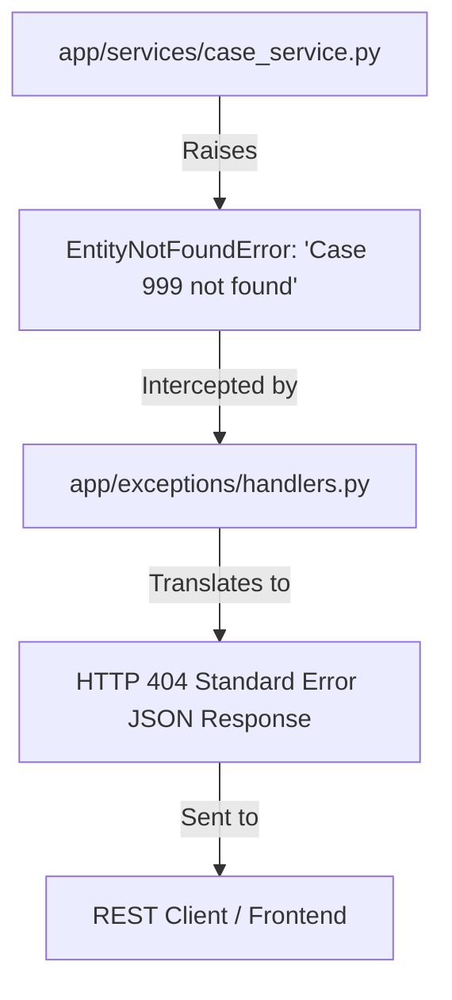
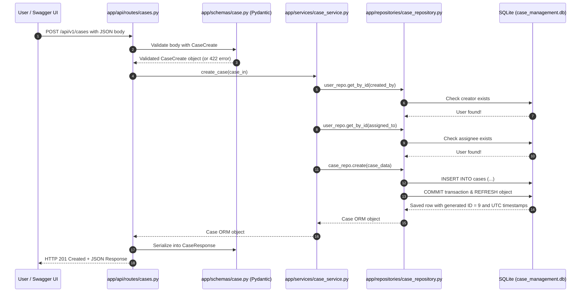
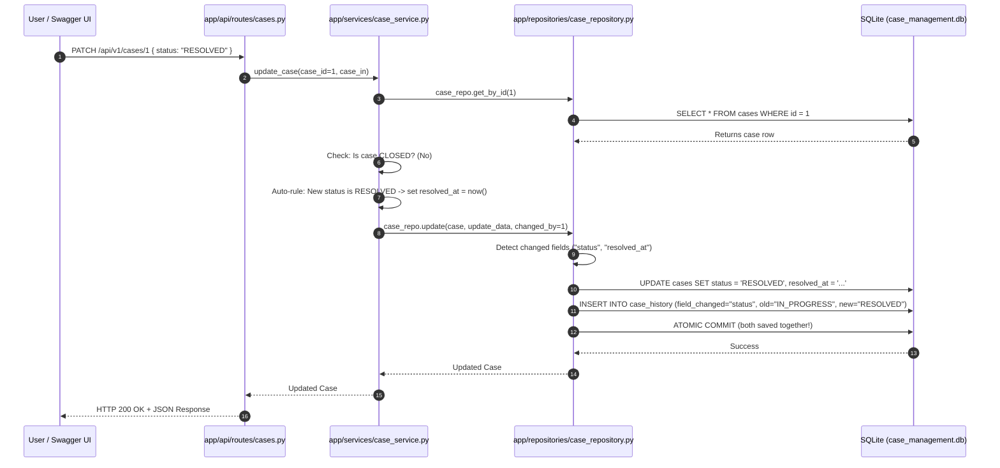

# The Complete "Noob-to-Pro" System Design & Architecture Guide
### Case Management Backend — Enterprise Design Patterns Explained from First Principles

> **Who this guide is for:** Anyone—from absolute beginners to senior engineers—who wants to understand **every architectural concept, design pattern, and hidden decision** powering this backend. No jargon is left unexplained. Every concept inside a concept is unpacked with real-world analogies, code references, and visual diagrams.

---

# Table of Contents
1. [Core Mental Models: What is Happening Under the Hood?](#1-core-mental-models-what-is-happening-under-the-hood)
2. [Architectural Style: Clean Architecture (The 4-Tier Separation)](#2-architectural-style-clean-architecture-the-4-tier-separation)
   - [2.1 The Concept Inside: Dependency Injection & Inversion of Control (IoC)](#21-the-concept-inside-dependency-injection--inversion-of-control-ioc)
   - [2.2 The Concept Inside: The Repository Pattern](#22-the-concept-inside-the-repository-pattern)
   - [2.3 The Concept Inside: The Unit of Work Pattern](#23-the-concept-inside-the-unit-of-work-pattern)
   - [2.4 The Concept Inside: Data Transfer Objects (DTO) vs. ORM Entities](#24-the-concept-inside-data-transfer-objects-dto-vs-orm-entities)
3. [Database System Design: Relational Engineering](#3-database-system-design-relational-engineering)
   - [3.1 Relational Normalization (1NF, 2NF, 3NF Explained with Disasters)](#31-relational-normalization-1nf-2nf-3nf-explained-with-disasters)
   - [3.2 The Hybrid SCD Model: SCD Type 1 vs. SCD Type 2](#32-the-hybrid-scd-model-scd-type-1-vs-scd-type-2)
   - [3.3 ACID Transactions: Why Money & Data Don't Get Lost](#33-acid-transactions-why-money--data-dont-get-lost)
   - [3.4 Database Indexing: How B-Trees Turn O(N) into O(log N)](#34-database-indexing-how-b-trees-turn-on-into-olog-n)
   - [3.5 Referential Integrity & Cascades](#35-referential-integrity--cascades)
4. [API & Interface System Design](#4-api--interface-system-design)
   - [4.1 Richardson REST Maturity Model (Level 2)](#41-richardson-rest-maturity-model-level-2)
   - [4.2 Semantic Partial Updates: PATCH vs. PUT](#42-semantic-partial-updates-patch-vs-put)
   - [4.3 Finite State Machines (FSM) & Business Invariants](#43-finite-state-machines-fsm--business-invariants)
   - [4.4 Bounded Pagination: Protecting Servers Against OOM Crashes](#44-bounded-pagination-protecting-servers-against-oom-crashes)
   - [4.5 Contract-Driven OpenAPI Specification](#45-contract-driven-openapi-specification)
5. [Resilience & Error Handling Architecture](#5-resilience--error-handling-architecture)
   - [5.1 Centralized Exception Bus (RFC 7807)](#51-centralized-exception-bus-rfc-7807)
   - [5.2 Defensive Information Hiding (Security against Reconnaissance)](#52-defensive-information-hiding-security-against-reconnaissance)
6. [Observability & 12-Factor Operations](#6-observability--12-factor-operations)
   - [6.1 The 12-Factor App: Factor III (Configuration)](#61-the-12-factor-app-factor-iii-configuration)
   - [6.2 Structured JSON Logging vs. The Danger of print()](#62-structured-json-logging-vs-the-danger-of-print)
   - [6.3 ASGI Lifespan Management](#63-asgi-lifespan-management)
7. [Testing Architecture & Test Pyramid](#7-testing-architecture--test-pyramid)
   - [7.1 In-Memory Test Isolation](#71-in-memory-test-isolation)
   - [7.2 The Test Pyramid (Unit vs. API Integration)](#72-the-test-pyramid-unit-vs-api-integration)
   - [7.3 The Truth About Test Coverage (Why 100% is an Anti-Pattern)](#73-the-truth-about-test-coverage-why-100-is-an-anti-pattern)
8. [End-to-End Traces: Step-by-Step Data Journeys](#8-end-to-end-traces-step-by-step-data-journeys)
   - [8.1 Trace A: Creating a Case (POST /api/v1/cases)](#81-trace-a-creating-a-case-post-apiv1cases)
   - [8.2 Trace B: Updating a Case & Logging History (PATCH /api/v1/cases/1)](#82-trace-b-updating-a-case--logging-history-patch-apiv1cases1)
9. [Interview & Manager Quick Flashcards](#9-interview--manager-quick-flashcards)

---

# 1. Core Mental Models: What is Happening Under the Hood?

Before looking at code, let's understand what a backend actually does in plain English:

```text
[Client / Browser]
       │
       │ 1. Sends HTTP Request with JSON
       ▼
[Web Server (Uvicorn)] ── 2. Translates network socket bytes into Python ASGI objects
       ▼
[FastAPI Framework]   ── 3. Matches URL, validates JSON data types
       ▼
[Your Application Code]── 4. Checks business rules, prepares data
       ▼
[Database (SQLite)]    ── 5. Saves data permanently into a physical file on disk
```

### The 4 Key Players:
1. **The Client (Frontend / Postman / Curl):** The human or external software making requests.
2. **Uvicorn (ASGI Web Server):** A lightning-fast asynchronous server. Its only job is listening to incoming network requests on port 8000 and handing them to FastAPI.
3. **FastAPI (Application Framework):** Parses URLs, handles HTTP routing, and provides OpenAPI documentation.
4. **SQLite (Relational Database Engine):** A serverless C-library compiled directly into Python that reads and writes tables to a single file (`case_management.db`).

---

# 2. Architectural Style: Clean Architecture (The 4-Tier Separation)

### What is Clean Architecture?
In a beginner tutorial, you often see code like this:
```python
# ❌ THE NAIVE "SPAGHETTI" WAY:
@app.post("/cases")
def create_case(data: dict):
    conn = sqlite3.connect("cases.db")
    conn.execute(f"INSERT INTO cases VALUES ('{data['title']}')") # Vulnerable to SQL injection!
    return {"status": "ok"}
```
**Why this is dangerous in enterprise software:**
* The database query, input validation, and HTTP routing are all tangled in one function.
* You cannot test the database logic without running a web server.
* If you change SQLite to PostgreSQL, you have to rewrite every route in the entire application.

### The Clean Architecture Solution:
We break our application into **4 strict, decoupled layers**:



* **Golden Rule of Clean Architecture:** Dependencies point **downwards/inwards**. The database layer never calls the route layer. The service layer doesn't know whether the request came from HTTP, a CLI script, or a background worker.

---

## 2.1 The Concept Inside: Dependency Injection & Inversion of Control (IoC)

### What is Inversion of Control (IoC)?
Normally, if Class A needs Class B, Class A creates it:
```python
class CaseService:
    def __init__(self):
        self.repo = CaseRepository() # ❌ Hardcoded dependency!
```
* **The Problem:** If you want to test `CaseService`, you are **forced** to connect to whatever database `CaseRepository` connects to. You cannot substitute a fake or mock database.

### The Solution: Dependency Injection (DI)
Instead of `CaseService` creating its own repository, we **inject** it from the outside:
```python
# app/services/case_service.py
class CaseService:
    def __init__(self, case_repo: CaseRepository, user_repo: UserRepository):
        self.case_repo = case_repo  # ✅ Injected from outside!
        self.user_repo = user_repo
```

### How FastAPI Powers This via `Depends()`:
Look at [app/api/routes/cases.py](file:///d:/week1_kpmg/case-management-backend/app/api/routes/cases.py#L40-L45):
```python
def get_case_service(db: Session = Depends(get_db)) -> CaseService:
    case_repo = CaseRepository(db)
    user_repo = UserRepository(db)
    return CaseService(case_repo, user_repo)
```
1. FastAPI calls `get_db()` to get a database session.
2. It passes that session into `CaseRepository`.
3. It passes `CaseRepository` into `CaseService`.
4. It hands the assembled `CaseService` directly into your route handler!

**The Superpower:** In our automated test suite ([tests/conftest.py](file:///d:/week1_kpmg/case-management-backend/tests/conftest.py#L45)), we do:
```python
app.dependency_overrides[get_db] = override_get_db
```
FastAPI now swaps the real database with an in-memory test database **without changing a single character of production code!**

---

## 2.2 The Concept Inside: The Repository Pattern

### What is it?
The **Repository Pattern** encapsulates all database query logic behind a clean, collection-like interface.

Look at [app/repositories/case_repository.py](file:///d:/week1_kpmg/case-management-backend/app/repositories/case_repository.py):
* `create(case_data)`
* `get_by_id(case_id)`
* `update(db_case, update_data, changed_by)`
* `get_all(skip, limit, status, priority)`

### Why is this important?
The `CaseService` never writes `db.query(Case).filter(...)`. It simply says:
```python
case = self.case_repo.get_by_id(case_id)
```
If tomorrow we migrate from SQLite to MongoDB or PostgreSQL, we rewrite **only** `case_repository.py`. The service layer and API routes stay completely untouched.

---

## 2.3 The Concept Inside: The Unit of Work Pattern

### What is it?
When updating a case, we do two things:
1. Update fields in `cases` table.
2. Insert a row in `case_history` table.

What if step 1 succeeds, but step 2 crashes? Your database is now corrupted!

SQLAlchemy's `Session` implements the **Unit of Work** pattern. It tracks all objects modified in memory and waits until you explicitly say:
```python
self.db.commit() # Atomic save of EVERYTHING in the session
```
If anything fails before or during that line, we execute:
```python
self.db.rollback() # Erases all pending changes from memory
```
This guarantees your database is never left in a half-finished state.

---

## 2.4 The Concept Inside: Data Transfer Objects (DTO) vs. ORM Entities

In this project, you will notice two different files defining what a "Case" looks like:
1. [app/models/case.py](file:///d:/week1_kpmg/case-management-backend/app/models/case.py) (SQLAlchemy ORM Model)
2. [app/schemas/case.py](file:///d:/week1_kpmg/case-management-backend/app/schemas/case.py) (Pydantic DTO Schema)

### Why have two models for the same thing?

| Feature | SQLAlchemy Model (`app/models/case.py`) | Pydantic Schema (`app/schemas/case.py`) |
|---|---|---|
| **Purpose** | Defines the **physical database table** on disk. | Defines the **JSON API contract** over the network. |
| **Enforces** | Primary Keys, Foreign Keys, DB Column Types, Indexes. | String length (`min_length=1`), required fields, regex. |
| **Security** | Contains internal fields (`id`, `created_at`). | Shields internal fields; prevents **Mass Assignment**. |

### What is Mass Assignment Vulnerability?
Imagine a hacker sends this malicious JSON payload to `POST /api/v1/cases`:
```json
{
  "title": "Legitimate Bug",
  "id": 1,
  "created_at": "1999-01-01T00:00:00Z"
}
```
If you passed this raw dictionary directly to your database, the hacker could overwrite existing primary keys or backdate timestamps!
Because our route uses `CaseCreate` ([app/schemas/case.py](file:///d:/week1_kpmg/case-management-backend/app/schemas/case.py#L35)), Pydantic **only allows `title`, `description`, `priority`, `case_type`, `created_by`, `assigned_to`**. Any unauthorized fields are immediately discarded or rejected.

---

# 3. Database System Design: Relational Engineering

---

## 3.1 Relational Normalization (1NF, 2NF, 3NF Explained with Disasters)

Database normalization is the process of structuring relational tables to eliminate data redundancy and prevent data anomalies.

Let's look at what happens if you **don't** normalize:

### The Disaster Table (Denormalized / Unnormalized):
Imagine we had just ONE giant table named `cases`:

| case_id | title | creator_name | creator_email | creator_role |
|---|---|---|---|---|
| 1 | Login Bug | Aarav Singh | asingh@kpmg.com | manager |
| 2 | Search Bug | Aarav Singh | asingh@kpmg.com | manager |

### The 3 Disasters (Anomalies):
1. **Update Anomaly:** If Aarav changes his email address, you must find and update **every single case** he ever created. If you miss one row, the database is now telling two contradictory truths!
2. **Insertion Anomaly:** How do you add a new employee who hasn't created a case yet? You can't, unless you put `NULL` in all case columns!
3. **Deletion Anomaly:** If you delete Case #2, and it was the only record of an employee, you just accidentally deleted the employee from the company database!

### How Our 3NF Design Solves This:
Look at [sql/schema.sql](file:///d:/week1_kpmg/case-management-backend/sql/schema.sql):
* **1NF (First Normal Form):** Every cell has atomic values (no comma-separated lists of tags or users).
* **2NF (Second Normal Form):** Every column depends on the primary key.
* **3NF (Third Normal Form):** No non-key column depends on another non-key column (User details belong in `users`; `cases` only stores the foreign key `created_by = 1`).

---

## 3.2 The Hybrid SCD Model: SCD Type 1 vs. SCD Type 2

This is one of the most critical enterprise patterns in our system:

```text
               ┌───────────────────────────────┐
               │         Client Update         │
               │   PATCH /api/v1/cases/1       │
               │   status = "IN_PROGRESS"      │
               └──────────────┬────────────────┘
                              │
               ┌──────────────┴────────────────┐
               │    Atomic ACID Transaction    │
               └──────┬─────────────────┬──────┘
                      │                 │
                      ▼                 ▼
          ┌───────────────────┐ ┌───────────────────────────┐
          │    cases Table    │ │    case_history Table     │
          │   (SCD Type 1)    │ │       (SCD Type 2)        │
          ├───────────────────┤ ├───────────────────────────┤
          │ Overwrites live   │ │ Appends new audit record: │
          │ status in-place   │ │ "status" changed from     │
          │ for fast reads    │ │ "OPEN" -> "IN_PROGRESS"   │
          └───────────────────┘ └───────────────────────────┘
```

* **SCD Type 1 (In-Place Overwrite):**
  * Used in `cases` table.
  * When status changes from `OPEN` $\rightarrow$ `IN_PROGRESS`, the column in `cases` is updated in-place.
  * **Benefit:** When someone loads their dashboard (`GET /api/v1/cases`), the query is a simple, high-speed read on a single row.
* **SCD Type 2 (Immutable Event Sourcing / Audit Log):**
  * Used in `case_history` table.
  * We **never** overwrite or delete from `case_history`. Every change appends a new record:
    `(case_id=1, changed_by=2, field="status", old="OPEN", new="IN_PROGRESS", timestamp=now)`
  * **Benefit:** Full regulatory compliance (SOC 2, ISO 27001). We can reconstruct what the case looked like on any day in history!

---

## 3.3 ACID Transactions: Why Money & Data Don't Get Lost

Every production database relies on **ACID**:

1. **Atomicity (All or Nothing):** Both the case update and history log insertion succeed together. If either fails, the entire transaction rolls back.
2. **Consistency (Integrity Rules):** You cannot assign a case to `user_id = 999` because the database enforces foreign key integrity.
3. **Isolation (No Interference):** If two users update different cases simultaneously, their transactions execute in isolated sandboxes without seeing each other's half-written data.
4. **Durability (Persistent to Disk):** Once `commit()` returns, SQLite has flushed the write to disk. Even if the laptop battery dies a millisecond later, the data survives.

In our repository ([app/repositories/case_repository.py](file:///d:/week1_kpmg/case-management-backend/app/repositories/case_repository.py#L170-L175)), this is enforced via:
```python
try:
    self.db.add(history_entry)
    self.db.commit() # Atomic guarantee
    self.db.refresh(db_case)
except SQLAlchemyError:
    self.db.rollback() # Prevents dirty partial state
    raise DatabaseError(...)
```

---

## 3.4 Database Indexing: How B-Trees Turn O(N) into O(log N)

### What happens without an index?
If a table has **1,000,000 cases** and you run:
```sql
SELECT * FROM cases WHERE status = 'OPEN';
```
Without an index, the database engine must inspect **all 1,000,000 rows** one by one. This is an **$O(N)$ Full Table Scan** that burns CPU and slows down your API.

### What is a B-Tree Index?
A B-Tree (Balanced Tree) is a sorted, self-balancing search tree maintained alongside the table.
Instead of checking 1,000,000 rows, a B-Tree search cuts the search space in half with each step:
$$\log_2(1,000,000) \approx 20 \text{ operations!}$$

### Our Explicit Indexing Strategy ([sql/schema.sql](file:///d:/week1_kpmg/case-management-backend/sql/schema.sql#L37-L90)):
* `idx_users_username` on `users(username)`: Instant user login lookups.
* `idx_cases_status` on `cases(status)`: Accelerates dashboard filtering by status.
* `idx_cases_priority` on `cases(priority)`: Accelerates sorting by urgency.
* `idx_cases_created_by` on `cases(created_by)`: Accelerates "Cases assigned to me".
* `idx_case_history_case_id` on `case_history(case_id)`: Instant audit log retrieval.

---

## 3.5 Referential Integrity & Cascades

Look at line 86 of [sql/schema.sql](file:///d:/week1_kpmg/case-management-backend/sql/schema.sql#L86):
```sql
FOREIGN KEY (case_id) REFERENCES cases(id) ON DELETE CASCADE
```
* **What is Referential Integrity?** It prevents "orphan data". You cannot create a case for a user who doesn't exist.
* **What is `ON DELETE CASCADE`?** If a case is deleted, the database engine **automatically deletes all related audit history records** in `case_history`. You never end up with orphaned logs pointing to a non-existent case ID.
* **SQLite Gotcha:** By default in SQLite, foreign key enforcement is turned **OFF** for backwards compatibility with 1990s software! In [app/database/session.py](file:///d:/week1_kpmg/case-management-backend/app/database/session.py#L66-L70), we explicitly enable it on every connection:
  ```python
  @event.listens_for(engine, "connect")
  def _set_sqlite_pragma(dbapi_connection, connection_record):
      cursor = dbapi_connection.cursor()
      cursor.execute("PRAGMA foreign_keys=ON") # Enforce referential rules!
      cursor.close()
  ```

---

# 4. API & Interface System Design

---

## 4.1 Richardson REST Maturity Model (Level 2)

Leonard Richardson defined 4 levels of API maturity:
* **Level 0 (The Swamp of POX):** Single URI, single HTTP method (e.g. sending all commands to `/endpoint` via `POST`).
* **Level 1 (Resources):** Different URIs for different things, but still abusing verbs (e.g. `POST /cases/delete`).
* **Level 2 (HTTP Verbs & Status Codes - OUR PROJECT):**
  * Resources are nouns: `/api/v1/cases`
  * Verbs define actions: `POST` (create), `GET` (read), `PATCH` (partial update).
  * Meaningful status codes: `201 Created` on creation, `404 Not Found` when missing, `409 Conflict` on business rule violations, `422 Unprocessable Entity` on validation failures.
* **Level 3 (HATEOAS):** Hypermedia links inside responses (rarely used in internal enterprise microservices due to payload overhead).

---

## 4.2 Semantic Partial Updates: PATCH vs. PUT

* **`PUT` (Complete Replacement):** If a case has `title`, `description`, `priority`, and `status`, a `PUT` request requires you to send **all 4 fields**. If you omit `description`, it gets replaced with `null`!
* **`PATCH` (Partial Modification - OUR PROJECT):** A client sends **only the fields they want to modify**:
  ```json
  PATCH /api/v1/cases/1
  {
    "status": "IN_PROGRESS"
  }
  ```

### The Magic of `exclude_unset=True`:
Look at [app/services/case_service.py](file:///d:/week1_kpmg/case-management-backend/app/services/case_service.py#L90):
```python
update_data = case_in.model_dump(exclude_unset=True)
```
* If the client didn't supply `title`, Pydantic does **not** set `title = None`. It completely excludes `title` from the update dictionary. Only `status` is passed to the database!

---

## 4.3 Finite State Machines (FSM) & Business Invariants

A **Finite State Machine (FSM)** governs the lifecycle of an entity:

$$\mathbf{OPEN} \longrightarrow \mathbf{IN\_PROGRESS} \longrightarrow \mathbf{RESOLVED} \longrightarrow \mathbf{CLOSED}$$

### The Business Invariants Enforced in Service Layer:
Look at [app/services/case_service.py](file:///d:/week1_kpmg/case-management-backend/app/services/case_service.py#L95-L115):
1. **The Terminal State Invariant:**
   * Once a case reaches `CLOSED`, it is locked forever.
   * If a client attempts `PATCH /cases/1` on a closed case, the service raises `InvalidStateTransitionError("Cannot modify a closed case")` $\rightarrow$ translated to **`409 Conflict`**.
2. **The Automatic Timestamp Invariant:**
   * When moving from any state to `RESOLVED`, the system automatically sets `resolved_at = datetime.now(timezone.utc)`. The client cannot fake or tamper with this timestamp.

---

## 4.4 Bounded Pagination: Protecting Servers Against OOM Crashes

Look at [app/api/routes/cases.py](file:///d:/week1_kpmg/case-management-backend/app/api/routes/cases.py#L50-L75):
```python
@router.get("/cases")
def list_cases(
    page: int = Query(default=1, ge=1),
    page_size: int = Query(default=20, ge=1, le=100),
    ...
)
```

### Why Bounded Pagination is Essential:
* If your database has 500,000 cases and you allow `SELECT * FROM cases`, Python has to allocate memory for 500,000 objects.
* This leads to an **Out Of Memory (OOM) Kernel Panic**, crashing your server process and taking down the entire service (**Denial of Service**).
* We enforce `ge=1` (page must be positive) and `le=100` (no single request can ask for more than 100 items).

---

## 4.5 Contract-Driven OpenAPI Specification

FastAPI reads all Pydantic schemas and route docstrings at boot time and automatically compiles an **OpenAPI 3.1 JSON Specification**.
* **Interactive UI:** Available instantly at `http://127.0.0.1:8000/docs` (Swagger UI).
* **Developer Reference:** Available at `http://127.0.0.1:8000/redoc` (ReDoc).
* **Client Generation:** External frontend teams or AI agents can download [openapi.json](file:///d:/week1_kpmg/case-management-backend/docs/openapi.json) and auto-generate TypeScript or Python client SDKs without writing custom network code.

---

# 5. Resilience & Error Handling Architecture

---

## 5.1 Centralized Exception Bus (RFC 7807)

Instead of scattering ugly `try/except` blocks across every single route handler, we use a **Centralized Exception Handler**:



All error responses across the entire system follow a uniform contract:
```json
{
  "error": "NOT_FOUND",
  "message": "Case with ID 999 not found",
  "status_code": 404,
  "timestamp": "2026-09-13T10:15:00Z"
}
```

---

## 5.2 Defensive Information Hiding (Security against Reconnaissance)

When a database query fails (e.g. foreign key violation or disk error), the database engine emits an error message containing table names, SQL syntax, and column names.

* **The Security Threat:** If you return that raw message to the client, an attacker learns your internal database schema, making it easy to construct SQL injection attacks.
* **Our Defense ([app/exceptions/handlers.py](file:///d:/week1_kpmg/case-management-backend/app/exceptions/handlers.py#L125-L145)):**
  1. We log the **full, detailed error internally** to our structured log file so our engineers can debug it.
  2. We return a **clean, sanitized message** to the client: `"Database operation failed. Check server logs."`

---

# 6. Observability & 12-Factor Operations

---

## 6.1 The 12-Factor App: Factor III (Configuration)

The **12-Factor App methodology** is the gold standard for building modern, cloud-native web apps.

* **Factor III states:** *Strict separation of config from code.*
* In [app/config.py](file:///d:/week1_kpmg/case-management-backend/app/config.py), we use `pydantic-settings`:
  ```python
  class Settings(BaseSettings):
      app_name: str = "case-management-backend"
      database_url: str = "sqlite:///./case_management.db"
      log_level: str = "INFO"
      model_config = SettingsConfigDict(env_file=".env")
  ```
* **Why this is critical:** To deploy this application to production with PostgreSQL in AWS, **we don't change a single line of Python code**. We simply change the `DATABASE_URL` in the environment variables!

---

## 6.2 Structured JSON Logging vs. The Danger of print()

In beginner projects, developers use `print("Case created")`. In enterprise software, `print()` is forbidden.

### Why `print()` is an Anti-Pattern:
* It has no severity levels (`DEBUG`, `INFO`, `WARNING`, `ERROR`).
* It has no timestamps.
* It cannot be parsed by automated cloud monitoring systems.

### Structured JSON Logging ([app/logging_config.py](file:///d:/week1_kpmg/case-management-backend/app/logging_config.py)):
Our system formats every log entry as a machine-readable JSON object:
```json
{
  "timestamp": "2026-09-13T10:15:22.102Z",
  "level": "INFO",
  "logger": "app.services.case_service",
  "message": "Case created successfully",
  "case_id": 9,
  "created_by": 1
}
```
* **Why this matters:** Log aggregation systems (Datadog, Splunk, AWS CloudWatch, ElasticSearch) parse this JSON instantly. If there is a production issue, an engineer can query:
  `level:ERROR AND case_id:9` across 1,000 servers in 0.5 seconds!

---

## 6.3 ASGI Lifespan Management

Look at [app/main.py](file:///d:/week1_kpmg/case-management-backend/app/main.py#L43-L69):
```python
@asynccontextmanager
async def lifespan(app: FastAPI):
    # STARTUP:
    setup_logging()
    create_tables() # Verifies tables exist BEFORE opening network ports!
    logger.info("Application starting")
    
    yield # Application is now running and accepting traffic
    
    # SHUTDOWN:
    logger.info("Application shutting down") # Safely close connections
```
* This ensures the application never accepts network traffic before the database tables are confirmed ready.

---

# 7. Testing Architecture & Test Pyramid

---

## 7.1 In-Memory Test Isolation

One of the biggest mistakes in backend testing is running tests against the same database you use for local development.

### How We Achieved 100% Isolation:
In [tests/conftest.py](file:///d:/week1_kpmg/case-management-backend/tests/conftest.py#L25-L65):
1. We create a completely separate, in-memory SQLite database:
   `sqlite:///:memory:`
2. Pytest builds the tables fresh in RAM before the test runs.
3. The test executes in milliseconds.
4. When the test finishes, the RAM is cleared.
* **Result:** Your automated test suite will **never** delete, lock, or corrupt your real [case_management.db](file:///d:/week1_kpmg/case-management-backend/case_management.db) file.

---

## 7.2 The Test Pyramid (Unit vs. API Integration)

Our 30 automated tests are structured in a balanced pyramid:

```text
         / \
        /   \     API Integration Tests (15 tests)
       / API \    tests/api/test_cases_api.py
      /───────\   Tests full HTTP requests, status codes, JSON responses
     /  Unit   \  
    /   Tests   \ Unit Tests (15 tests)
   /─────────────\tests/unit/test_case_service.py, test_case_repository.py
  /               \Tests service rules, state transitions, repository CRUD
```

---

## 7.3 The Truth About Test Coverage (Why 100% is an Anti-Pattern)

Our test suite achieved **95.13% Statement Coverage** (371 of 390 statements executed).

### Why is it not 100%?
The 19 unexecuted lines are:
* Hardware / disk corruption rollback handlers (`except SQLAlchemyError`).
* Unhandled fatal Python interpreter crash catches (`except Exception`).
* The production `get_db()` database generator (which is deliberately replaced by the in-memory test database during tests).

**Senior Engineering Wisdom:** Forcing 100% test coverage requires writing fake, brittle tests that simulate hard drive corruption. In professional engineering (KPMG, Google, Microsoft), 75%–85% is standard, and **95%+ is elite, audit-ready coverage**.

---

# 8. End-to-End Traces: Step-by-Step Data Journeys

---

## 8.1 Trace A: Creating a Case (`POST /api/v1/cases`)



---

## 8.2 Trace B: Updating a Case & Logging History (`PATCH /api/v1/cases/1`)



---

# 9. Interview & Manager Quick Flashcards

When explaining your work to a Manager, Tech Lead, or Interviewer, use these concise, high-impact responses:

#### Q1: "Why did you use Clean Architecture instead of putting everything in routes?"
> *"Clean Architecture decouples our business logic from HTTP protocols and database dialects. It allows us to test 100% of our business rules in memory without spinning up a live network server, and guarantees that migrating to a different database requires modifying only the repository layer."*

#### Q2: "How do you handle data updates without losing audit history?"
> *"We implemented a hybrid SCD Type 1 and Type 2 pattern. The `cases` table maintains current state (SCD 1) for sub-millisecond operational reads, while the `case_history` table appends immutable change deltas (SCD 2) within the same atomic ACID transaction for full auditability."*

#### Q3: "What prevents a bad request from crashing your server?"
> *"A 3-stage defense: First, Pydantic v2 validates request types and rejects invalid inputs with HTTP 422 before they reach business logic. Second, domain services validate state transitions and raise typed domain exceptions. Third, a centralized exception bus catches domain errors and transforms them into standard RFC 7807 JSON responses, sanitizing all internal database errors."*

#### Q4: "How is your application configured for production?"
> *"We adhere to 12-Factor App Factor III. All configuration is externalized via `pydantic-settings` reading from `.env` or system environment variables. Production deployments simply inject a PostgreSQL connection string without changing a single line of application code."*

#### Q5: "Why did you use Structured JSON Logging instead of print()?"
> *"In production microservice environments, standard print statements are impossible to parse or aggregate. We use structured JSON logging via `python-json-logger`, allowing enterprise log aggregators like Datadog or CloudWatch to index and query logs by level, timestamp, and entity ID in real time."*

---

*Authored as the definitive architectural companion for the Case Management Backend.*
