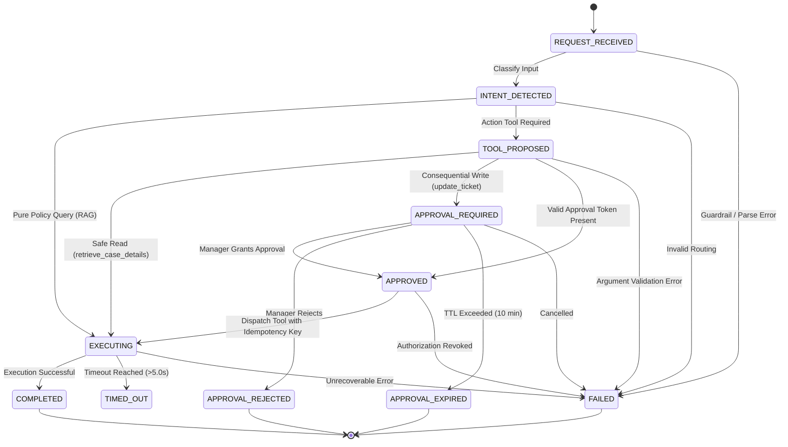
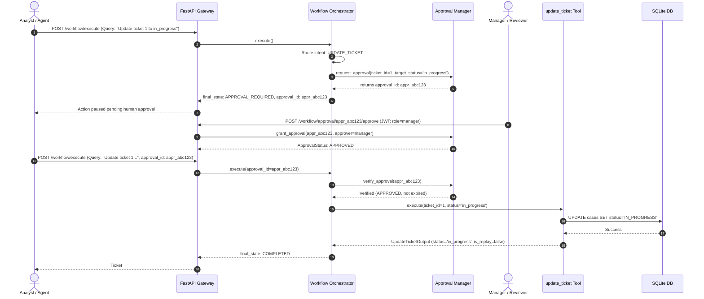
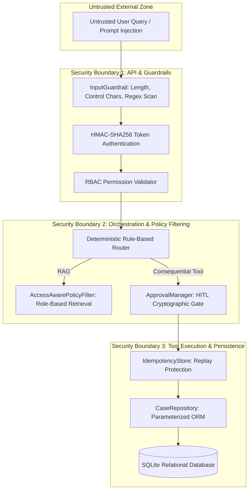

# Master System Architecture Document — Enterprise Case & Controlled AI Platform

> **Status:** Production-Ready (Week 1 + Week 2 + Week 3 + Week 4 Fully Integrated)  
> **Test Suite:** 143 Tests Passing (87.15% Total Code Coverage)

---

## 1. Executive Summary

The **Enterprise Case & Controlled AI Platform** is a unified, production-grade enterprise software system combining:
1. **Transactional Backend (Week 1):** FastAPI, SQLAlchemy, SQLite, Clean Architecture, and Audit Logging for Case Management.
2. **Analytical Lakehouse Pipeline (Week 2):** Medallion Architecture (Raw → Standardized → Curated), Data Profiling, Quarantine Isolation, and Automated Reconciliation.
3. **Grounded Policy Knowledge Assistant (Week 3):** Retrieval-Augmented Generation (RAG) system with Ingestion, Markdown Section Chunking, Dense Vector + Lucene BM25 Hybrid Indexing, CrossScore Reranking, Token-Bounded Context Assembly, and Zero-Hallucination Grounded Generation with verified citations.
4. **Controlled AI Workflows & Production Engineering (Week 4):** Typed Tool Contracts (`retrieve_case_details`, `update_ticket`), Finite State Machine Orchestration, Intent Routing, Retries with Exponential Backoff, Execution Timeouts, Graceful Fallbacks, Human-in-the-Loop (HITL) Governance with Cryptographic Approval Tokens, Token Authentication, Role-Based Access Control (RBAC), Prompt Injection Defenses, Access-Aware Retrieval, Distributed Tracing (`X-Correlation-ID`), Structured Events, Metrics, and CI/CD Quality Gates.

---

## 2. Multi-Pillar Solution Architecture

```mermaid
graph TB
    subgraph Client & Consumer Layer
        User[Human Users / Caseworkers]
        Approver[Managers & Approvers]
        External[External API Clients]
    end

    subgraph Ingress & Web Gateway : app/
        FastAPI[FastAPI Gateway :8000]
        OpenAPI[Swagger UI /docs & OpenAPI Specs]
        AuthMW[JWT Auth & RBAC Middleware]
        TelemetryMW[X-Correlation-ID & Tracing Middleware]
    end

    subgraph Pillar 1: Case Management Service (Week 1)
        CaseAPI[app/api/routes/cases.py]
        CaseService[app/services/case_service.py]
        CaseRepo[app/repositories/case_repository.py]
        SQLite[(SQLite DB: case_management.db)]
    end

    subgraph Pillar 2: Analytical Data Pipeline (Week 2)
        Sources[Multi-Source Ingestion: CSV, JSON, Parquet, API]
        Raw[Raw Storage Layer]
        Validation[Quality Rules & Schema Contracts]
        Standardized[Standardized Storage Layer]
        Curated[Curated Aggregations & Joins]
        Quarantine[Quarantine Dead-Letter Storage]
        Reconciliation[Row-Count & Sum Reconciler]
    end

    subgraph Pillar 3: Grounded Policy Assistant (Week 3)
        PolicyCorpus[data/policies/: Enterprise Policies]
        Ingestion[rag/ingestion: Markdown & PDF Parsers]
        Chunking[rag/chunking: Section & Recursive Chunkers]
        VectorIdx[rag/indexing: Dense Vector Index - Cosine]
        BM25Idx[rag/indexing: Lucene Smoothed BM25 Index]
        HybridFusion[rag/indexing: Weighted & RRF Fusion Engine]
        Reranker[rag/retrieval: CrossScore Reranker]
        Context[rag/context: Token-Bounded Context Assembler]
        LLMGen[rag/generation: Grounded Answer Generator]
        CitationEngine[Citation Cross-Verification Engine]
    end

    subgraph Pillar 4: Controlled AI Workflow Engine (Week 4)
        WorkflowAPI[app/api/routes/workflow.py]
        Guardrails[security/guardrails.py: Injection Sanitizer]
        Router[workflow/router.py: Intent Router]
        FSM[workflow/state.py: Finite State Machine]
        Orchestrator[workflow/orchestrator.py: Workflow Orchestrator]
        ApprovalMgr[workflow/approval.py: Human Approval Manager]
        ToolRegistry[tools/registry.py: Tool Registry]
        ToolRead[tools/retrieve_case.py: Safe Read Tool]
        ToolWrite[tools/update_ticket.py: Consequential Write Tool]
        IdempStore[tools/update_ticket.py: IdempotencyStore]
        TracerEngine[observability/: Tracer, Events, Metrics]
    end

    User --> FastAPI
    Approver --> FastAPI
    External --> FastAPI

    FastAPI --> AuthMW --> TelemetryMW
    TelemetryMW --> CaseAPI
    TelemetryMW --> WorkflowAPI

    CaseAPI --> CaseService --> CaseRepo --> SQLite

    SQLite -.->|Data Source| Sources
    Sources --> Raw --> Validation --> Standardized --> Curated
    Validation -.->|Failed Rules| Quarantine
    Curated -.-> Reconciliation

    PolicyCorpus --> Ingestion --> Chunking --> VectorIdx & BM25Idx
    VectorIdx & BM25Idx --> HybridFusion --> Reranker --> Context --> LLMGen --> CitationEngine

    WorkflowAPI --> Guardrails --> Router --> FSM --> Orchestrator
    Orchestrator -->|Policy Question| HybridFusion
    Orchestrator -->|Read Request| ToolRead --> CaseRepo
    Orchestrator -->|Write Request| ApprovalMgr
    Approver -->|Approve via API| ApprovalMgr
    ApprovalMgr -->|Valid Token| ToolWrite --> IdempStore --> CaseRepo
    Orchestrator --> TracerEngine
```

---

## 3. Workflow State Machine & Execution Sequence

### 3.1 State Transition Diagram


### 3.2 Human-in-the-Loop Sequence Diagram


---

## 4. Trust Boundaries & Security Architecture



### Core Security Principles:
1. **The LLM is Never the Security Boundary:** AI models cannot grant permissions, bypass approvals, or self-authorize actions. All authorization and approval checks are enforced deterministically in Python application code.
2. **Untrusted Data Isolation:** User inputs and retrieved policy texts are framed inside explicit XML tags (`<user_input>`, `<retrieved_evidence>`).
3. **Least Privilege RBAC:** `viewer` cannot mutate tickets; `agent` can only propose updates; only `manager` and `admin` can approve mutations.
4. **Idempotency Protection:** Replay attacks and network retries cannot execute duplicate database mutations.
