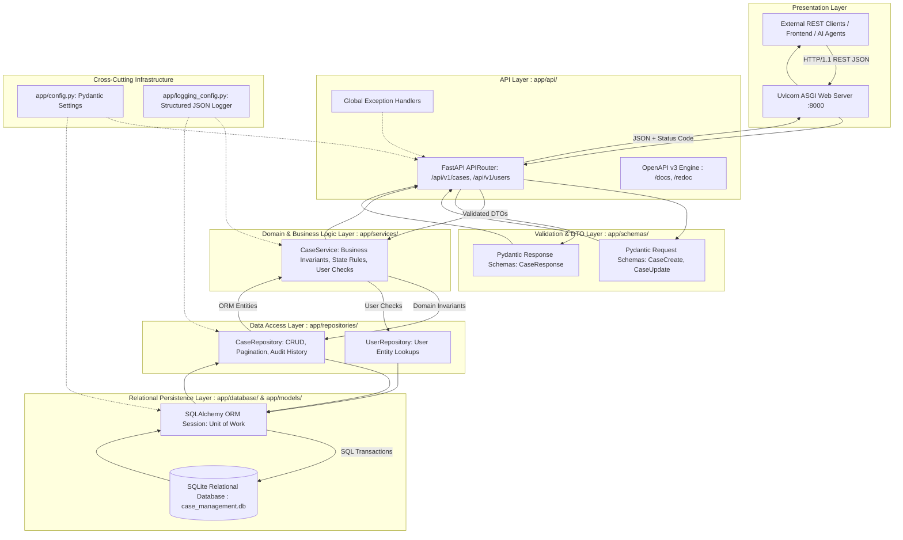

# System Architecture Document — Case Management Backend

## 1. Executive Summary
The **Case Management Backend** is an enterprise-grade, RESTful transactional service engineered for issue tracking, support ticketing, and defect management. It provides a modular, fully tested Python foundation implementing Clean Architecture principles, strict schema validation, ACID relational persistence, and structured observability.

---

## 2. Multi-Tier Solution Anatomy & Layer Boundaries



---

## 3. Layer Descriptions & Responsibilities

### 3.1 Presentation & Ingress
- **Uvicorn**: High-performance asynchronous server gateway interface (ASGI) server listening on `127.0.0.1:8000`.
- **FastAPI Core**: Handles request dispatching, URL parameter extraction, dependency injection, and automatic OpenAPI generation.

### 3.2 API Layer (`app/api/routes/cases.py`)
- **Responsibility**: Exclusively responsible for HTTP concerns.
- **Rules**:
  - Parses HTTP path, query, and body parameters.
  - Maps domain operations to semantic HTTP status codes (`201 Created` for new resources, `200 OK` for reads/updates).
  - Contains **zero** SQL queries and **zero** direct database session manipulations.
  - Delegates all business decisions to the Service layer.

### 3.3 Schema & DTO Layer (`app/schemas/case.py`)
- **Responsibility**: Input validation and output serialization.
- **Rules**:
  - Uses Pydantic `BaseModel` and `Field()` to enforce types, length boundaries (`min_length=1, max_length=255`), and enumerations.
  - Formats output JSON and protects internal database columns from leaking using `from_attributes=True`.

### 3.4 Domain / Service Layer (`app/services/case_service.py`)
- **Responsibility**: Business rules and workflow state transitions.
- **Rules**:
  - Validates entity relationships (e.g. verifying that `created_by` references an existing user before allowing a case to be created).
  - Enforces state machine invariants (e.g. a `CLOSED` case cannot have its status altered).
  - Coordinates multi-repository interactions.
  - Completely decoupled from HTTP request objects (receives plain Python objects, returns ORM instances).

### 3.5 Repository Layer (`app/repositories/case_repository.py`)
- **Responsibility**: Isolated data access and transaction boundaries.
- **Rules**:
  - Encapsulates all SQLAlchemy queries (`query()`, `filter()`, `add()`, `commit()`, `rollback()`).
  - Automatically records audit history entries in `case_history` whenever a case is mutated.
  - Guarantees transaction rollback upon any database exception.

### 3.6 Persistence Layer (`app/database/` & `app/models/`)
- **Responsibility**: Physical relational data storage and schema constraints.
- **Rules**:
  - Implements Third Normal Form (3NF) relational schema with primary and foreign key constraints.
  - Uses SQLAlchemy Declarative Base.

---

## 4. Unidirectional Dependency Rule

```text
[API Routes] ──> [Domain Services] ──> [Repositories] ──> [Relational Database]
      │                   │                    │
      ▼                   ▼                    ▼
 [Schemas DTO]      [Models ORM]          [Models ORM]
```

- **Dependency Inversion**: High-level modules do not depend on low-level modules; both depend on abstractions.
- **No Backward Imports**: The Repository layer NEVER imports from the Service or API layers.
- **Testability**: Every layer can be mocked and tested in total isolation from the layers above and below it.

---

## 5. Security Architecture
1. **Input Sanitization**: Pydantic validates data types and limits string lengths, shielding against buffer overflow and parameter tampering.
2. **SQL Injection Defense**: All database operations use SQLAlchemy parameterized queries and ORM objects. Raw string concatenation in SQL is strictly prohibited.
3. **Information Masking**: Global exception handlers catch unexpected 500 errors, log the complete traceback internally to JSON logs, and return only a sanitized `INTERNAL_ERROR` envelope to the client.
4. **Secret Isolation**: All credentials and environment variables are loaded via `pydantic-settings` from the environment or `.env` file; zero secrets are committed to version control.
