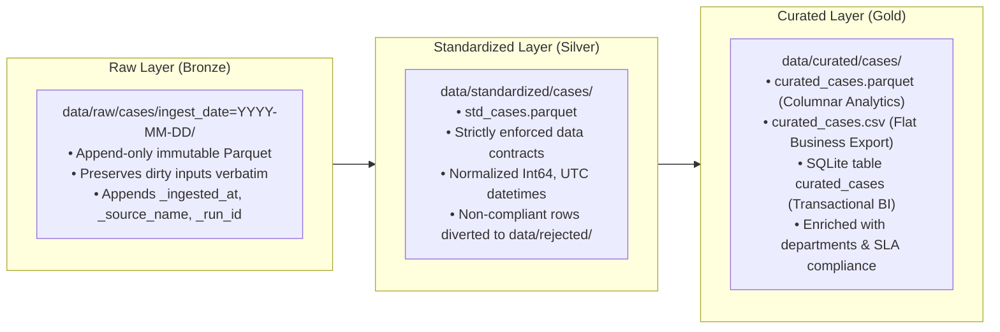

# Medallion Data Layer Architecture & Physical Storage Design

## 1. Architectural Overview

The Case Management Data Platform implements a multi-tier **Medallion Data Lakehouse Architecture** dividing data into three distinct processing and refinement tiers:
1. **Raw Layer (Bronze)**: Immutable Ingestion Landing
2. **Standardized Layer (Silver)**: Cleansed, Validated, and Deduplicated Single Source of Truth
3. **Curated Layer (Gold)**: Enriched, Dimensional, and Aggregated Business Data Products

---

## 2. Layer Specifications

### Layer 1: Raw (Bronze) Layer
* **Storage Path**: `data/raw/{dataset_name}/ingest_date={YYYY-MM-DD}/raw_{dataset_name}.parquet`
* **Format**: Apache Parquet with Snappy compression.
* **Access Mode**: Append-only, partitioned by date.
* **Mutation Policy**: Strictly immutable. No updates, no deletes, no in-place cleaning.
* **Lineage Injections**:
  - `_ingested_at`: UTC ISO timestamp when file landed.
  - `_source_name`: Ingestion source identifier (e.g. `cases_csv`, `policy_parquet`).
  - `_run_id`: Unique orchestration execution identifier (e.g. `RUN_20260916_120000`).

---

### Layer 2: Standardized (Silver) Layer
* **Storage Path**: `data/standardized/{dataset_name}/std_{dataset_name}.parquet`
* **Format**: Strongly-typed Apache Parquet.
* **Access Mode**: Overwrite per batch / partition.
* **Transformations Applied**:
  - String sanitization (strip whitespace, trim empty descriptions).
  - Categorical normalization (uppercase enum codes).
  - Numeric type casting (`Int64` nullable integer for keys).
  - Timezone conversion to UTC (`datetime64[ns, UTC]`).
  - **Quality Rule Partitioning**: Corrupted or non-compliant records are diverted to `data/rejected/rejected_{run_id}.json`. Only 100% clean records land in Silver.

---

### Layer 3: Curated (Gold) Layer
* **Storage Path**: `data/curated/{dataset_name}/`
* **Serving Formats**:
  1. `curated_cases.parquet`: High-throughput columnar file for big data analytics and AI training.
  2. `curated_cases.csv`: Flat tabular file for spreadsheet exports and external partners.
  3. Relational Table `curated_cases` in `cases.db`: Indexed SQL table for sub-second BI dashboard queries.
* **Enrichment Applied**:
  - Joined with `reference.json` to attach assignee tier, region, and department name.
  - Joined with `policy_metadata.parquet` to attach target resolution hours and compliance framework.
  - Analytical metrics computed: `resolution_time_hours`, `sla_breached` boolean flag.
  - Window functions applied: `priority_duration_rank` (dense rank of resolution speed within priority) and `department_case_seq` (cumulative sequence per department).

---

## 3. Physical Storage & Partitioning Strategy

| Tier | Storage Path | Partition Scheme | Compression | Retention Policy |
|---|---|---|---|---|
| **Bronze** | `data/raw/` | `ingest_date=YYYY-MM-DD` | Snappy | 7 Years (Regulatory Audit) |
| **Silver** | `data/standardized/` | Dataset directory | Snappy | 30 Days rolling / Full history |
| **Gold** | `data/curated/` | Multi-format files + SQL | Snappy (Parquet) | Permanent Active Analytical Mart |
| **Quarantine** | `data/rejected/` | `rejected_{run_id}.json` | Uncompressed JSON | 90 Days (Operational Remediation) |
