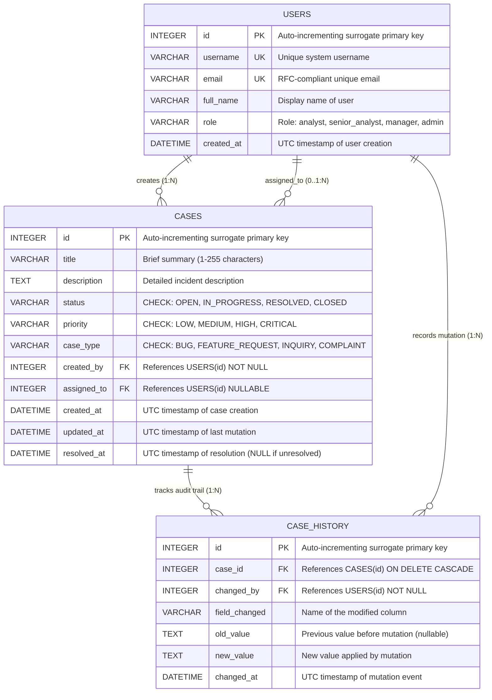

# Relational Database Design Specification

## 1. Overview
The **Case Management** database is engineered to Third Normal Form (3NF) standards. It enforces referential integrity, domain constraint validation, and auditability at the storage engine level.

The physical schema is defined in [sql/schema.sql](file:///d:/week1_kpmg/case-management-backend/sql/schema.sql) and implemented in Python via SQLAlchemy ORM models in [app/models/case.py](file:///d:/week1_kpmg/case-management-backend/app/models/case.py).

---

## 2. Entity-Relationship (ER) Diagram

---

## 3. Data Dictionary

### Table 1: `users`
Represents internal operators, system analysts, case managers, and administrators.

| Column | Data Type | Nullable | Default | Constraints | Description |
|---|---|---|---|---|---|
| `id` | `INTEGER` | No | Auto-increment | `PRIMARY KEY` | Unique surrogate key |
| `username` | `VARCHAR(50)` | No | None | `UNIQUE`, Indexed | System login identifier |
| `email` | `VARCHAR(255)` | No | None | `UNIQUE` | User email address |
| `full_name` | `VARCHAR(255)` | No | None | None | User's full human name |
| `role` | `VARCHAR(50)` | No | `'analyst'` | None | Role-based authorization tier |
| `created_at`| `DATETIME` | No | `datetime('now')` | UTC | Account creation timestamp |

### Table 2: `cases`
The primary transactional entity tracking issues, bugs, inquiries, and requests.

| Column | Data Type | Nullable | Default | Constraints | Description |
|---|---|---|---|---|---|
| `id` | `INTEGER` | No | Auto-increment | `PRIMARY KEY` | Unique case identifier |
| `title` | `VARCHAR(255)` | No | None | Length 1–255 | Short title of the case |
| `description` | `TEXT` | Yes | `NULL` | Max 5000 chars | Detailed explanation |
| `status` | `VARCHAR(20)` | No | `'OPEN'` | `CHECK (status IN (...))` | Current state in lifecycle |
| `priority` | `VARCHAR(20)` | No | `'MEDIUM'` | `CHECK (priority IN (...))` | Urgency classification |
| `case_type` | `VARCHAR(20)` | No | `'INQUIRY'`| `CHECK (case_type IN (...))` | Domain classification |
| `created_by`| `INTEGER` | No | None | `FOREIGN KEY -> users(id)` | Author of the ticket |
| `assigned_to`| `INTEGER` | Yes | `NULL` | `FOREIGN KEY -> users(id)` | Current assignee (nullable) |
| `created_at`| `DATETIME` | No | `datetime('now')` | UTC | Creation timestamp |
| `updated_at`| `DATETIME` | No | `datetime('now')` | UTC | Last modified timestamp |
| `resolved_at`| `DATETIME`| Yes | `NULL` | UTC | Timestamp when resolved |

### Table 3: `case_history` (Audit Trail)
Append-only historical audit log recording all mutations to cases.

| Column | Data Type | Nullable | Default | Constraints | Description |
|---|---|---|---|---|---|
| `id` | `INTEGER` | No | Auto-increment | `PRIMARY KEY` | Unique audit entry ID |
| `case_id` | `INTEGER` | No | None | `FK -> cases(id) ON DELETE CASCADE` | Parent case reference |
| `changed_by`| `INTEGER` | No | None | `FK -> users(id)` | User who enacted change |
| `field_changed` | `VARCHAR(100)` | No | None | None | Attribute modified |
| `old_value` | `TEXT` | Yes | `NULL` | None | Stringified previous value |
| `new_value` | `TEXT` | No | None | None | Stringified updated value |
| `changed_at`| `DATETIME` | No | `datetime('now')` | UTC | Mutation timestamp |

---

## 4. Normalization Verification (1NF to 3NF)

1. **First Normal Form (1NF) Satisfied**:
   - Every column contains atomic (indivisible) scalar values.
   - There are no comma-separated strings or array fields.
   - Each row is uniquely identified by a primary key (`id`).

2. **Second Normal Form (2NF) Satisfied**:
   - The schema is in 1NF.
   - All tables use single-column primary keys (`id`), so no partial functional dependencies on composite keys can possibly exist.

3. **Third Normal Form (3NF) Satisfied**:
   - The schema is in 2NF.
   - There are zero transitive dependencies. Non-key attributes depend solely on the primary key.
   - *Example*: User information (e.g. `full_name`, `email`) is not stored inside `cases`. Only `created_by` (foreign key pointing to `users.id`) is stored. This prevents update anomalies.

---

## 5. Indexing & Query Optimization Strategy

| Index Name | Table | Columns | Rationale |
|---|---|---|---|
| `idx_users_username` | `users` | `username` | Fast $O(\log N)$ B-Tree lookups during user login or verification |
| `idx_cases_status` | `cases` | `status` | Accelerated filtering for active tickets (`WHERE status = 'OPEN'`) |
| `idx_cases_priority` | `cases` | `priority` | High-priority triage queries (`WHERE priority = 'CRITICAL'`) |
| `idx_cases_created_by` | `cases` | `created_by` | Fast joins and filtering by ticket creator |
| `idx_case_history_case_id`| `case_history` | `case_id` | Fast retrieval of complete audit history for a specific case |
