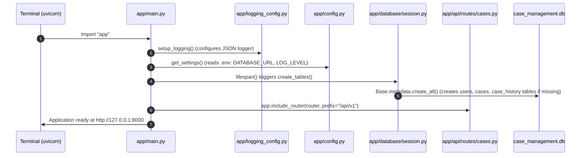
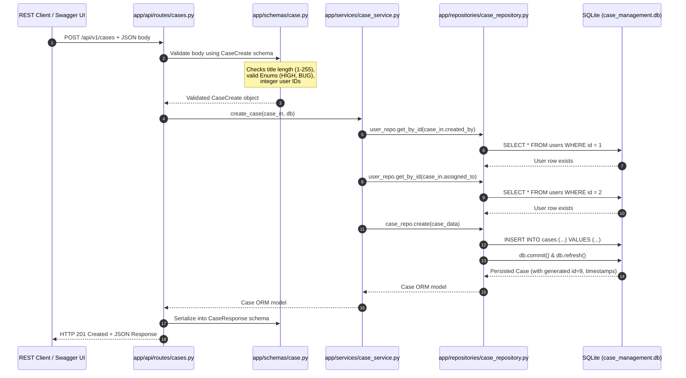

# End-to-End Walkthrough: How the Case Management System Works

This guide explains **how every piece of the project connects and runs from start to finish**. Whether you are tracing code execution, running commands, or explaining the system in an interview, this document maps out every file, function, and request lifecycle.

---

## 1. Directory & File Map (Who Does What?)

```text
case-management-backend/
├── app/
│   ├── main.py                     # [1] APPLICATION ENTRY POINT (FastAPI app & lifespan)
│   ├── config.py                   # [2] CONFIGURATION (Loads .env variables)
│   ├── logging_config.py           # [3] LOGGING (Structured JSON logging format)
│   ├── api/
│   │   └── routes/cases.py         # [4] CONTROLLER LAYER (HTTP endpoints: POST, GET, PATCH)
│   ├── schemas/
│   │   └── case.py                 # [5] DTO / VALIDATION (Pydantic models: input/output contracts)
│   ├── services/
│   │   └── case_service.py         # [6] BUSINESS LOGIC (State rules, foreign key validation)
│   ├── repositories/
│   │   └── case_repository.py      # [7] DATA ACCESS LAYER (SQLAlchemy queries & audit history)
│   ├── database/
│   │   └── session.py              # [8] DATABASE CONNECTION (Engine, SessionLocal, create_tables)
│   ├── models/
│   │   └── case.py                 # [9] ORM ENTITIES (SQLAlchemy tables: User, Case, CaseHistory)
│   └── exceptions/
│       └── handlers.py             # [10] GLOBAL ERROR HANDLERS (404, 409, 500 JSON formatting)
├── sql/                            # PURE SQL SCRIPTS (schema, seed, queries, transactions)
├── tests/                          # 30 AUTOMATED TESTS (Unit & API test suite)
├── seed_db.py                      # HELPER SCRIPT to initialize & seed database in 1 second
└── pyproject.toml                  # Project packaging, dependencies & test configuration
```

---

## 2. Startup Sequence: What Happens When You Run the App?

When you execute:
```powershell
uvicorn app.main:app --reload
```

Here is the exact startup sequence:



---

## 3. End-to-End Request Trace 1: Creating a Case (`POST /api/v1/cases`)

Suppose a client sends an HTTP POST request:

### The Input Payload:
```json
POST /api/v1/cases HTTP/1.1
Host: 127.0.0.1:8000
Content-Type: application/json

{
  "title": "Database connection pool exhausted during peak hours",
  "description": "Queries timing out on reporting dashboard",
  "priority": "HIGH",
  "case_type": "BUG",
  "created_by": 1,
  "assigned_to": 2
}
```

### Step-by-Step Code Execution:



### The Output Response:
```json
{
  "id": 9,
  "title": "Database connection pool exhausted during peak hours",
  "description": "Queries timing out on reporting dashboard",
  "status": "OPEN",
  "priority": "HIGH",
  "case_type": "BUG",
  "created_by": 1,
  "assigned_to": 2,
  "created_at": "2026-09-11T05:20:00Z",
  "updated_at": "2026-09-11T05:20:00Z",
  "resolved_at": null
}
```

---

## 4. End-to-End Request Trace 2: Updating a Case & Audit Logging (`PATCH /api/v1/cases/1`)

Updating a case triggers **business rule validation** and writes to the **audit history** table:

### The Input Payload:
```json
PATCH /api/v1/cases/1 HTTP/1.1
Content-Type: application/json

{
  "status": "RESOLVED",
  "priority": "MEDIUM"
}
```

### Step-by-Step Code Execution:
1. **Controller (`app/api/routes/cases.py`)**:
   - Parses path parameter `case_id=1` and body `CaseUpdate`.
   - Rejects empty bodies with `400 Bad Request`.
   - Calls `service.update_case(case_id=1, case_in=case_in)`.
2. **Service Layer (`app/services/case_service.py`)**:
   - Calls `case_repo.get_by_id(1)`. If case doesn't exist -> raises `EntityNotFoundError` (translated to HTTP 404).
   - **Business Invariant Check:** If `case.status == "CLOSED"`, raises `InvalidStateTransitionError` ("Cannot modify a closed case" -> translated to HTTP 409 Conflict).
   - **Automatic Timestamp Rule:** If status changes to `RESOLVED`, automatically sets `resolved_at = datetime.now(timezone.utc)`.
   - Calls `case_repo.update(case, update_data, changed_by=1)`.
3. **Repository Layer (`app/repositories/case_repository.py`)**:
   - Compares the new values with existing values.
   - For every modified field, creates a `CaseHistory` record:
     - `field_changed: "status"`, `old_value: "IN_PROGRESS"`, `new_value: "RESOLVED"`
     - `field_changed: "priority"`, `old_value: "HIGH"`, `new_value: "MEDIUM"`
   - Executes atomic commit:
     ```python
     db.add(history_entry)
     db.commit()
     db.refresh(db_case)
     ```
4. **Response**:
   - Returns updated case with `200 OK`.

---

## 5. End-to-End Request Trace 3: Listing & Filtering Cases (`GET /api/v1/cases`)

### The Input:
```text
GET /api/v1/cases?status=OPEN&priority=HIGH&page=1&page_size=10
```

### Step-by-Step Code Execution:
1. **Controller (`cases.py`)**:
   - Extracts query parameters `status`, `priority`, `page`, `page_size`.
   - Validates `page >= 1` and `1 <= page_size <= 100`.
   - Calls `case_repo.get_all(skip=0, limit=10, status="OPEN", priority="HIGH")`.
2. **Repository (`case_repository.py`)**:
   - Builds dynamic SQLAlchemy query:
     ```python
     query = db.query(Case)
     if status:
         query = query.filter(Case.status == status)
     if priority:
         query = query.filter(Case.priority == priority)
     total = query.count()
     cases = query.offset(skip).limit(limit).all()
     ```
3. **Response (`CaseListResponse`)**:
   - Returns array of cases along with pagination metadata: `{"items": [...], "total": 3, "page": 1, "page_size": 10}`.

---

## 6. How Errors are Caught and Formatted (Global Exception Handlers)

When an error happens anywhere in the system, it never crashes the server. Instead, custom exceptions are translated into consistent JSON error responses:

```text
Domain Error Raised (e.g. EntityNotFoundError)
    ↓
app/exceptions/handlers.py (Catches specific exception class)
    ↓
Generates standard error JSON:
{
  "error": "NOT_FOUND",
  "message": "Case with ID 999 not found",
  "status_code": 404,
  "timestamp": "2026-09-11T05:22:00Z"
}
```

---

## 7. Master Cheat-Sheet of Commands

Here are all the commands you need to run and test everything:

| Action | Command | What it does |
|---|---|---|
| **Activate Virtual Env** | `.\venv\Scripts\Activate.ps1` | Activates project environment |
| **Initialize & Seed DB** | `python seed_db.py` | Creates SQLite tables and inserts 5 users, 8 cases, 13 audit logs |
| **Run Backend Server** | `uvicorn app.main:app --reload` | Starts FastAPI on `http://127.0.0.1:8000` |
| **Open Interactive Docs** | Open browser to `http://127.0.0.1:8000/docs` | Swagger UI to test endpoints with buttons |
| **Run All 30 Tests** | `pytest` | Runs unit tests and API integration tests |
| **Run Test Coverage** | `pytest --cov=app --cov-report=term-missing` | Shows code coverage % per file (95%+) |
| **Interactive SQL CLI** | `python -m sqlite3 case_management.db` | Opens direct terminal prompt to query database |
