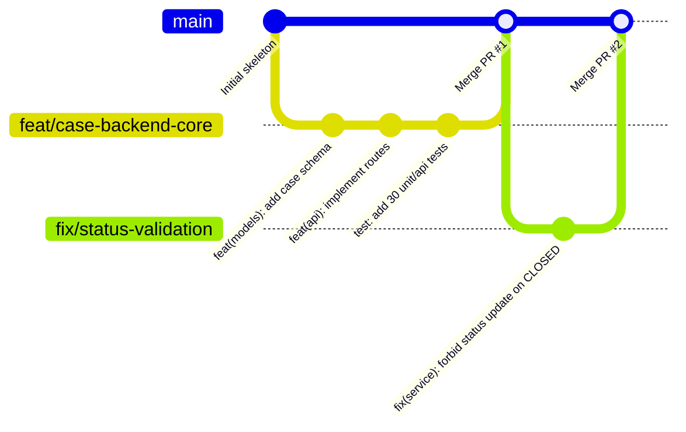
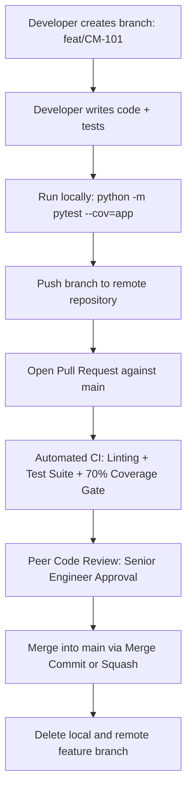

# Git Workflow & Source Control Standards

## 1. Overview
This document specifies the branching strategy, commit conventions, pull request workflows, and merge handling standards enforced across the Case Management Backend project.

---

## 2. Branching Model: GitHub Flow with Feature Branches



### Branch Naming Convention:
Format: `<type>/<ticket-id>-<short-description>`
- **`feat/`**: New feature development (e.g. `feat/CM-101-create-case-api`)
- **`fix/`**: Bug fixes (e.g. `fix/CM-102-status-closed-reopen`)
- **`docs/`**: Documentation additions or updates (e.g. `docs/CM-103-architecture-guide`)
- **`test/`**: Test additions or coverage improvements (e.g. `test/CM-104-api-edge-cases`)
- **`refactor/`**: Code restructuring with no behavior changes (e.g. `refactor/CM-105-isolate-repository`)

---

## 3. Commit Message Standards (Conventional Commits v1.0.0)

All commit messages must adhere to the Conventional Commits specification:

```text
<type>(<scope>): <subject in imperative mood>

[optional body explaining WHY the change was made and any trade-offs]

[optional footer: Closes #issue-number]
```

### Approved Types:
- `feat`: A new user-facing feature or endpoint
- `fix`: A bug fix in existing functionality
- `docs`: Documentation changes only
- `test`: Adding missing tests or correcting existing tests
- `refactor`: A code change that neither fixes a bug nor adds a feature
- `chore`: Changes to build process, dependencies, or tool configuration

### Good vs. Bad Commit Examples:
- **BAD**: `git commit -m "updates"` (Meaningless, gives zero context to reviewers)
- **BAD**: `git commit -m "fixed stuff in service"` (Vague, lacks scope)
- **GOOD**: `feat(api): implement POST /api/v1/cases with Pydantic validation`
- **GOOD**: `fix(services): prevent status transitions on CLOSED cases`
- **GOOD**: `test(unit): add mock tests for CaseService user validation`

---

## 4. Pull Request (PR) Lifecycle & Quality Gates

Every code change must pass through a Pull Request before being merged into `main`:



### Pre-Merge Quality Gates:
1. **Automated Test Suite**: 100% of pytest tests must pass (`python -m pytest`).
2. **Coverage Gate**: Statement coverage must meet or exceed 70% (`fail_under = 70`).
3. **No Committed Secrets**: `.env` and SQLite binary files must be absent from the PR diff.
4. **Clean Merge**: All merge conflicts resolved.

---

## 5. Merge Conflict Resolution Protocol
When concurrent changes touch the same lines, follow this exact sequence:

1. **Update Local `main`**:
   ```bash
   git switch main
   git pull origin main
   ```
2. **Rebase or Merge `main` into your feature branch**:
   ```bash
   git switch feat/my-feature
   git merge main
   ```
3. **Inspect Conflict Markers**:
   Open conflicted files and identify the `<<<<<<< HEAD`, `=======`, and `>>>>>>> main` blocks.
4. **Resolve Manually**:
   Consult with the author of the conflicting commit, combine the changes logically, and delete conflict markers.
5. **Stage and Commit**:
   ```bash
   git add <resolved-file>
   git commit -m "merge: resolve conflicts with main in <file>"
   ```
6. **Verify Build**:
   Rerun `python -m pytest` to guarantee that conflict resolution did not introduce broken code.
