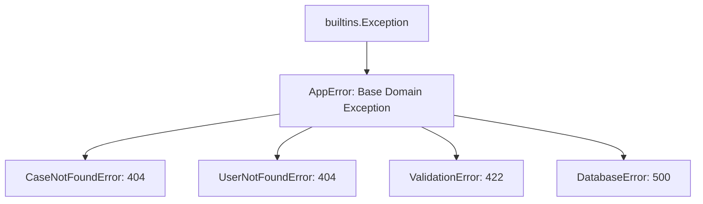
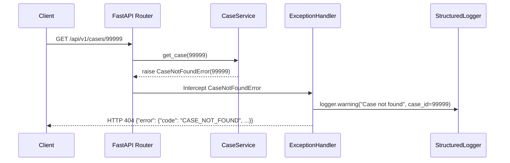

# Observability: Structured Logging & Error Architecture

## 1. Overview
Observability is a core requirement of enterprise backend systems. The Case Management Backend implements a unified observability architecture combining:
1. **Machine-Readable Structured JSON Logging** (via `python-json-logger`)
2. **Domain-Specific Exception Hierarchy** (via custom `AppError` subclasses)
3. **Information-Masking Global HTTP Handlers** (preventing internal stack trace leakage)

---

## 2. Structured JSON Logging Architecture

### 2.1 Configuration
Logging is initialized in [app/logging_config.py](file:///d:/week1_kpmg/case-management-backend/app/logging_config.py) during application startup. Every log entry is converted into a standard single-line JSON object emitted to `sys.stdout`.

### 2.2 Standard Log Field Dictionary

| Key | Type | Description | Example |
|---|---|---|---|
| `timestamp` | `string` | ISO 8601 UTC timestamp with timezone offset | `"2026-09-10T12:00:00+0000"` |
| `level` | `string` | Log severity level (`DEBUG`, `INFO`, `WARNING`, `ERROR`) | `"INFO"` |
| `logger` | `string` | Python module namespace where the log originated | `"app.services.case_service"` |
| `message` | `string` | Human-readable event description | `"Case created successfully"` |
| `case_id` | `integer` | ID of the case involved in the event | `42` |
| `operation`| `string` | Identifier for the operation being executed | `"create_case"` |
| `path` | `string` | Ingress URL path for HTTP-level events | `"/api/v1/cases"` |

### 2.3 Concrete Log Output Example:
```json
{
  "timestamp": "2026-09-10T12:00:00+0000",
  "level": "INFO",
  "logger": "app.services.case_service",
  "message": "Case created successfully",
  "case_id": 9,
  "status": "OPEN",
  "operation": "create_case"
}
```

### 2.4 Security & Privacy Boundaries (What NOT to Log)
Under enterprise compliance policies:
- **Never Log**: Passwords, authorization headers, bearer tokens, API keys, private database connection strings.
- **Mask PII**: Email addresses and user real names are excluded from informational logs; only surrogate integer user IDs (`user_id = 1`) are logged.

---

## 3. Exception Handling Architecture

### 3.1 Domain Exception Hierarchy
In [app/exceptions/__init__.py](file:///d:/week1_kpmg/case-management-backend/app/exceptions/__init__.py), all application exceptions inherit from a common base:



### 3.2 Global FastAPI Exception Handlers
In [app/exceptions/handlers.py](file:///d:/week1_kpmg/case-management-backend/app/exceptions/handlers.py), handlers convert internal Python exceptions into clean, uniform HTTP JSON responses.



### 3.3 Stack Trace Masking (Zero-Leak Policy)
When an unhandled exception or database failure occurs:
1. The **full exception and traceback** is logged to internal server logs via `logger.exception(...)` for developer debugging.
2. The **HTTP client response** receives only a generic, sanitized envelope:
   ```json
   {
     "error": {
       "code": "INTERNAL_ERROR",
       "message": "An internal error occurred",
       "details": null
     }
   }
   ```
Internal file paths, database library versions, and query SQL strings are **never** exposed over the public API.
