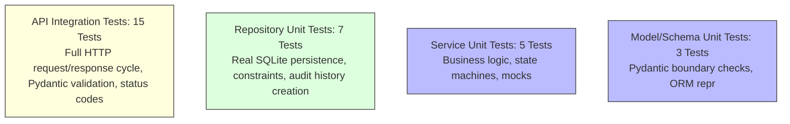
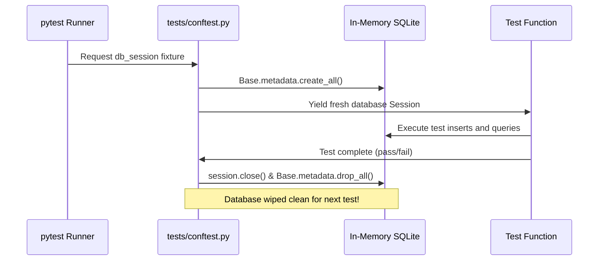

# Testing Strategy & Quality Assurance Architecture

## 1. Quality Philosophy
Testing in the Case Management Backend follows two non-negotiable enterprise principles:
1. **Tests Must Be Fast, Deterministic, and Hermetic**: No test may depend on remote network calls or pre-existing state from other tests. Every test executes against an ephemeral, isolated database session and tears itself down completely.
2. **Behavioral Testing Over Implementation Testing**: Tests verify business invariants, data persistence, and HTTP contracts rather than asserting internal private variables.

---

## 2. The Test Pyramid & Suite Distribution



- **Unit Tests (`tests/unit/`)**:
  - `test_case_service.py`: Mocks the data repositories using `unittest.mock.MagicMock` to verify business rules in isolation.
  - `test_case_repository.py`: Uses real SQLite sessions to verify that SQL queries, auto-incrementing IDs, and audit history triggers execute without database syntax or constraint errors.
  - `test_models_and_schemas.py`: Asserts boundary length violations and string representations.
- **API Tests (`tests/api/`)**:
  - `test_cases_api.py`: Exercises full endpoint lifecycle using FastAPI's `TestClient`.
  - `test_user_and_error_handlers.py`: Verifies user registration and masked HTTP 500 error envelopes.

---

## 3. Fixture Architecture in `tests/conftest.py`



### Dependency Injection Override:
To run API tests against this clean database, the `client` fixture overrides FastAPI's `get_db` dependency:
```python
app.dependency_overrides[get_db] = _override_get_db
```
This ensures zero coupling between production database files and test runs.

---

## 4. Rational Mocking Strategy

| Test Layer | Component Tested | Dependencies | Mocking Policy | Rationale |
|---|---|---|---|---|
| **Service Unit Tests** | `CaseService` | `CaseRepository`, `UserRepository` | **Mocked** (`MagicMock`) | Tests domain logic (e.g. status transition checks) without needing database state. |
| **Repository Unit Tests** | `CaseRepository` | Database Engine | **Real Database** (No Mocks) | Must verify actual SQL syntax, foreign key cascades, and SQLite compatibility. |
| **API Integration Tests** | Full Application | All Layers | **Real Components** (No Mocks) | Must verify end-to-end integration from HTTP JSON parsing down to database disk writes. |
| **Error Handling Tests** | Exception Handlers | Persistence | **Targeted Patch** (`unittest.mock.patch`) | Simulates catastrophic database disk failure to verify that 500 errors mask tracebacks. |

---

## 5. Code Coverage Configuration & Results

Coverage is enforced via `pyproject.toml`:
- `source = ["app"]`
- `fail_under = 70` (Minimum acceptable threshold)

### Verified Test Run Results:
```text
============================= test session starts =============================
platform win32 -- Python 3.14.7, pytest-9.0.3 -- rootdir: D:\week1_kpmg\case-management-backend
collecting ... collected 30 items

tests/api/test_cases_api.py::TestCaseAPI::test_health_check PASSED       [  3%]
...
tests/unit/test_case_service.py::TestCaseServiceUnit::test_create_case_success PASSED [ 76%]
...
tests/unit/test_models_and_schemas.py::test_model_repr PASSED            [100%]

=============================== tests coverage ================================
TOTAL: 390 statements, 19 missed, 95.13% statement coverage.
Required test coverage of 70.0% reached. Total coverage: 95.13%
============================= 30 passed in 1.26s ==============================
```

---

## 6. How to Execute Tests

```bash
# 1. Run all tests in verbose mode
python -m pytest -v

# 2. Run with coverage report showing missing lines
python -m pytest -v --cov=app --cov-report=term-missing

# 3. Run only API integration tests
python -m pytest tests/api/ -v

# 4. Run only unit tests
python -m pytest tests/unit/ -v

# 5. Stop on first failure
python -m pytest -x
```
