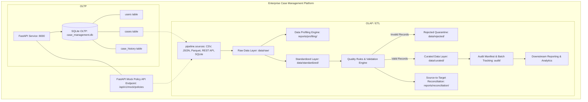

# Week 1 Baseline Verification & Architecture Status

**Document Purpose:** Baseline assessment of the Week 1 Case Management Backend before implementing Week 2 data pipeline extensions.  
**Baseline Date:** 2026-09-16  
**Environment:** Python 3.14.7, Windows 11, SQLite 3.50.4, FastAPI 0.141.1  

---

## 1. Existing Week 1 Functionality Summary

The Week 1 codebase delivers a fully operational, test-driven REST API backend for Case Management:
- **Core Entities:** `User`, `Case`, `CaseHistory` (Audit Log) modeled in SQLAlchemy 2.0 ORM.
- **Relational Persistence:** SQLite database (`case_management.db`) normalized to 3NF with foreign keys, CHECK constraints, and B-Tree indexes.
- **API Endpoints:**
  - `POST /api/v1/cases` (Case creation with Pydantic validation)
  - `GET /api/v1/cases` (Bounded pagination, status/priority filtering)
  - `GET /api/v1/cases/{case_id}` (Single case lookup)
  - `PATCH /api/v1/cases/{case_id}` (Partial updates, status transitions, resolution timestamps, immutable closed state)
  - `GET /api/v1/users` & `POST /api/v1/users` (User management)
  - `GET /health` (Liveness probe)
- **Cross-Cutting Architecture:**
  - Clean 4-Tier Architecture (API Router $\rightarrow$ Pydantic DTOs $\rightarrow$ Service Invariants $\rightarrow$ Repository Unit of Work).
  - Structured JSON logging (`python-json-logger`).
  - Global centralized exception handling mapping to RFC 7807 JSON errors.
  - 12-Factor environment configuration via `pydantic-settings`.

---

## 2. Automated Test Baseline & Coverage

Execution command:
```powershell
pytest -v --cov=app --cov-report=term-missing
```

### Verified Baseline Test Results:
```text
============================= test session starts =============================
platform win32 -- Python 3.14.7, pytest-9.1.1, pluggy-1.6.0
rootdir: D:\week1_kpmg\case-management-backend
configfile: pyproject.toml
testpaths: tests
plugins: anyio-4.15.1, cov-7.1.0
collected 30 items

tests/api/test_cases_api.py::TestCaseAPI::test_health_check PASSED       [  3%]
tests/api/test_cases_api.py::TestCaseAPI::test_create_user_api PASSED    [  6%]
tests/api/test_cases_api.py::TestCaseAPI::test_create_case_valid PASSED  [ 10%]
tests/api/test_cases_api.py::TestCaseAPI::test_create_case_missing_required_title PASSED [ 13%]
tests/api/test_cases_api.py::TestCaseAPI::test_create_case_invalid_title_length PASSED [ 16%]
tests/api/test_cases_api.py::TestCaseAPI::test_create_case_nonexistent_creator PASSED [ 20%]
tests/api/test_cases_api.py::TestCaseAPI::test_get_case_existing PASSED  [ 23%]
tests/api/test_cases_api.py::TestCaseAPI::test_get_case_missing PASSED   [ 26%]
tests/api/test_cases_api.py::TestCaseAPI::test_update_case_valid PASSED  [ 30%]
tests/api/test_cases_api.py::TestCaseAPI::test_update_case_empty_body_rejected PASSED [ 33%]
tests/api/test_cases_api.py::TestCaseAPI::test_update_case_nonexistent_case PASSED [ 36%]
tests/api/test_cases_api.py::TestCaseAPI::test_update_case_cannot_reopen_closed PASSED [ 40%]
tests/api/test_cases_api.py::TestCaseAPI::test_list_cases_pagination_and_filter PASSED [ 43%]
tests/api/test_user_and_error_handlers.py::test_list_users_api PASSED    [ 46%]
tests/api/test_user_and_error_handlers.py::test_database_error_handler PASSED [ 50%]
tests/unit/test_case_repository.py::TestCaseRepositoryUnit::test_user_repository_create_and_get PASSED [ 53%]
tests/unit/test_case_repository.py::TestCaseRepositoryUnit::test_user_repository_get_missing_raises_error PASSED [ 56%]
tests/unit/test_case_repository.py::TestCaseRepositoryUnit::test_case_create_persists_to_db PASSED [ 60%]
tests/unit/test_case_repository.py::TestCaseRepositoryUnit::test_case_get_by_id_success PASSED [ 63%]
tests/unit/test_case_repository.py::TestCaseRepositoryUnit::test_case_get_by_id_missing_raises_not_found PASSED [ 66%]
tests/unit/test_case_repository.py::TestCaseRepositoryUnit::test_case_update_records_audit_history PASSED [ 70%]
tests/unit/test_case_repository.py::TestCaseRepositoryUnit::test_case_get_all_pagination_and_filtering PASSED [ 73%]
tests/unit/test_case_service.py::TestCaseServiceUnit::test_create_case_success PASSED [ 76%]
tests/unit/test_case_service.py::TestCaseServiceUnit::test_create_case_fails_when_creator_not_found PASSED [ 80%]
tests/unit/test_case_service.py::TestCaseServiceUnit::test_create_case_fails_when_assignee_not_found PASSED [ 83%]
tests/unit/test_case_service.py::TestCaseServiceUnit::test_update_case_fails_if_closed PASSED [ 86%]
tests/unit/test_case_service.py::TestCaseServiceUnit::test_update_case_sets_resolved_at PASSED [ 90%]
tests/unit/test_models_and_schemas.py::test_model_repr PASSED            [ 93%]
tests/unit/test_models_and_schemas.py::test_schema_title_too_long PASSED [ 96%]
tests/unit/test_models_and_schemas.py::test_schema_user_create_invalid_username PASSED [100%]

=============================== tests coverage ================================
TOTAL: 390 Statements, 19 Missed, 95.13% Statement Coverage
======================= 30 passed, 2 warnings in 1.36s ========================
```

---

## 3. Known Non-Blocking Warnings
- `StarletteDeprecationWarning`: FastApi TestClient with `httpx` instead of `httpx2` (upstream cosmetic warning, tests pass cleanly).
- `anyio.abc.BlockingPortal` deprecation warning (upstream Starlette testclient wrapper warning).
- Neither warning affects runtime, API correctness, or data persistence.

---

## 4. Week 2 Integration Architecture

Week 2 does **not** replace Week 1. It seamlessly integrates as a parallel, data-processing subsystem:



### Key Integration Touchpoints:
1. **Mock REST API Integration:** Week 1 FastAPI backend serves `/api/v1/mock/policies` which the Week 2 pipeline consumes programmatically.
2. **Relational Database Ingestion:** The Week 2 pipeline directly extracts case records from Week 1 SQLite tables to demonstrate relational table ingestion.
3. **Domain Continuity:** All pipeline datasets (cases, reference user SLA data, policy compliance metadata) strictly belong to the Case Management domain.
4. **Preservation Commitment:** All 30 Week 1 tests must remain passing throughout and after Week 2 implementation.
