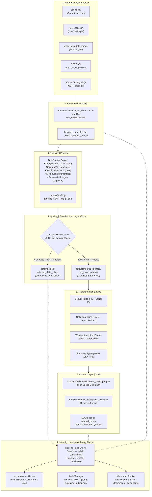

# Week 2 Enterprise Data Pipeline: Architecture Specification

## 1. System Architecture Diagram

---

## 2. Component Responsibility Matrix

| Component | Module | Responsibility | Key Classes & Functions |
|---|---|---|---|
| **Sources** | `pipeline/sources/` | Ingestion from CSV, JSON, Parquet, SQLite, REST API with fallback | `CSVSource`, `JSONSource`, `ParquetSource`, `DatabaseSource`, `APISource` |
| **Contracts** | `pipeline/schemas/` | Schema validation, contract declarations, enum constraints | `DataContract`, `SchemaValidator`, `CASE_SOURCE_CONTRACT` |
| **Profiler** | `pipeline/profiling/` | Vectorized 5-pillar statistical profiling and reporting | `DataProfiler` |
| **Quality Engine** | `pipeline/validation/` | Evaluating 8 domain rules, partitioning valid vs invalid | `QualityRulesEvaluator`, `QualityRule`, `CASE_QUALITY_RULES` |
| **Quarantine** | `pipeline/quarantine/` | Persisting dead-letter payloads with root-cause failure metadata | `QuarantineManager` |
| **Transformations** | `pipeline/transformations/` | Type standardization, timestamp parsing, deduplication, joins, windowing, rollups | `standardize_case_records`, `deduplicate_cases`, `join_case_reference_and_policies`, `apply_window_metrics`, `aggregate_department_sla_summary` |
| **Medallion Layers** | `pipeline/layers/` | Managing Raw Bronze, Standardized Silver, and Curated Gold tiers | `RawLayerManager`, `StandardizedLayerManager`, `CuratedLayerManager` |
| **Reconciliation** | `pipeline/reconciliation/` | Mathematical balancing, variance alerts, Markdown reports | `ReconciliationEngine` |
| **Audit & State** | `pipeline/audit/`, `pipeline/orchestration/` | Run manifests, JSONL execution ledgers, high-watermark delta state | `AuditManager`, `WatermarkTracker` |
| **Orchestrator** | `pipeline/orchestration/` | Master 10-stage execution DAG and state machine | `CaseManagementPipeline` |
| **CLI Runner** | `pipeline/cli.py` | Command-line interface with flags (`--mode full/incremental`, `--file`) | `main` CLI runner |
