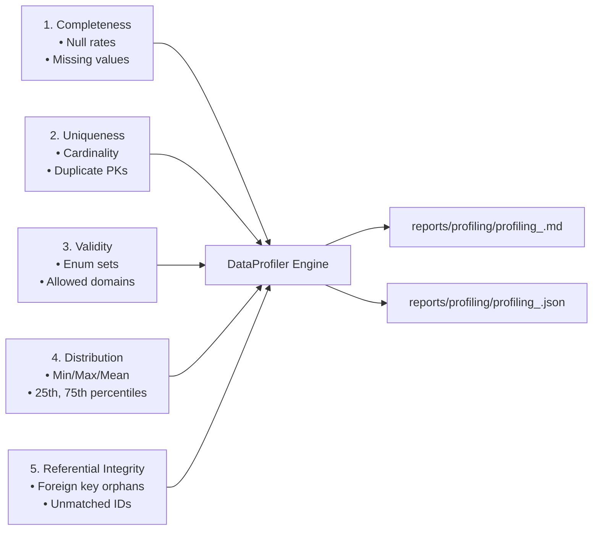

# Automated Data Profiling: 5-Pillar Statistical Verification

## 1. Overview

Before performing downstream transformations, the pipeline executes the `DataProfiler` (`pipeline/profiling/profiler.py`). The profiler evaluates the dataset across 5 fundamental statistical pillars:

---

## 2. Profiling Metrics Formulae

1. **Completeness**:
   $$\text{Completeness } (\%) = \frac{\text{Total Rows} - \text{Null Rows}}{\text{Total Rows}} \times 100$$
   Empty strings in string columns are classified as nulls.
2. **Uniqueness**:
   $$\text{Uniqueness } (\%) = \frac{\text{Distinct Primary Keys}}{\text{Total Rows}} \times 100$$
3. **Validity**:
   $$\text{Validity } (\%) = \frac{\text{Total Rows} - \text{Domain Breaches}}{\text{Total Rows}} \times 100$$
4. **Distribution**:
   - `min`, `max`, `mean`, `median`
   - 25th percentile ($Q1$) and 75th percentile ($Q3$)
5. **Referential Integrity**:
   - Compares fact keys against set lookups (`valid_user_ids`).
   - Flags orphans where foreign key is not in parent reference table.
