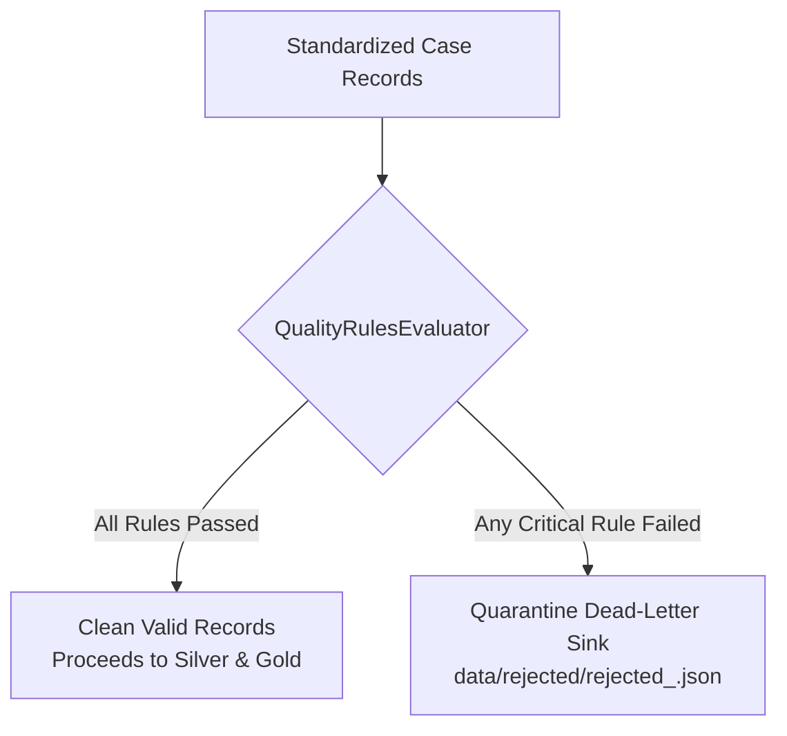

# Data Quality Rules Catalog & Evaluation Engine

## 1. Overview

In `pipeline/validation/quality_rules.py`, the Case Management Data Pipeline codifies **8 automated business domain rules**.

---

## 2. The 8 Automated Quality Rules

| Rule ID | Name & Description | Severity | Failure Action | Evaluator |
|---|---|:---:|:---:|---|
| `RULE-CASE-001` | **Required Title**: Case title must be non-null and non-empty. | `CRITICAL` | `QUARANTINE` | `check_required_title` |
| `RULE-CASE-002` | **Valid Status**: Must match `['OPEN', 'IN_PROGRESS', 'RESOLVED', 'CLOSED']`. | `CRITICAL` | `QUARANTINE` | `check_valid_status` |
| `RULE-CASE-003` | **Valid Priority**: Must match `['LOW', 'MEDIUM', 'HIGH', 'CRITICAL']`. | `CRITICAL` | `QUARANTINE` | `check_valid_priority` |
| `RULE-CASE-004` | **Valid Case Type**: Must match `['BUG', 'FEATURE_REQUEST', 'INQUIRY', 'COMPLAINT']`. | `CRITICAL` | `QUARANTINE` | `check_valid_case_type` |
| `RULE-CASE-005` | **Positive ID**: `case_id` must be an integer $> 0$. | `CRITICAL` | `QUARANTINE` | `check_positive_id` |
| `RULE-CASE-006` | **Creator Reference**: `created_by` must exist in reference users lookup. | `CRITICAL` | `QUARANTINE` | `check_referential_creator` |
| `RULE-CASE-007` | **Assignee Reference**: If assigned, `assigned_to` must exist in reference users lookup. | `CRITICAL` | `QUARANTINE` | `check_referential_assignee` |
| `RULE-CASE-008` | **Valid Datetime**: `created_at` must be a valid parseable ISO-8601 timestamp. | `CRITICAL` | `QUARANTINE` | `check_valid_created_at` |
