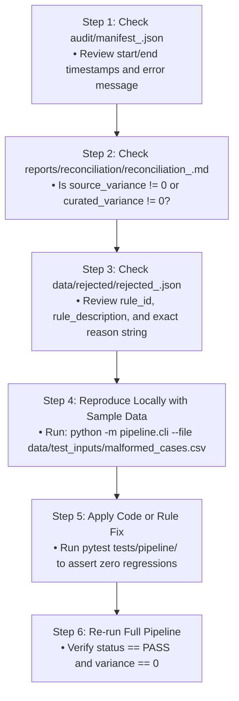

# Week 2 Pipeline Troubleshooting & Debugging Guide

## 1. The 6-Step Triage & Debugging Methodology

When an automated pipeline alerts with a failure or non-zero reconciliation variance:

---

## 2. Common Pipeline Failure Symptoms & Remedies

### Symptom 1: `source_variance > 0` (Source Count != Valid + Quarantined)
* **Diagnosis**: Records were dropped inside `QualityRulesEvaluator.evaluate()` without being added to `valid_df` or `rejected_records`.
* **Fix**: Ensure that every branch in the rule evaluation loop either appends to `valid_indices` or `rejected_records`.

### Symptom 2: `curated_variance != 0` (Curated Count != Valid - Duplicates)
* **Diagnosis**: Non-unique join keys in `policies_df` or `reference.json` caused row multiplication during relational joins.
* **Fix**: Ensure `.drop_duplicates(subset=['case_type', 'priority'])` is executed on policy metadata prior to joining.

### Symptom 3: UnicodeEncodeError in Windows Terminal (CLI run)
* **Diagnosis**: Windows console running code page 1252 or cp437 cannot print UTF-8 emojis.
* **Fix**: Use ASCII status indicators (`>>>`, `[SUCCESS]`, `[ERROR]`) in `pipeline/cli.py`.
