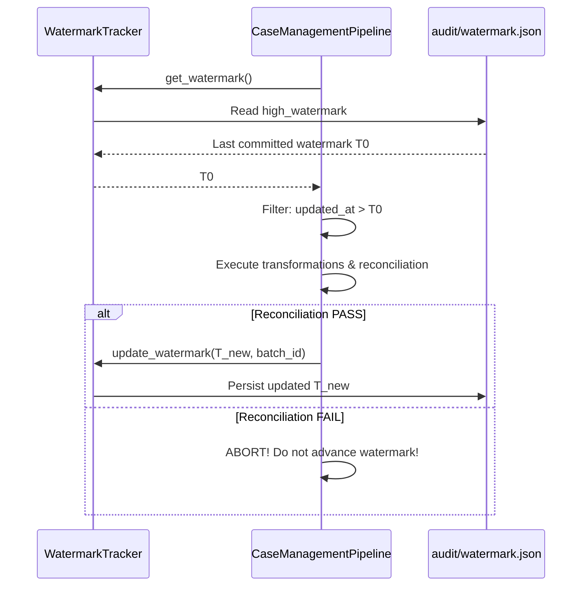

# Incremental Loading & High-Watermark State Management

## 1. Overview & Architecture

The `WatermarkTracker` (`pipeline/orchestration/incremental.py`) enables delta processing by tracking the maximum `updated_at` timestamp committed across pipeline runs.



---

## 2. State Schema (`audit/watermark.json`)

```json
{
  "high_watermark": "2026-03-01T12:00:00+00:00",
  "updated_at": "2026-09-16T12:05:00.123456+00:00",
  "last_batch_id": "BATCH_20260916_1205"
}
```

---

## 3. Two-Phase Commit Safety

The watermark timestamp is strictly updated **only after** all curated outputs are written and reconciliation has passed. If an error occurs during transformation or reconciliation, the watermark remains at its previous value, ensuring uncommitted records are reprocessed on the next execution.
