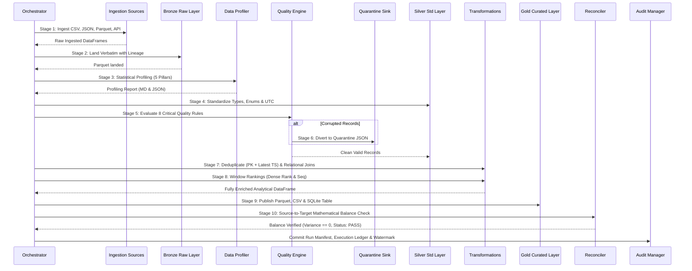

# Pipeline Design & The 10-Stage Orchestration Lifecycle

## 1. Lifecycle Overview

The `CaseManagementPipeline` class in `pipeline/orchestration/pipeline.py` coordinates the end-to-end data pipeline lifecycle across 10 deterministic stages.

---

## 2. Stage-by-Stage Detailed Specification

1. **Stage 1: Heterogeneous Ingestion**:
   - `cases_csv`: Ingests operational cases from `data/input/cases.csv` as raw strings.
   - `reference_users_json` & `reference_depts_json`: Ingests from `data/input/reference.json` using targeted record paths.
   - `policy_parquet`: Ingests SLA rules and compliance frameworks from `data/input/policy_metadata.parquet`.
   - `mock_rest_api`: Queries `GET /api/v1/mock/policies` with fallback cache protection.
2. **Stage 2: Raw Bronze Landing**:
   - Persists unadulterated cases into `data/raw/cases/ingest_date=YYYY-MM-DD/raw_cases.parquet`.
   - Injects `_ingested_at`, `_source_name`, and `_run_id`.
3. **Stage 3: Statistical Data Profiling**:
   - Vectorized assessment of Completeness, Uniqueness, Validity, Distribution, and Referential Integrity.
   - Generates `reports/profiling/profiling_<run_id>.md` and `.json`.
4. **Stage 4: Data Standardization & Coercion**:
   - Coerces case IDs and user IDs to `Int64`.
   - Converts strings to uppercase enums and parses timestamps to `datetime64[ns, UTC]`.
   - Imputes empty descriptions.
5. **Stage 5: Quality Rule Evaluation**:
   - Evaluates all 8 critical domain rules row-by-row.
6. **Stage 6: Quarantine Sink Management**:
   - Diverts failing records to `data/rejected/rejected_<run_id>.json` with failure reason and rule metadata.
7. **Stage 7: Deduplication & Relational Joins**:
   - Deduplicates by `case_id` ordering by `updated_at` ascending, keeping `last`.
   - Joins reference users (tier, region, department ID) and department lookup names.
   - Joins SLA policies on `(case_type, priority)` and computes `resolution_time_hours` and `sla_breached`.
8. **Stage 8: Window Analytical Ranking**:
   - Calculates `priority_duration_rank` (dense rank within priority).
   - Calculates `department_case_seq` (cumulative sequence per department).
9. **Stage 9: Curated Gold Publishing**:
   - Writes `data/curated/cases/curated_cases.parquet`.
   - Writes `data/curated/cases/curated_cases.csv`.
   - Idempotently replaces SQLite table `curated_cases` in `data/cases.db`.
10. **Stage 10: Reconciliation & Audit Manifestation**:
    - Asserts $\text{Source} == \text{Valid} + \text{Quarantined}$ and $\text{Curated} == \text{Valid} - \text{Duplicates}$.
    - Generates Markdown reconciliation ledger at `reports/reconciliation/reconciliation_<run_id>.md`.
    - Persists `audit/manifest_<run_id>.json` and appends to `audit/execution_ledger.jsonl`.
    - If incremental, commits updated high-watermark timestamp to `audit/watermark.json`.
