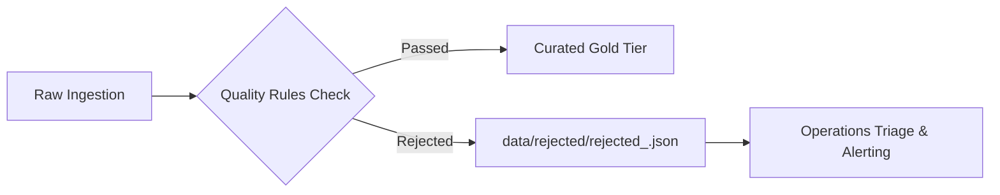

# Quarantine & Rejected-Record Handling: Architecture & Schema

## 1. Overview & Architecture

Non-compliant and corrupted records are never silently dropped or discarded. They are routed into a dedicated **Quarantine Dead-Letter Sink** managed by `QuarantineManager` (`pipeline/quarantine/quarantine_manager.py`).



---

## 2. Quarantined Record Schema

Each rejected file is named `rejected_{run_id}.json` and contains:
```json
{
  "run_id": "RUN_20260916_120000",
  "batch_id": "BATCH_20260916_1200",
  "quarantined_at": "2026-09-16T12:00:00+00:00",
  "total_quarantined": 1,
  "rejected_records": [
    {
      "original_record": { "case_id": "16", "status": "INVALID_STATUS" },
      "source": "cases.csv",
      "run_id": "RUN_20260916_120000",
      "rule_id": "RULE-CASE-002",
      "rule_description": "Case status must match domain enum",
      "reason": "Status 'INVALID_STATUS' not in allowed enum",
      "severity": "CRITICAL",
      "rejected_at": "2026-09-16T12:00:00+00:00"
    }
  ]
}
```

This ensures complete auditability and root-cause transparency for regulatory compliance and operational remediation.
