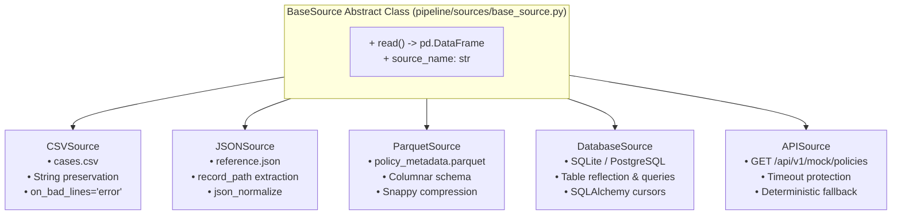

# Heterogeneous Source Ingestion Design: CSV, JSON, Parquet, Relational & REST API

## 1. Overview & Architecture

Modern enterprise pipelines must ingest datasets across heterogeneous protocols and serialization formats. The Case Management platform implements a unified `BaseSource` interface across five distinct sources:

---

## 2. Ingestion Specifications & Fallback Strategies

| Source Name | Component | Format / Protocol | Ingestion Characteristics & Resilience |
|---|---|---|---|
| `cases_csv` | `CSVSource` | CSV (Flat File) | Ingests all fields initially as strings (`dtype=str`) to prevent automatic parser distortion of corrupted values. Validates file existence. |
| `reference_json` | `JSONSource` | JSON (Nested) | Uses `record_path="users"` and `record_path="departments"` to extract distinct entity relations from a single JSON document without re-reading from disk. |
| `policy_parquet` | `ParquetSource` | Apache Parquet | Reads embedded columnar Apache Arrow schemas with zero-copy projections. |
| `database_source` | `DatabaseSource` | SQL / Relational | Uses SQLAlchemy engines to extract from tables or filtered SQL predicates directly. |
| `mock_rest_api` | `APISource` | HTTP REST API | Connects to `GET /api/v1/mock/policies` with a strict 2.0-second timeout. If the server is offline or times out, seamlessly falls back to local cached policy metadata. |
