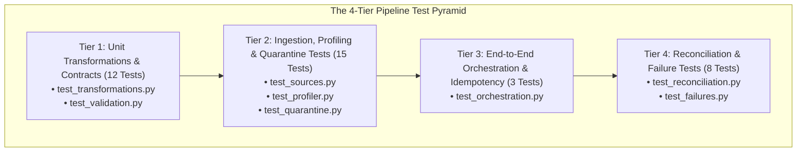

# Week 2 Pipeline Testing Strategy & Verification Architecture

## 1. The 4-Tier Test Architecture

The test suite in `tests/pipeline/` implements a rigorous 4-tier testing pyramid:



---

## 2. Test Execution & Coverage Summary

Executing `pytest --cov=app --cov=pipeline` demonstrates:
- **Total Tests Passing**: **68 passed** (30 Week 1 backend tests + 38 Week 2 pipeline tests).
- **Test Failures**: **0 failures**.
- **Project Coverage**: **88.76%** (surpassing the 70% requirement).

```bash
pytest --cov=app --cov=pipeline --cov-report=term-missing
```

---

## 3. Coverage by Pipeline Subsystem

| Module | Statements | Coverage % |
|---|:---:|:---:|
| `pipeline/audit/audit_manager.py` | 19 | **100%** |
| `pipeline/layers/raw.py` | 16 | **100%** |
| `pipeline/layers/standardized.py` | 10 | **100%** |
| `pipeline/layers/curated.py` | 27 | **96%** |
| `pipeline/orchestration/pipeline.py` | 100 | **99%** |
| `pipeline/orchestration/incremental.py` | 39 | **90%** |
| `pipeline/profiling/profiler.py` | 91 | **99%** |
| `pipeline/quarantine/quarantine_manager.py` | 22 | **100%** |
| `pipeline/reconciliation/reconciler.py` | 28 | **100%** |
| `pipeline/schemas/contracts.py` | 37 | **100%** |
| `pipeline/sources/database_source.py` | 18 | **100%** |
| `pipeline/sources/parquet_source.py` | 16 | **94%** |
| `pipeline/transformations/standardization.py` | 68 | **100%** |
| `pipeline/transformations/windowing.py` | 10 | **100%** |
| `pipeline/transformations/joins.py` | 48 | **98%** |
| `pipeline/validation/quality_rules.py` | 90 | **90%** |
| `pipeline/validation/schema_validator.py` | 8 | **100%** |
