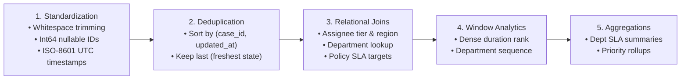

# Transformation Engine Design: Standardization, Deduplication, Joins, and Windows

## 1. Overview & Architecture

The transformation subsystem (`pipeline/transformations/`) executes 5 core transformation stages:

---

## 2. Transformation Modules

| Module | Core Function | Description |
|---|---|---|
| `standardization.py` | `standardize_case_records` | Normalizes text fields, upper-cases enums, imputes null descriptions, casts IDs to `Int64`, and parses dates to UTC `datetime64[ns, UTC]`. |
| `deduplication.py` | `deduplicate_cases` | Deterministically deduplicates cases by `case_id`, sorting by `updated_at` ascending and keeping the latest record. Returns count of duplicates removed. |
| `joins.py` | `join_case_reference_and_policies` | Enriches cases with employee details, department names, and policy SLA targets. Computes `resolution_time_hours` and `sla_breached`. |
| `windowing.py` | `apply_window_metrics` | Calculates `priority_duration_rank` (dense rank within priority) and `department_case_seq` (cumulative sequence per department). |
| `aggregation.py` | `aggregate_department_sla_summary` | Produces executive summary rollups with volume, breach counts, and SLA compliance percentages. |
