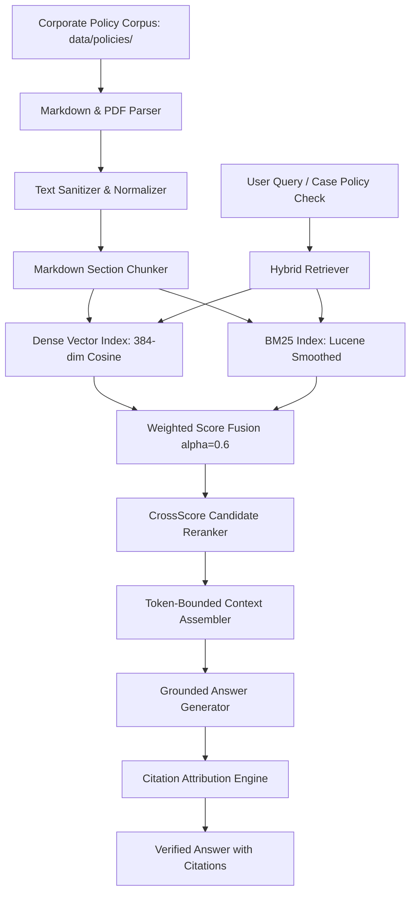

# Week 3: Grounded Policy RAG Architecture

## 1. System Overview
The Week 3 Grounded Policy RAG service is an enterprise-grade retrieval and question-answering system operating over corporate policy manuals. It couples dual dense and sparse search indices with candidate reranking, token-bounded context assembly, and zero-hallucination generation.

## 2. Component Pipeline

