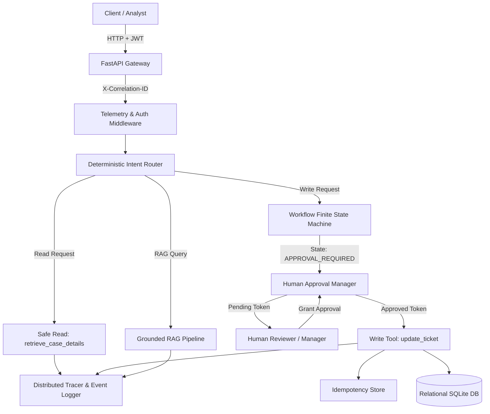

# Week 4: Controlled AI Workflow Architecture

## 1. System Overview
Week 4 extends the Case Management Platform with a deterministic, stateful AI Workflow Orchestration layer. The system moves beyond passive Question-Answering to controlled, authenticated agency with strict typed tool contracts and mandatory Human-in-the-Loop (HITL) governance.

## 2. Component Hierarchy

## 3. Core Architectural Boundaries
1. **API & Authentication Boundary:** Validates caller identity using HMAC-SHA256 JWT tokens.
2. **Deterministic Routing Boundary:** Intent is classified through validated rule-based heuristics and regex matching rather than unconstrained prompt steering.
3. **Approval Boundary:** Consequential mutations (ticket updates) can NEVER be executed unilaterally by an AI agent; an explicit cryptographic approval token signed by an authorized manager is required.
4. **Idempotency & Replay Boundary:** Replays of approved mutations return the existing cached execution output without duplicating database state transitions.
