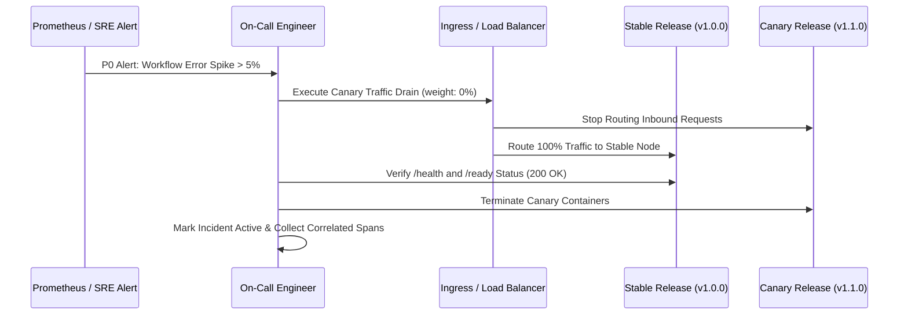

# Rollback Strategy & Emergency Procedures

## 1. Overview
When an automated workflow or agentic integration exhibits unsafe behaviors (e.g., elevated error rates, policy bypasses, downstream timeouts), rapid and deterministic rollback procedures protect system integrity.

---

## 2. Trigger Conditions for Immediate Rollback

| Metric / Symptom | Severity | Threshold | Action |
|---|---|---|---|
| **Workflow Mutation Failures** | P0 (Critical) | > 5% failure on `/api/v1/workflow/execute` within 3 min | Instant rollback to previous stable deployment |
| **RBAC / Auth Bypass Attempt** | P0 (Critical) | Any successful write without valid approval or unauthorized read | Quarantine affected nodes + rollback |
| **P99 Latency Degradation** | P1 (High) | P99 > 3.0 seconds sustained for 5 min | Traffic cutover to fallback / rollback |
| **Memory / CPU Exhaustion** | P1 (High) | Container CPU > 90% or OOM crash | Spin down canary nodes |

---

## 3. Step-by-Step Rollback Procedure



### Command Execution Runbook

1. **Step 1: Shift Ingress Traffic Back to Stable Node**
   ```bash
   # If using docker-compose / reverse proxy
   docker exec nginx nginx -s reload -c /etc/nginx/conf.d/rollback-to-stable.conf
   ```

2. **Step 2: Verify Readiness of Stable Cluster**
   ```bash
   curl -I http://localhost:8000/ready
   # Expected response: HTTP/1.1 200 OK, {"status": "ready"}
   ```

3. **Step 3: Preserve Incident Traces and Events**
   ```bash
   # Capture last 1000 workflow events from error window
   curl -s http://localhost:8000/api/v1/workflow/metrics > incident_metrics.json
   ```

4. **Step 4: Graceful Shutdown of Problematic Containers**
   ```bash
   docker stop case-management-canary
   ```
