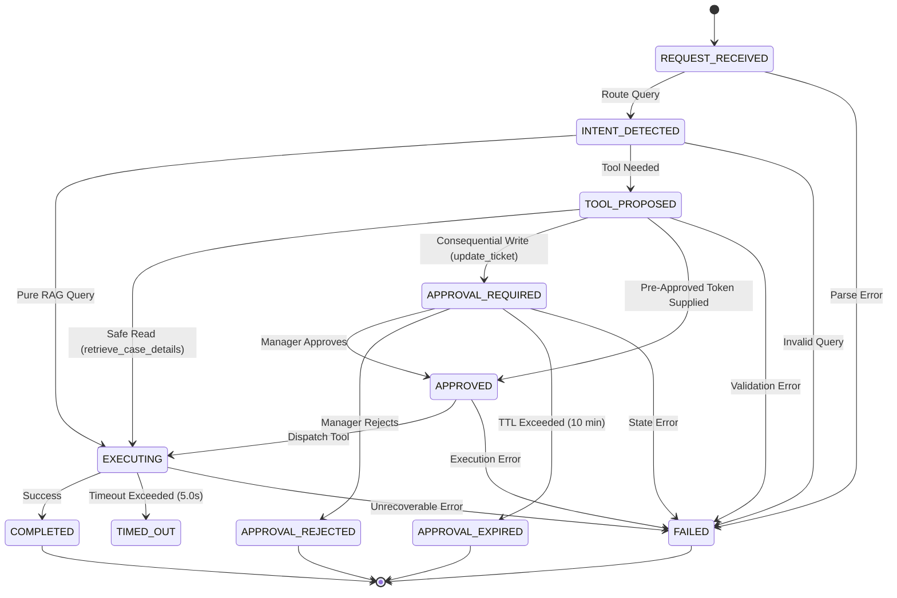

# Week 4: Workflow Orchestration & Finite State Machine

## 1. State Machine Specification
The workflow implements a finite state machine with strict, valid state transitions.

## 2. State Validation & Context Model
State is tracked in `WorkflowContext` (defined in `workflow/state.py`) including:
- `request_id` (e.g. `req_abc123`)
- `correlation_id` (e.g. `corr_xyz789`)
- `username` and `user_role`
- `current_state` and `state_history` with transition timestamps and reasons
- `selected_tool` and `tool_arguments`
- `approval_id` and `approval_status`
- `tool_result` and `error`
