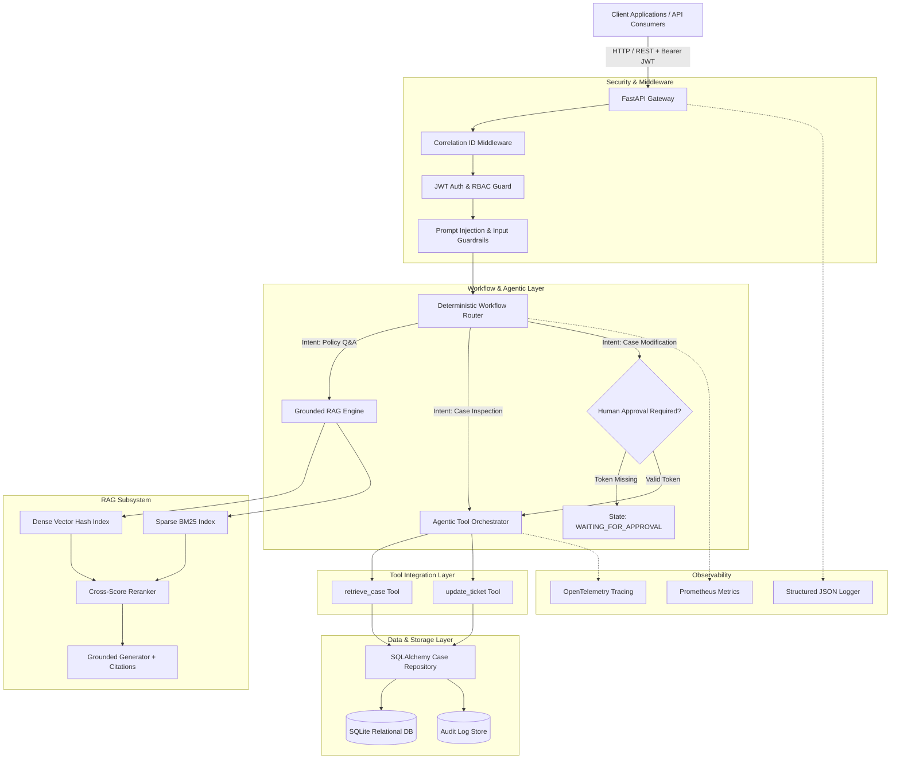

# System Component Diagram

The following Mermaid diagram details the high-level architecture of the Enterprise Case Management Platform, depicting interactions between clients, security middleware, domain services, RAG, agentic tools, and persistent storage.

