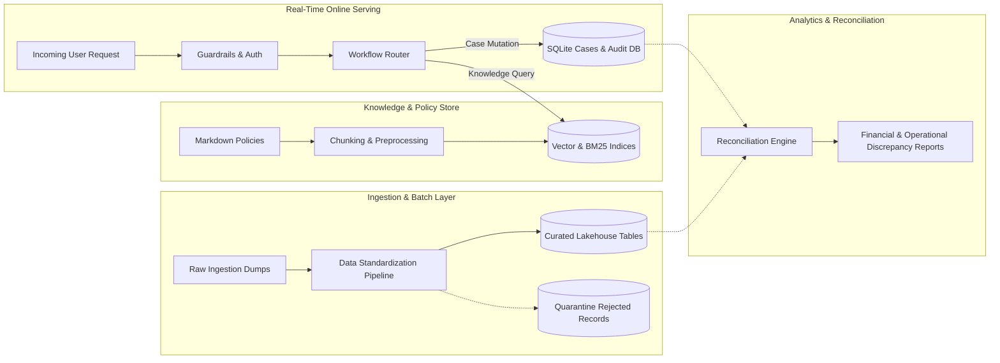

# System Data Flow Diagram

```mermaid
graph LR
    subgraph Ingestion & Batch Layer
        RawDump[Raw Ingestion Dumps] --> CleanPipe[Data Standardization Pipeline]
        CleanPipe --> MedallionCurated[(Curated Lakehouse Tables)]
        CleanPipe -.-> Rejected[(Quarantine Rejected Records)]
    end

    subgraph Knowledge & Policy Store
        PolicyMD[Markdown Policies] --> IngestChunk[Chunking & Preprocessing]
        IngestChunk --> HybridIndex[(Vector & BM25 Indices)]
    end

    subgraph Real-Time Online Serving
        UserReq[Incoming User Request] --> Guardrails[Guardrails & Auth]
        Guardrails --> Router[Workflow Router]
        Router -->|Knowledge Query| HybridIndex
        Router -->|Case Mutation| SQLiteStore[(SQLite Cases & Audit DB)]
    end

    subgraph Analytics & Reconciliation
        SQLiteStore -.-> ReconJob[Reconciliation Engine]
        MedallionCurated -.-> ReconJob
        ReconJob --> ReconReport[Financial & Operational Discrepancy Reports]
    end
```
