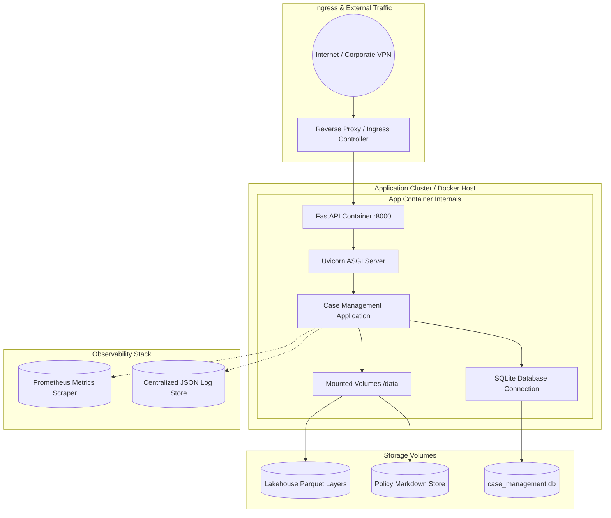

# Deployment Architecture Diagram

```mermaid
graph TD
    subgraph Ingress & External Traffic
        Internet((Internet / Corporate VPN)) --> Ingress[Reverse Proxy / Ingress Controller]
    end

    subgraph Application Cluster / Docker Host
        Ingress --> AppContainer[FastAPI Container :8000]
        
        subgraph App Container Internals
            AppContainer --> Uvicorn[Uvicorn ASGI Server]
            Uvicorn --> AppEngine[Case Management Application]
            AppEngine --> FileMount[Mounted Volumes /data]
            AppEngine --> DBEngine[SQLite Database Connection]
        end
    end

    subgraph Storage Volumes
        FileMount --> LakehouseData[(Lakehouse Parquet Layers)]
        FileMount --> PolicyDocs[(Policy Markdown Store)]
        DBEngine --> SQLiteFile[(case_management.db)]
    end

    subgraph Observability Stack
        AppEngine -.-> Prometheus[(Prometheus Metrics Scraper)]
        AppEngine -.-> LogStore[(Centralized JSON Log Store)]
    end
```
