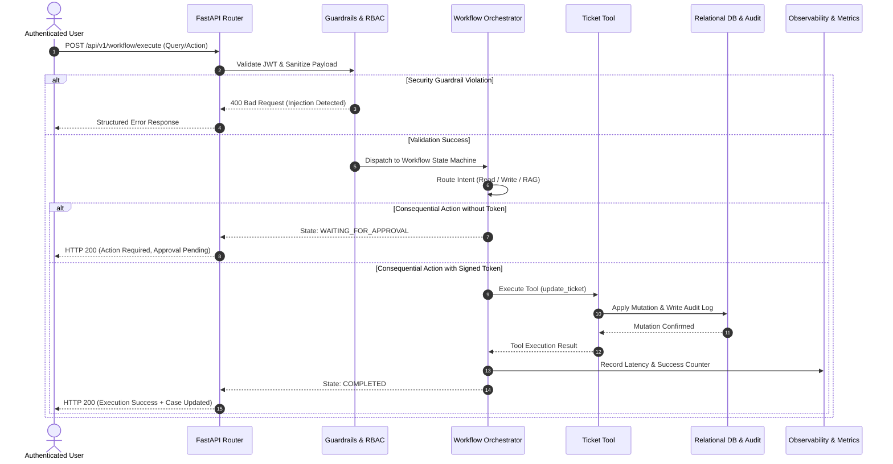
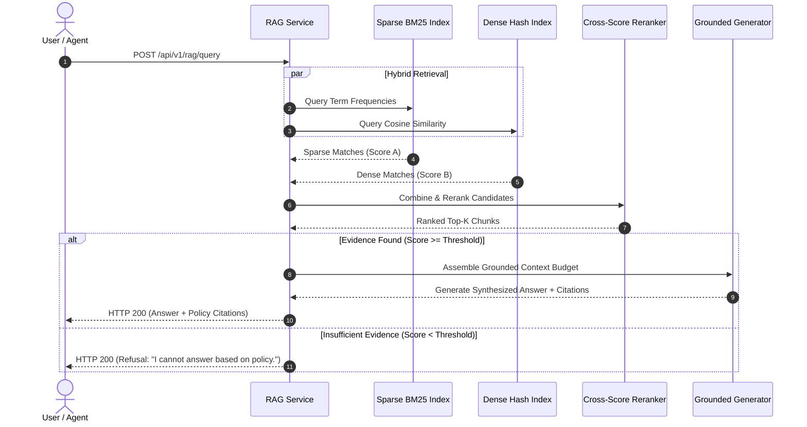
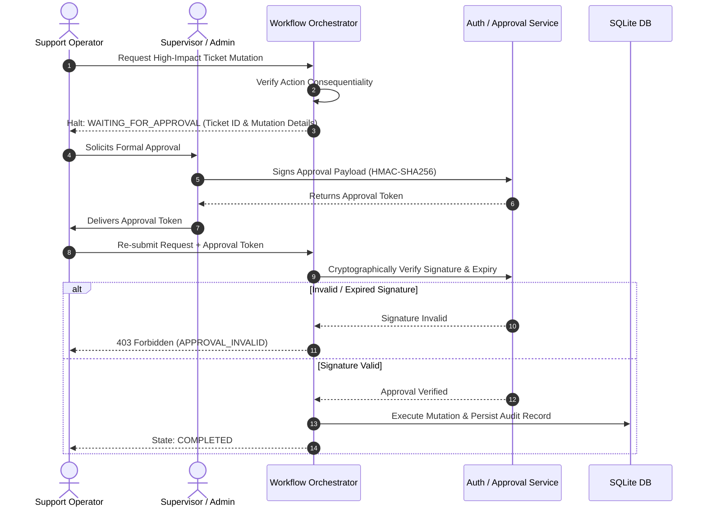

# System Sequence Diagrams

## 1. End-to-End User Journey Sequence Diagram

```mermaid
sequenceDiagram
    autonumber
    actor User as Authenticated User
    participant API as FastAPI Router
    participant Sec as Guardrails & RBAC
    participant WF as Workflow Orchestrator
    participant Tool as Ticket Tool
    participant DB as Relational DB & Audit
    participant Obs as Observability & Metrics

    User->>API: POST /api/v1/workflow/execute (Query/Action)
    API->>Sec: Validate JWT & Sanitize Payload
    alt Security Guardrail Violation
        Sec-->>API: 400 Bad Request (Injection Detected)
        API-->>User: Structured Error Response
    else Validation Success
        Sec->>WF: Dispatch to Workflow State Machine
        WF->>WF: Route Intent (Read / Write / RAG)
        alt Consequential Action without Token
            WF-->>API: State: WAITING_FOR_APPROVAL
            API-->>User: HTTP 200 (Action Required, Approval Pending)
        else Consequential Action with Signed Token
            WF->>Tool: Execute Tool (update_ticket)
            Tool->>DB: Apply Mutation & Write Audit Log
            DB-->>Tool: Mutation Confirmed
            Tool-->>WF: Tool Execution Result
            WF->>Obs: Record Latency & Success Counter
            WF-->>API: State: COMPLETED
            API-->>User: HTTP 200 (Execution Success + Case Updated)
        end
    end
```

## 2. RAG Policy Query Sequence Diagram

```mermaid
sequenceDiagram
    autonumber
    actor User as User / Agent
    participant RAG as RAG Service
    participant BM25 as Sparse BM25 Index
    participant Vec as Dense Hash Index
    participant RR as Cross-Score Reranker
    participant Gen as Grounded Generator

    User->>RAG: POST /api/v1/rag/query
    par Hybrid Retrieval
        RAG->>BM25: Query Term Frequencies
        RAG->>Vec: Query Cosine Similarity
    end
    BM25-->>RAG: Sparse Matches (Score A)
    Vec-->>RAG: Dense Matches (Score B)
    RAG->>RR: Combine & Rerank Candidates
    RR-->>RAG: Ranked Top-K Chunks
    alt Evidence Found (Score >= Threshold)
        RAG->>Gen: Assemble Grounded Context Budget
        Gen-->>RAG: Generate Synthesized Answer + Citations
        RAG-->>User: HTTP 200 (Answer + Policy Citations)
    else Insufficient Evidence (Score < Threshold)
        RAG-->>User: HTTP 200 (Refusal: "I cannot answer based on policy.")
    end
```

## 3. Human-in-the-Loop (HITL) Approval Sequence Diagram

```mermaid
sequenceDiagram
    autonumber
    actor Operator as Support Operator
    actor Supervisor as Supervisor / Admin
    participant WF as Workflow Orchestrator
    participant Auth as Auth / Approval Service
    participant DB as SQLite DB

    Operator->>WF: Request High-Impact Ticket Mutation
    WF->>WF: Verify Action Consequentiality
    WF-->>Operator: Halt: WAITING_FOR_APPROVAL (Ticket ID & Mutation Details)
    Operator->>Supervisor: Solicits Formal Approval
    Supervisor->>Auth: Signs Approval Payload (HMAC-SHA256)
    Auth-->>Supervisor: Returns Approval Token
    Supervisor->>Operator: Delivers Approval Token
    Operator->>WF: Re-submit Request + Approval Token
    WF->>Auth: Cryptographically Verify Signature & Expiry
    alt Invalid / Expired Signature
        Auth-->>WF: Signature Invalid
        WF-->>Operator: 403 Forbidden (APPROVAL_INVALID)
    else Signature Valid
        Auth-->>WF: Approval Verified
        WF->>DB: Execute Mutation & Persist Audit Record
        WF-->>Operator: State: COMPLETED
    end
```
