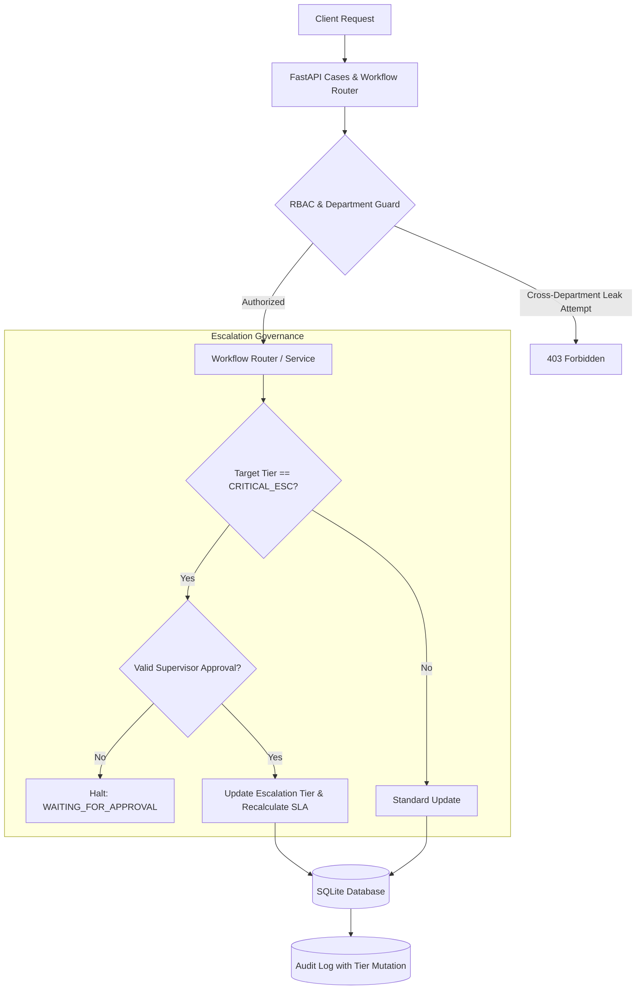

# Updated Architecture (Post-Scope-Change)

## Component Interaction Flow

```mermaid
graph TD
    Client[Client Request] --> API[FastAPI Cases & Workflow Router]
    API --> RBAC{RBAC & Department Guard}
    RBAC -->|Cross-Department Leak Attempt| Reject[403 Forbidden]
    RBAC -->|Authorized| Router[Workflow Router / Service]
    
    subgraph Escalation Governance
        Router --> EscCheck{Target Tier == CRITICAL_ESC?}
        EscCheck -->|Yes| TokenCheck{Valid Supervisor Approval?}
        TokenCheck -->|No| Halt[Halt: WAITING_FOR_APPROVAL]
        TokenCheck -->|Yes| ApplyEsc[Update Escalation Tier & Recalculate SLA]
        EscCheck -->|No| StandardUpdate[Standard Update]
    end

    ApplyEsc --> DB[(SQLite Database)]
    StandardUpdate --> DB
    DB --> Audit[(Audit Log with Tier Mutation)]
```
