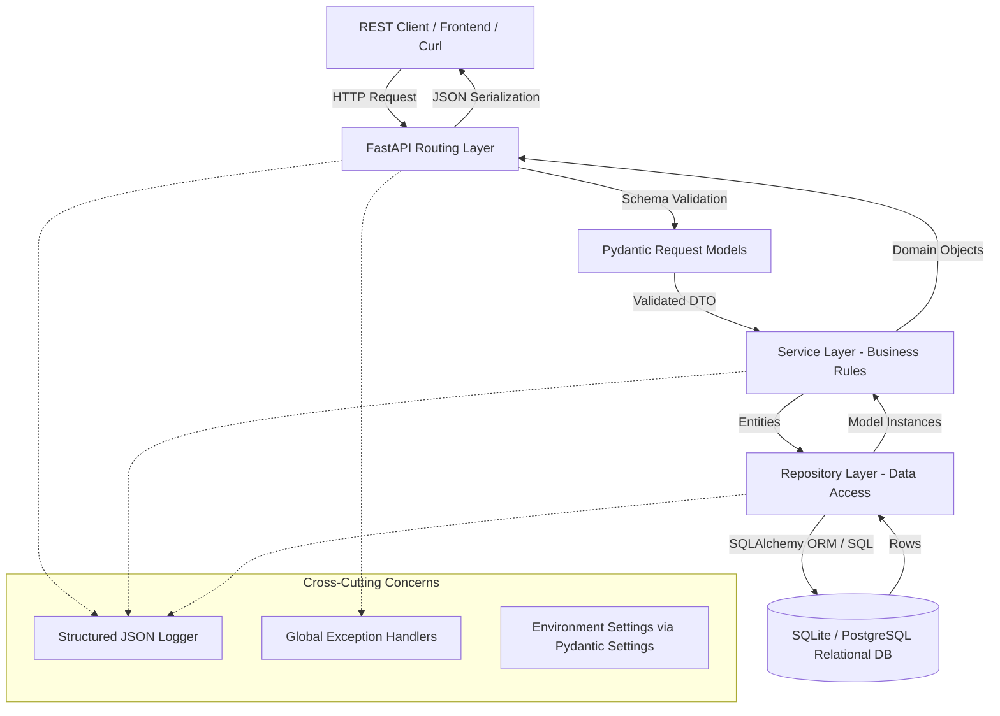

# Module 00: Week 1 Curriculum & System Overview

## 1. What It Is
Week 1 of the Forward Deployed Engineering (FDE) Readiness Program establishes the core foundation of production backend engineering: constructing a modular, testable Python backend with a normalized relational database layer and REST interfaces, adhering to professional source-control and test-driven workflows.

## 2. Why It Exists
In enterprise and forward-deployed AI solutions, machine learning models and intelligent workflows cannot run in a vacuum. They require deterministic, resilient, observable, and secured enterprise backends to manage state, enforce business logic, interface with relational data systems, validate inputs, and provide auditable APIs. If the foundational backend is fragile or tightly coupled, any AI layer built on top will fail in production.

## 3. Why Backend Engineers Use It
Enterprise engineering teams rely on:
- **Modular architecture** to allow teams to build and scale services concurrently without merge conflicts or code spaghetti.
- **Relational databases** with ACID guarantees to prevent corruption of critical financial, case, or operational data.
- **RESTful APIs with OpenAPI specifications** to provide unambiguous contracts to frontend clients, mobile devices, and automated tool-calling agents.
- **Automated test suites (pytest)** and **structured logging (JSON)** to catch regressions before deployment and debug incidents within seconds in production.

## 4. How It Works
The Week 1 system functions as an integrated pipeline:

## 5. Important Terminology
- **FDE (Forward Deployed Engineer)**: An engineer who bridges the gap between core product software, high-level client business problems, and production deployment environments.
- **ACID**: Atomicity, Consistency, Isolation, Durability — the four guarantees of relational database transactions.
- **DTO (Data Transfer Object)**: An object carrying data between processes/layers (represented by Pydantic schemas in this project).
- **Separation of Concerns (SoC)**: A design principle separating a software application into distinct sections, where each section addresses a separate concern.
- **Contract-First / Schema-Driven API**: An approach where API inputs, outputs, and status codes are formally defined and strictly validated.

## 6. How It Connects to the Week 1 Project
In our `case-management-backend` project:
- The core business domain is **Enterprise Case Management** (tickets, issues, incident reports).
- The REST API is implemented in [app/api/routes/cases.py](file:///d:/week1_kpmg/case-management-backend/app/api/routes/cases.py).
- Domain rules are encapsulated in [app/services/case_service.py](file:///d:/week1_kpmg/case-management-backend/app/services/case_service.py).
- Persistence is handled in [app/repositories/case_repository.py](file:///d:/week1_kpmg/case-management-backend/app/repositories/case_repository.py).
- The relational data layer is modeled in [app/models/case.py](file:///d:/week1_kpmg/case-management-backend/app/models/case.py) and defined in [sql/schema.sql](file:///d:/week1_kpmg/case-management-backend/sql/schema.sql).

## 7. Week 1 Roadmap & Module Map
| Module # | Topic | Primary Deliverable / Code Target |
|---|---|---|
| **01** | FDE Solution Anatomy | System architecture & 5-tier layer boundaries |
| **02** | Git & Version Control | Feature-branch workflow, merge conflicts, PRs |
| **03-07** | Python Modular Engineering | Packages, type hints, configuration, exceptions, structured logging |
| **08-12** | Testing & Quality Assurance | pytest, unit testing, fixtures, mocking, coverage |
| **13-18** | Relational Databases & SQL | Normalization, joins, CTEs, window functions, ACID transactions |
| **19-24** | REST APIs & FastAPI | HTTP methods, status codes, Pydantic validation, OpenAPI, error contracts |
| **25-26** | Documentation & Debugging | Technical documentation, systematic root cause analysis |

## 8. Short Self-Test
1. What is the fundamental difference between an ORM model and a Pydantic schema in our backend architecture?
2. Why is a monolithic `main.py` considered an anti-pattern in professional engineering?
3. Which layer in our architecture is allowed to directly issue database queries?
*(Answers: 1. ORM models represent database table storage; Pydantic schemas represent HTTP request/response validation contracts. 2. A monolithic file couples routing, business logic, and SQL, making concurrent development and unit testing impossible. 3. Only the Repository layer.)*
