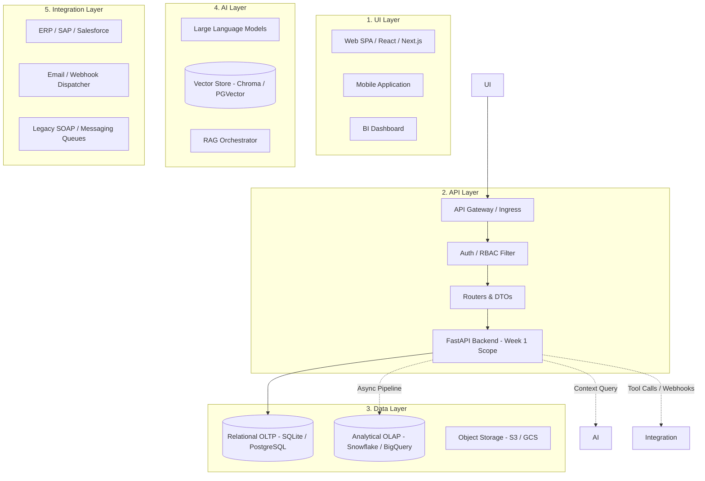

# Module 01: FDE Solution Anatomy — The 5 Architectural Layers

## 1. What It Is
An **FDE Solution Anatomy** is the standard multi-tier enterprise architecture pattern used by Forward Deployed Engineers to deliver scalable, secure, and maintainable systems. It partitions a complex software solution into five distinct operational tiers:
1. **UI Layer** (User Interface)
2. **API Layer** (Application Programming Interface & Gateway)
3. **Data Layer** (Relational, Analytical, and Unstructured Storage)
4. **AI Layer** (Models, Retrieval Augmented Generation, Agents)
5. **Integration Layer** (Third-party connectors, Enterprise Service Buses, Legacy APIs)

## 2. Why It Exists
Enterprises suffer from "monolithic collapse" when business logic, database queries, web rendering, and machine learning models are mixed inside a single application. If an AI model latency spikes, the UI crashes; if the database schema evolves, the client interface breaks. Layered architectures enforce strict boundaries, allowing each layer to scale, evolve, and be tested independently.

## 3. Why Backend Engineers Use It
- **Independent Scalability**: You can scale the compute-heavy API layer across 20 containers while the database runs on a dedicated high-memory cluster.
- **Security Boundaries**: Frontend users never connect directly to the database. The API acts as a secure gatekeeper enforcing authentication, rate-limiting, and input sanitization.
- **Contract Decoupling**: Frontend teams can develop mock UIs using an OpenAPI specification before the backend database migrations are even written.

## 4. How It Works: Architectural Overview



### Layer Responsibilities and Boundaries

| Layer | Responsibility | Input | Output | Technology Examples |
|---|---|---|---|---|
| **UI** | Visual rendering, user interaction, client state | User input (clicks, keyboard) | Visual DOM, HTTP calls | React, Vue, Flutter, HTML/CSS |
| **API** | Request validation, auth, orchestration, serialization | HTTP / gRPC requests | HTTP status codes, JSON/XML | FastAPI, Express, Spring Boot |
| **Data** | ACID durability, relational queries, indexing, storage | SQL queries, transactions | Result tuples, rows, documents | PostgreSQL, SQLite, Redis |
| **AI** | Semantic reasoning, text synthesis, embeddings, RAG | Natural language prompts, context | Embeddings, generated text | OpenAI, PyTorch, vLLM, LangChain |
| **Integration** | Connecting disparate internal/external third-party systems | Event messages, webhooks | Transformed payload envelopes | Kafka, Celery, REST adapters |

## 5. Where the Week 1 Backend Fits
**Week 1 lives directly in the intersection of the API Layer and the Relational Data Layer.**
- It implements the core transaction-processing engine (OLTP) for Case Management.
- It exposes a typed, documented REST interface using **FastAPI**.
- It persists state to a normalized relational database using **SQLAlchemy** and **SQLite**.

### How Week 1 Prepares for Later Weeks (Weeks 2–5):
- *Week 2 (Data Pipelines)* will ingest batch files into the case tables designed in Week 1.
- *Week 3 (Grounded RAG)* will index policy manuals to answer inquiries related to Week 1 cases.
- *Week 4 (AI Tool Integration)* will transform the Week 1 `GET /cases/{id}` and `PUT /cases/{id}` endpoints into typed agent tools with human-in-the-loop approvals.
- *Week 5 (Deployment & Hardening)* will package this entire integrated solution for client delivery.

## 6. Real Backend Example: The Case Creation Request Flow
1. **User Action**: A customer support agent enters a ticket into a frontend portal (UI Layer).
2. **HTTP Transmission**: The browser sends `POST /api/v1/cases` with a JSON payload to the API Layer.
3. **API Validation**: FastAPI and Pydantic inspect the payload. If `title` is missing, the request is stopped immediately at the boundary with HTTP 422.
4. **Service Orchestration**: `CaseService.create_case` verifies business logic: Does the user who opened this ticket exist in the database?
5. **Data Persistence**: `CaseRepository` generates an `INSERT INTO cases ...` statement within an ACID transaction.
6. **Integration / AI (Future)**: In later phases, a webhook might notify an external ticketing system or trigger an AI triage agent.
7. **Response**: HTTP 201 Created is returned with the persisted Case JSON object.

## 7. Common Mistakes & Anti-Patterns
- **The "God Component" Anti-Pattern**: Writing SQL queries directly inside React components or FastAPI route handlers.
- **Leaking Data Models into the UI**: Exposing raw database columns (like internal integer IDs, deleted flags, or password hashes) directly to clients without DTO abstraction.
- **Coupling AI Directly to Database**: Allowing an LLM direct, unfiltered SQL read/write access to production transactional tables without validation barriers.

## 8. Good vs. Bad Practices
- **BAD**:
  ```python
  # Route handler doing EVERYTHING: parsing, SQL, logic, formatting
  @app.post("/cases")
  def create_case(request: dict):
      conn = sqlite3.connect("prod.db")
      conn.execute(f"INSERT INTO cases VALUES ('{request['title']}')") # SQL Injection vulnerability!
      return {"ok": True}
  ```
- **GOOD**:
  ```python
  # Clean boundary separation: Router handles HTTP -> Service handles rules -> Repo handles SQL
  @router.post("/cases", response_model=CaseResponse, status_code=201)
  def create_case(case_in: CaseCreate, db: Session = Depends(get_db)):
      return case_service.create_case(db, case_in)
  ```

## 9. Practical Exercises
1. Trace the directory structure of `case-management-backend/app/` and map each subdirectory (`api/`, `services/`, `repositories/`, `models/`, `database/`) to one of the architectural layers.
2. Identify which file enforces the boundary between the API Layer and the Data Layer. *(Answer: `app/repositories/case_repository.py` and `app/schemas/case.py`)*.

## 10. Interview Questions & Model Answers
**Q: Why do we separate the API Layer from the Data Layer using Repositories rather than writing queries in routes?**
*Answer:* Writing database queries directly in route handlers tightly couples HTTP request lifecycle to database storage technology. By abstracting queries into a Repository layer: (1) we can test business logic with mocks without needing a running database; (2) we can change the underlying database or ORM without rewriting HTTP endpoints; and (3) we prevent database connection leaks by centralizing transaction management.

## 11. Short Self-Test
1. True or False: In a well-designed FDE solution, the UI layer communicates directly with the Relational Data Layer via SQL over WebSockets. *(False — UI communicates only via API contracts).*
2. Which layer is responsible for enforcing that a title must be between 1 and 255 characters? *(The API / Schema validation layer).*
