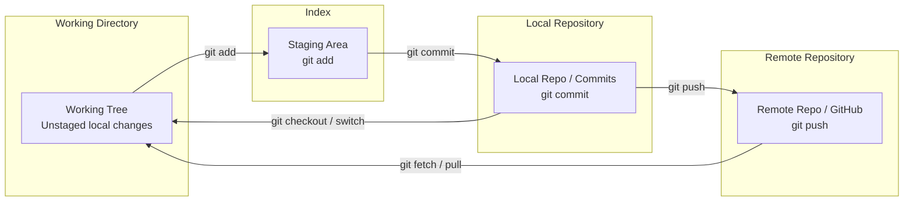

# Module 02: Git Version Control & Source Control Discipline

## 1. What It Is
**Git** is a distributed version control system (VCS) that tracks changes in source code over time. Unlike centralized systems (SVN), every developer's local Git repository contains the full cryptographic commit history, enabling offline branching, staging, history rewriting, and cryptographic integrity verification.

## 2. Why It Exists
In multi-developer enterprise engineering:
- Multiple engineers modify the same codebase simultaneously without overwriting each other's work.
- Every modification is attributed to an author with an explanation (commit message) and timestamp.
- Software releases can be tagged, branched, or safely rolled back within seconds if a bug reaches production.

## 3. Why Backend Engineers Use It
- **Code Review & Pull Requests**: Enables QA review, automated CI/CD checks (linting, tests), and senior engineer sign-off before code reaches the `main` branch.
- **Auditing & Compliance**: Enterprise compliance standards (e.g., SOC 2, ISO 27001) mandate that every change deployed to production be traceable to an approved pull request and verified commit hash.
- **Experimentation without Risk**: Feature branches allow developers to spike new database architectures or APIs without destabilizing the stable development branch.

## 4. How It Works: The Three Trees of Git



1. **Working Tree**: Your actual files on disk that you edit with your IDE.
2. **Staging Area (Index)**: A staging buffer where you curate changes before permanently committing them.
3. **Commit History (HEAD)**: Immutable snapshot graph linked by SHA-1/SHA-256 hashes.

## 5. Important Terminology
- **Commit**: An immutable snapshot of the entire project at a point in time, pointing to its parent commit(s).
- **Branch**: A lightweight, movable pointer to a specific commit.
- **HEAD**: A symbolic reference pointing to the currently checked-out branch or commit.
- **Merge**: Combining the changes from one branch into another.
- **Merge Conflict**: A situation where Git cannot automatically reconcile differing edits to the same lines in the same file.
- **Pull Request (PR) / Merge Request**: A mechanism to propose changes, conduct code review, and run automated tests before merging into a target branch.
- **.gitignore**: A configuration file instructing Git which files, directories, and sensitive patterns to never track.

## 6. Conventional Commits & Branch Naming Standards

### Branch Naming Convention:
Format: `<type>/<ticket-id>-<short-description>`
- `feature/CM-101-create-case-api`
- `bugfix/CM-102-fix-status-transition-closed`
- `refactor/CM-103-isolate-user-repository`
- `test/CM-104-add-coverage-edge-cases`
- `docs/CM-105-update-api-specification`

### Commit Message Format (Conventional Commits):
```text
<type>(<scope>): <short imperative description>

[optional body explaining WHY this change was made]

[optional footer: Closes #123]
```

Examples:
- `feat(api): implement POST /api/v1/cases with Pydantic validation`
- `fix(services): prevent status transitions on CLOSED cases`
- `test(unit): add mock tests for CaseService user validation`
- `docs(readme): add step-by-step clean setup instructions`

## 7. Common Git Commands Cheat Sheet

| Command | Purpose |
|---|---|
| `git status` | Show current branch, staged, unstaged, and untracked files |
| `git add <file>` | Move changes from working directory to the staging area |
| `git add -p` | Interactively stage specific hunks/lines of code |
| `git commit -m "..."` | Record staged changes as a new commit snapshot |
| `git checkout -b <name>` | Create and switch to a new branch |
| `git branch -v` | List local branches and their latest commit hash |
| `git merge <branch>` | Merge specified branch into the currently active branch |
| `git log --oneline --graph --all` | Visualize commit graph across all branches |
| `git diff` | View unstaged changes; `git diff --staged` views staged changes |
| `git stash` / `git stash pop` | Temporarily shelve uncommitted work to switch branches cleanly |

## 8. Common Mistakes & Troubleshooting
- **Mistake 1: Committing secrets or `.env` files.**
  - *Fix*: Immediately add `.env` to `.gitignore`. If already committed, remove from cache with `git rm --cached .env` and commit.
- **Mistake 2: The Mega-Commit (`git add . && git commit -m "updates"`).**
  - *Problem*: Makes code reviews impossible and bisecting bugs extremely painful.
  - *Fix*: Break commits down into atomic, logical units (one commit per logical change).
- **Mistake 3: Detached HEAD state.**
  - *Cause*: Checking out a commit hash directly (`git checkout a1b2c3d`) instead of a branch.
  - *Fix*: Return to your branch using `git switch main` or create a new branch from here with `git switch -c new-branch`.

## 9. How It Connects to the Week 1 Project
Our project repository demonstrates:
- A clean `.gitignore` excluding Python caches, virtual environments, `.env` files, and SQLite database binaries.
- Feature branches (`feat/case-backend-core`) merged cleanly into `main`.
- Clean, semantic, conventional commit history tracing the evolution from skeleton to tested service.

## 10. Practical Exercises
Follow the hands-on lab in [learning/git-lab.md](file:///d:/week1_kpmg/case-management-backend/learning/git-lab.md) to practice branching, committing, creating a deliberate merge conflict, resolving it, and inspecting the resulting Git DAG (Directed Acyclic Graph).

## 11. Interview Questions & Model Answers
**Q: What is the difference between `git merge` and `git rebase`?**
*Answer:* `git merge` creates a new "merge commit" combining two branches, preserving the exact chronological history and branch topology. `git rebase` rewrites history by moving the base of your branch onto the tip of another, producing a linear commit history. Teams typically use rebase for local feature branches before merging, and merge (or squash merge) when integrating into shared protected branches like `main`.

## 12. Short Self-Test
1. Which command un-stages a file from the staging area without discarding local changes? *(Answer: `git restore --staged <file>`)*
2. What file should always be created before any code is written to prevent committing temporary SQLite database files or `.env` secrets? *(Answer: `.gitignore`)*
