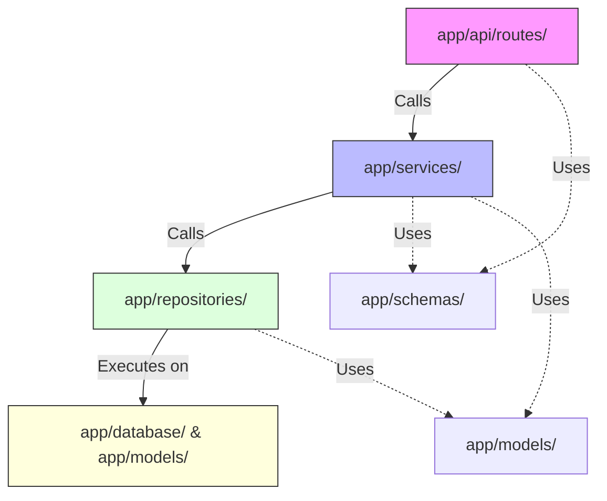

# Module 03: Python Modular Engineering & Separation of Concerns

## 1. What It Is
**Modular engineering** in Python is the practice of organizing code into distinct, single-responsibility files (**modules**) and directories containing `__init__.py` files (**packages**). It enforces clean separation of concerns: routing, business domain logic, data models, persistence, configuration, and infrastructure are strictly partitioned.

## 2. Why It Exists
Novice developers frequently place their entire application inside one monolithic script (e.g. `main.py` or a Jupyter notebook). While this works for tiny 50-line prototypes, it collapses in production:
- **Merge Hell**: Ten engineers trying to edit the same 3,000-line `main.py` create endless merge conflicts.
- **Untestability**: You cannot unit-test business rules without spinning up a live HTTP server and live database.
- **Circular Imports**: When file A imports file B and file B imports file A, Python crashes at startup with `ImportError`.
- **Cognitive Overload**: Developers cannot understand the system without reading thousands of lines of unrelated concerns.

## 3. Why Backend Engineers Use It
Enterprise backends use layered modularity to enforce **Single Responsibility Principle (SRP)** and **Dependency Inversion**:
- The HTTP layer knows *nothing* about how rows are stored in SQLite.
- The business logic layer knows *nothing* about HTTP status codes or FastAPI request objects.
- The database repository knows *nothing* about validation error messages sent to web browsers.

## 4. Architectural Comparison: Anti-Pattern vs. Enterprise Standard

### The Anti-Pattern: The God `main.py` (BAD)
```text
my_project/
└── main.py   <-- Contains database connection, SQL strings, FastAPI routes,
                  Pydantic schemas, password hashing, and logging setup!
```

**Why it fails**:
- Route functions directly contain raw SQL `SELECT * FROM cases`.
- If you switch from SQLite to PostgreSQL, you have to edit every single route.
- You cannot write a unit test for business logic without triggering live database writes.

### The Enterprise Architecture: Layered Packages (GOOD)
As implemented in our [app/](file:///d:/week1_kpmg/case-management-backend/app/) directory:

```text
app/
├── __init__.py               # Marks app as a Python package
├── main.py                   # Pure application startup & router assembly
├── config.py                 # Pydantic Settings & environment variables
├── logging_config.py         # Structured JSON logging formatter
├── api/                      # Presentation Layer (HTTP controllers)
│   ├── __init__.py
│   └── routes/
│       ├── __init__.py
│       └── cases.py          # FastAPI endpoint declarations & status codes
├── schemas/                  # Data Transfer Objects (DTOs)
│   ├── __init__.py
│   └── case.py               # Pydantic input/output validation models
├── models/                   # Relational Persistence Layer
│   ├── __init__.py
│   └── case.py               # SQLAlchemy ORM table definitions
├── services/                 # Domain / Business Logic Layer
│   ├── __init__.py
│   └── case.py               # Business rules, validation, workflow state
├── repositories/             # Data Access Layer (DAL)
│   ├── __init__.py
│   └── case_repository.py    # Isolated database queries & transactions
├── database/                 # Infrastructure
│   ├── __init__.py
│   └── session.py            # SQLAlchemy Engine & SessionLocal provider
└── exceptions/               # Domain Error Hierarchy
    ├── __init__.py           # Custom exception definitions
    └── handlers.py           # Global HTTP exception-to-JSON handlers
```

## 5. Dependency Direction Rule


**Strict Rule of Dependency Direction**:
- High-level modules (Routes) depend on mid-level modules (Services).
- Mid-level modules (Services) depend on low-level data access (Repositories).
- **Dependencies NEVER point backwards**: Repositories NEVER import from Routes or Services.
- Routes NEVER talk directly to the Database or Repositories.

## 6. How Modules and Packages Work in Python
- A **Module** is any Python file (`case_service.py`). You import symbols with:
  ```python
  from app.services.case_service import CaseService
  ```
- A **Package** is a folder containing an `__init__.py` file. It allows relative and absolute namespace navigation across subpackages.
- The `__init__.py` file can be empty, or it can expose a clean public API:
  ```python
  # app/exceptions/__init__.py
  from app.exceptions.base import AppError, CaseNotFoundError, ValidationError

  __all__ = ["AppError", "CaseNotFoundError", "ValidationError"]
  ```

## 7. Real Backend Example from the Project
Notice how [app/api/routes/cases.py](file:///d:/week1_kpmg/case-management-backend/app/api/routes/cases.py) is completely free of SQL:

```python
@router.post("/cases", response_model=CaseResponse, status_code=201)
def create_case(
    case_data: CaseCreate,
    db: Session = Depends(get_db),
) -> CaseResponse:
    # 1. Route handler is only 3 lines!
    # 2. It does not parse JSON manually (Pydantic does it)
    # 3. It does not check user existence (Service does it)
    # 4. It does not write SQL (Repository does it)
    case = case_service.create_case(db, case_data)
    return CaseResponse.model_validate(case)
```

And look at [app/services/case_service.py](file:///d:/week1_kpmg/case-management-backend/app/services/case_service.py):
```python
def create_case(self, db: Session, case_data: CaseCreate) -> Case:
    # Business logic: verify user exists before allowing case creation
    self.user_repo.get_by_id(db, case_data.created_by)
    
    case = Case(
        title=case_data.title,
        description=case_data.description,
        created_by=case_data.created_by,
        status=CaseStatus.OPEN,
    )
    return self.case_repo.create(db, case)
```

## 8. Common Mistakes
1. **Importing the database session inside routes directly**: This bypasses FastAPI's dependency injection and prevents test mocking.
2. **Circular imports**: Module A imports Module B, while Module B imports Module A at top level.
   - *Fix*: Keep models and schemas separated, and import inside functions if necessary.
3. **Using relative imports (`from ..models import Case`) everywhere**: Prefer clean absolute imports (`from app.models.case import Case`) based on the root package.

## 9. Practical Exercises
1. Open [app/main.py](file:///d:/week1_kpmg/case-management-backend/app/main.py). Count how many lines of business logic are in it. *(Answer: 0 lines; it only configures the app and attaches routers).*
2. Create a new service method in `app/services/case_service.py` that calculates the elapsed hours since a case was created. Does this require modifying the database repository? Why or why not?

## 10. Interview Questions & Model Answers
**Q: What is the difference between a Python module and a Python package?**
*Answer:* A module is a single Python file (`.py`) containing executable code, classes, and functions. A package is a directory that contains an `__init__.py` file (or namespace directory in PEP 420) and one or more modules or subpackages, providing hierarchical namespace management.

## 11. Short Self-Test
1. Why should route handlers never execute `db.execute("SELECT ...")` directly?
2. What is the role of `__all__` in a package's `__init__.py`?
*(Answers: 1. It violates separation of concerns, couples HTTP endpoints to SQL syntax, and prevents mocking in unit tests. 2. It explicitly defines which public symbols are exported when someone runs `from package import *`.)*
