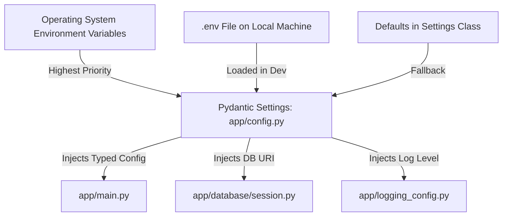

# Module 05: Application Configuration & Environment Separation

## 1. What It Is
**Configuration management** is the discipline of externalizing all operational settings, credentials, endpoints, and feature flags from application source code into the execution environment. It implements Factor III ("Config: Store config in the environment") of the industry-standard **Twelve-Factor App** methodology.

## 2. Why It Exists
Hardcoding configuration inside source code leads to catastrophic outcomes:
- **Security Breaches**: Hardcoded passwords, API keys, or private database URIs committed to Git repositories lead to automated credential theft by scrapers within minutes.
- **Environment Rigidity**: If `DATABASE_URL = "sqlite:///./dev.db"` is written in code, you cannot deploy that exact same container image to staging or production without rebuilding and editing code.
- **Deployment Downtime**: Changing a database host requires code modification, testing, committing, and a full redeployment instead of a simple environment variable update.

## 3. Why Backend Engineers Use It
- **Zero-Secret Codebases**: Source code can be made public or shared across internal teams with zero risk because no secrets exist in the repository.
- **Parity Across Environments**: The same Docker image or code bundle runs seamlessly in Local Development, CI/CD Test Runners, Staging, and Production by simply injecting environment variables.
- **Strong Typing on Startup**: Using tools like `pydantic-settings` guarantees that if a required environment variable (such as `DATABASE_URL`) is missing or malformed, the application crashes immediately at startup with an informative error rather than failing hours later mid-transaction.

## 4. How It Works: The 12-Factor Configuration Hierarchy



### The Three Configuration Tiers
1. **Defaults**: Safe fallback values defined in code for non-sensitive local development (e.g., `APP_PORT=8000`, `LOG_LEVEL="DEBUG"`).
2. **`.env` File**: A local, uncommitted file containing developer-specific overrides and local secrets.
3. **Environment Variables**: System-level environment variables injected by Kubernetes, Docker, or CI/CD runners (takes precedence over `.env`).

## 5. Project Implementation: `app/config.py` and `pydantic-settings`
In our backend project, configuration is handled cleanly in [app/config.py](file:///d:/week1_kpmg/case-management-backend/app/config.py):

```python
from functools import lru_cache
from pydantic_settings import BaseSettings

class Settings(BaseSettings):
    app_name: str = "case-management-backend"
    app_version: str = "1.0.0"
    app_env: str = "development"
    app_debug: bool = True
    app_host: str = "127.0.0.1"
    app_port: int = 8000

    database_url: str = "sqlite:///./case_management.db"

    log_level: str = "DEBUG"
    log_format: str = "json"

    model_config = {
        "env_file": ".env",
        "env_file_encoding": "utf-8",
        "case_sensitive": False,
    }

@lru_cache()
def get_settings() -> Settings:
    return Settings()
```

### Why `@lru_cache()` is Critical:
Reading `.env` from disk and parsing environment variables takes I/O cycles. The `@lru_cache()` decorator memoizes the result:
- The first time `get_settings()` is called, it loads and parses the settings.
- All subsequent calls across routes, services, and middleware return the exact same cached in-memory instance instantly.

## 6. The `.env.example` Contract
To onboard new team members without exposing secrets, enterprise repositories commit an [.env.example](file:///d:/week1_kpmg/case-management-backend/.env.example) file:

```bash
# Case Management Backend — Environment Configuration
# Copy this file to .env and fill in your values.
# NEVER commit the .env file to version control.

APP_NAME=case-management-backend
APP_VERSION=1.0.0
APP_ENV=development
APP_DEBUG=true
APP_HOST=127.0.0.1
APP_PORT=8000

DATABASE_URL=sqlite:///./case_management.db
LOG_LEVEL=DEBUG
LOG_FORMAT=json
```

## 7. Common Mistakes & Anti-Patterns
1. **Committing `.env` to Git**:
   - Always verify `.env` is listed in [.gitignore](file:///d:/week1_kpmg/case-management-backend/.gitignore).
2. **Scattering `os.getenv("VARIABLE")` everywhere**:
   - Anti-pattern: Calling `os.getenv()` in 40 different files. If a variable is renamed, you must search-and-replace across the entire codebase.
   - Best practice: Centralize all variables inside `app/config.py`.
3. **Failing to validate configuration on startup**:
   - If someone sets `APP_PORT="eight-thousand"` (string instead of int), a standard `os.getenv()` won't catch it until Uvicorn crashes. Pydantic Settings catches it instantly at startup.

## 8. Practical Exercises
1. Inspect [.gitignore](file:///d:/week1_kpmg/case-management-backend/.gitignore) and confirm that `.env` is properly ignored.
2. In PowerShell, override the log level without editing any files:
   ```powershell
   $env:LOG_LEVEL="WARNING"; python -c "from app.config import get_settings; print(get_settings().log_level)"
   ```
   Notice how Pydantic dynamically picked up the environment variable!

## 9. Interview Questions & Model Answers
**Q: What is the 12-Factor App rule regarding configuration, and how do you enforce it in Python?**
*Answer:* The 12-Factor App rule states that configuration must be strictly separated from code and stored in environment variables. In Python, we enforce this using `pydantic-settings`. We define a `Settings` class inheriting from `BaseSettings`, which reads from OS environment variables and `.env` files, validates types, and injects configuration as a dependency without hardcoded credentials.

## 10. Short Self-Test
1. What should you do if an API key was accidentally committed to a public Git repository? *(Answer: Immediately revoke and rotate the key in the provider console, remove it from Git history, and update `.gitignore`).*
2. Why is `@lru_cache()` used on the `get_settings()` function? *(Answer: To prevent repeated disk file reading and environment parsing on every single HTTP request).*
