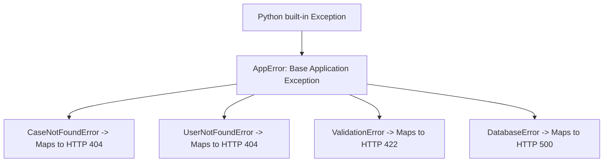

# Module 06: Python Exception Handling & Robust Error Architecture

## 1. What It Is
**Exception handling** is the mechanism by which an application responds to unexpected or exceptional runtime events (missing database records, network timeouts, invalid business operations) without crashing the server process or leaving the application state corrupted.

## 2. Why It Exists
In backend development, operations can fail for hundreds of legitimate reasons: a user queries a case ID that doesn't exist, a database connection drops, or a client sends malformed JSON. Without robust exception handling:
- The Python process crashes or hangs.
- Unhandled exceptions dump raw 500 internal server errors with complete stack traces directly to the client.
- Database transactions remain uncommitted or half-written, violating ACID atomicity.

## 3. Why Backend Engineers Use It
- **Consistent Client Experience**: Frontend applications and automated API consumers need deterministic, machine-parseable error envelopes, not varying HTML error pages.
- **Security / Information Leak Prevention**: Raw stack traces reveal file paths, database library versions, query structures, and OS usernames to potential attackers.
- **Auditability**: Meaningful error events can be logged with structured metadata to trigger engineering alerts.

## 4. The Cardinal Anti-Pattern: Silently Swallowing Errors
```python
# =========================================================================
# THE WORST CODE IN PRODUCTION BACKEND ENGINEERING (NEVER WRITE THIS):
# =========================================================================
try:
    save_case_to_database(case)
except Exception:
    pass  # <-- SILENT SWALLOW: The bug is now 100% invisible!
```
**Why this is catastrophic**:
- If the database disk is full, the app acts as if the case was saved successfully.
- The client receives HTTP 200 OK.
- No log is written. No alert fires. Data is permanently lost, and finding the root cause is nearly impossible.

## 5. The Enterprise Solution: Domain Exception Hierarchy
Instead of throwing generic `Exception` or `ValueError`, our backend defines an explicit, domain-specific exception hierarchy in [app/exceptions/__init__.py](file:///d:/week1_kpmg/case-management-backend/app/exceptions/__init__.py):



### Code Implementation:
```python
class AppError(Exception):
    """Base exception for all application errors."""
    def __init__(self, message: str = "An application error occurred"):
        self.message = message
        super().__init__(self.message)

class CaseNotFoundError(AppError):
    """Raised when a requested case does not exist (HTTP 404)."""
    def __init__(self, case_id: int):
        self.case_id = case_id
        super().__init__(f"Case with id {case_id} not found")

class ValidationError(AppError):
    """Raised for business-rule domain violations (HTTP 422)."""
    pass

class DatabaseError(AppError):
    """Raised when persistence operations fail (HTTP 500)."""
    pass
```

## 6. Global FastAPI Exception Handlers & Information Masking
In [app/exceptions/handlers.py](file:///d:/week1_kpmg/case-management-backend/app/exceptions/handlers.py), we register global handlers on the FastAPI application instance. This guarantees that **no unhandled exception escapes to the client**.

```python
def register_exception_handlers(app: FastAPI) -> None:
    @app.exception_handler(CaseNotFoundError)
    async def case_not_found_handler(request: Request, exc: CaseNotFoundError) -> JSONResponse:
        logger.warning("Case not found", extra={"case_id": exc.case_id, "path": str(request.url)})
        return _error_response(404, "CASE_NOT_FOUND", exc.message)

    @app.exception_handler(DatabaseError)
    async def database_error_handler(request: Request, exc: DatabaseError) -> JSONResponse:
        # LOG the full internal error details for the engineering team:
        logger.error("Database error", extra={"detail": exc.message, "path": str(request.url)})
        # MASK the details from the client for security:
        return _error_response(500, "INTERNAL_ERROR", "An internal error occurred")
```

### The Standard Error Contract:
Every single error returned by our API matches this envelope:
```json
{
  "error": {
    "code": "CASE_NOT_FOUND",
    "message": "Case with id 999 not found",
    "details": null
  }
}
```

## 7. HTTP Status Code Mapping
| Domain Exception | HTTP Status Code | Reason |
|---|---|---|
| `RequestValidationError` (Pydantic) | **422 Unprocessable Entity** | Syntactic/schema violation in incoming payload |
| `ValidationError` (Business Logic) | **422 Unprocessable Entity** | Semantic violation (e.g. altering a CLOSED case) |
| `CaseNotFoundError` / `UserNotFoundError` | **404 Not Found** | Resource identifier does not exist |
| `DatabaseError` | **500 Internal Server Error** | Unexpected disk, lock, or infrastructure failure |
| Generic `Exception` | **500 Internal Server Error** | Unhandled programming bug |

## 8. Common Mistakes
1. **Using `except Exception as e: return {"error": str(e)}`**:
   - This returns HTTP 200 with an error dict! Clients checking `response.ok` or `status_code == 200` will mistakenly treat this as a success.
2. **Exposing database table names or SQL queries in error responses**:
   - If a unique constraint fails, never return `sqlite3.IntegrityError: UNIQUE constraint failed: users.username`.
   - Instead, translate to: `{"error": {"code": "DUPLICATE_RESOURCE", "message": "Username is already taken"}}`.

## 9. Practical Exercises
1. Review test `test_database_error_handler` in [tests/api/test_user_and_error_handlers.py](file:///d:/week1_kpmg/case-management-backend/tests/api/test_user_and_error_handlers.py). Explain how the `patch` context manager simulates a database failure and how the assertion verifies that internal details are masked.
2. Trigger an unhandled error by sending an invalid type to the API using `curl` or `TestClient`, and observe the structured 422 JSON response.

## 10. Interview Questions & Model Answers
**Q: Why should backend APIs never expose Python stack traces in production responses?**
*Answer:* Exposing stack traces creates severe security vulnerabilities: it leaks internal file system paths, library versions (which attackers match against CVE databases), database schemas, and potentially cached environment variables or tokens. The proper approach is to log the stack trace internally to a secure, access-controlled logging system and return a generic error code (e.g., `INTERNAL_ERROR` with a correlation ID) to the client.

## 11. Short Self-Test
1. Which HTTP status code should be returned when a client attempts to retrieve a case ID that doesn't exist? *(Answer: HTTP 404 Not Found)*
2. What is the danger of writing `except Exception: pass`? *(Answer: It hides critical failures, corrupts data silently, and makes debugging impossible).*
