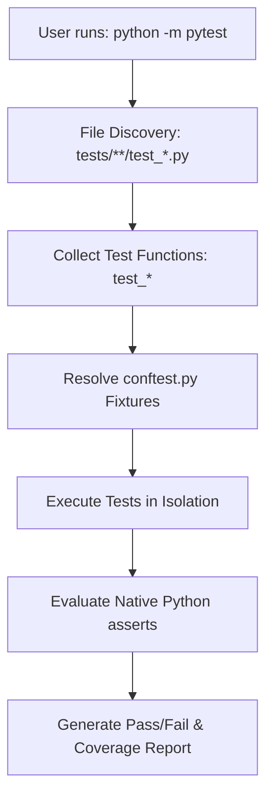

# Module 08: Testing Fundamentals & The pytest Framework

## 1. What It Is
**pytest** is the industry-standard testing framework for Python. It simplifies test creation with a clean, pythonic syntax, requiring only plain `assert` statements rather than cumbersome boilerplate classes (like Python's older `unittest.TestCase`).

## 2. Why It Exists
Software inevitably develops regressions when new features are added, dependencies are upgraded, or refactorings are performed. Automated testing provides an executable specification of application behavior that runs in seconds, guaranteeing that existing functionality remains intact without requiring manual QA clicking.

## 3. Why Backend Engineers Use It
- **Zero Boilerplate**: Uses Python's native `assert actual == expected` syntax with rich introspection (showing exact structural differences when assertions fail).
- **Powerful Fixture System**: Manages setup and teardown of complex resources (test databases, HTTP test clients, authentication tokens) cleanly and modularly.
- **Parametrization**: Enables running the same test logic against dozens of input/output test cases with a single decorator (`@pytest.mark.parametrize`).
- **Rich Plugin Ecosystem**: Seamlessly integrates with coverage (`pytest-cov`), async tests (`pytest-asyncio`), and mock utilities.

## 4. How pytest Discovers and Runs Tests
When you invoke `pytest` or `python -m pytest`:
1. It recursively searches the working directory for files matching `test_*.py` or `*_test.py`.
2. Inside those files, it discovers test functions prefixed with `test_*` or methods inside classes prefixed with `Test*`.
3. It resolves and executes all requested fixtures (dependencies).
4. It evaluates assertions and prints a colored, formatted test report.



## 5. Configuration in `pyproject.toml`
Rather than passing 10 CLI flags manually every time, our project configures pytest centrally in [pyproject.toml](file:///d:/week1_kpmg/case-management-backend/pyproject.toml):

```toml
[tool.pytest.ini_options]
testpaths = ["tests"]
python_files = ["test_*.py"]
python_classes = ["Test*"]
python_functions = ["test_*"]
addopts = "-v --tb=short"
```
- `testpaths = ["tests"]`: Only looks inside the `tests/` directory (avoids scanning virtualenv or cache folders).
- `addopts = "-v --tb=short"`: Runs in verbose mode (`-v`) with shortened tracebacks (`--tb=short`) for rapid reading.

## 6. Essential pytest Command Line Flags

| Flag | Purpose | Example |
|---|---|---|
| `-v` | Verbose mode: prints every individual test name and status | `python -m pytest -v` |
| `-k <expression>` | Filter tests by keyword expression | `python -m pytest -k "api or create"` |
| `-x` | Stop test execution immediately on the first failure | `python -m pytest -x` |
| `-s` | Disable stdout capture (allows `print()` and logs to show in console) | `python -m pytest -s` |
| `--tb=short` / `--tb=long` | Control traceback verbosity | `python -m pytest --tb=short` |
| `--cov=<module>` | Measure code coverage | `python -m pytest --cov=app` |

## 7. Real Backend Example: Rich Assertion Introspection
Unlike other frameworks where you must write `self.assertEqual(a, b)`, in pytest you write standard Python:
```python
def test_case_defaults(sample_case):
    assert sample_case.status == CaseStatus.OPEN
    assert sample_case.priority == CasePriority.MEDIUM
```
If this assertion fails, pytest doesn't just say "Failed" — it displays:
```text
>       assert sample_case.status == CaseStatus.OPEN
E       AssertionError: assert <CaseStatus.CLOSED: 'CLOSED'> == <CaseStatus.OPEN: 'OPEN'>
```

## 8. Common Mistakes
1. **Naming test files or functions without `test_` prefix**: pytest will simply skip them, giving you a false sense that all tests passed.
2. **Putting assertions outside test functions**: Placing `assert` in module scope causes the test suite to fail during collection before any tests run.
3. **Sharing state between tests**: If Test A modifies an object that Test B reads, Test B will fail if tests are run in random order. Tests must be completely independent.

## 9. Practical Exercises
1. Run only the repository unit tests using the keyword filter:
   ```bash
   python -m pytest -k "Repository" -v
   ```
2. Run the test suite and deliberately break one assertion in [tests/unit/test_models_and_schemas.py](file:///d:/week1_kpmg/case-management-backend/tests/unit/test_models_and_schemas.py). Observe the detailed assertion diff reported by pytest. Then restore it.

## 10. Interview Questions & Model Answers
**Q: How does pytest differ from Python's standard library `unittest` module?**
*Answer:* `unittest` requires subclassing `unittest.TestCase` and calling specific assertion methods (`self.assertEqual`, `self.assertRaises`). `pytest` uses plain Python functions and the native `assert` keyword, using bytecode rewriting to produce rich, readable failure introspections. Furthermore, pytest uses a functional, dependency-injected fixture model instead of rigid class-based `setUp()`/`tearDown()` hierarchies.

## 11. Short Self-Test
1. What file naming convention does pytest use by default to locate tests? *(Answer: Files starting with `test_` or ending with `_test.py`).*
2. What CLI flag stops pytest execution immediately upon the first failure? *(Answer: `-x` or `--exitfirst`).*
