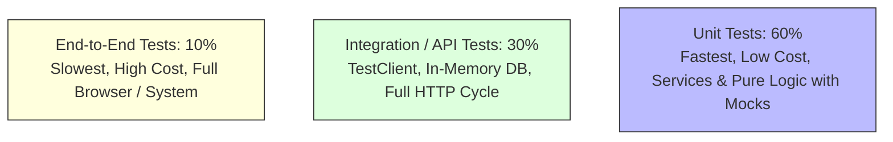

# Module 09: Unit Testing & The Testing Pyramid

## 1. What It Is
**Unit Testing** is the practice of testing the smallest testable parts of an application (individual functions, methods, or classes) in strict isolation from external systems such as live networks, remote APIs, or production databases.

## 2. Why It Exists
When a complex application fails, an end-to-end test can only tell you "the page crashed." It cannot tell you *which* line of code was responsible. Unit tests pinpoint the exact function and condition that caused the regression, executing in milliseconds.

## 3. The Testing Pyramid in Backend Systems



- **Unit Tests (Base)**: Fast, deterministic, test business logic, validation rules, error transitions. (Runs 1000 tests in 2 seconds).
- **API / Integration Tests (Middle)**: Test HTTP endpoints, status codes, database schema constraints, and dependency injection using `TestClient`.
- **End-to-End (Apex)**: Test real browsers or full multi-service deployments.

## 4. The Industry Standard Pattern: AAA (Arrange, Act, Assert)
Every well-structured unit test is structured into three distinct phases:

```python
def test_update_case_fails_if_closed():
    # 1. ARRANGE: Set up the test state and dependencies
    service = CaseService()
    mock_db = MagicMock()
    closed_case = Case(id=5, title="Archived", status=CaseStatus.CLOSED, created_by=1)
    service.case_repo.get_by_id = MagicMock(return_value=closed_case)
    update_data = CaseUpdate(status=CaseStatus.OPEN)

    # 2. ACT & 3. ASSERT: Execute the method under test and verify outcome
    with pytest.raises(ValidationError) as exc_info:
        service.update_case(mock_db, 5, update_data)

    assert "Cannot change the status of a CLOSED case" in exc_info.value.message
```

## 5. What to Test: The Three Paths
1. **The Happy Path**: Standard, valid inputs produce expected outputs (e.g. valid case creation returns status `OPEN`).
2. **The Negative Path**: Invalid inputs produce expected domain errors (e.g. non-existent user raises `UserNotFoundError`).
3. **Boundary Conditions**: Edge values (empty strings, maximum string length of 255 characters, negative IDs, null vs. omitted fields).

## 6. Real Backend Examples from Our Project
In [tests/unit/test_case_service.py](file:///d:/week1_kpmg/case-management-backend/tests/unit/test_case_service.py):
- `test_create_case_success`: Tests happy path for case creation.
- `test_create_case_fails_when_creator_not_found`: Tests negative path when a non-existent creator ID is supplied.
- `test_update_case_sets_resolved_at`: Tests state transition side-effects (setting timestamp on RESOLVED).

## 7. Common Mistakes
1. **Testing implementation details instead of behavior**: Don't test that a private variable `_x` was set; test that calling `get_x()` returns the expected result.
2. **Making unit tests dependent on network or file system**: If your test fails when you disconnect from Wi-Fi, it is not a unit test.
3. **Multiple unrelated assertions in one test**: If an assertion on line 3 fails, the assertions on lines 4–10 never run, masking other potential failures. Keep tests focused.

## 8. Practical Exercises
1. Locate `test_update_case_sets_resolved_at` in [tests/unit/test_case_service.py](file:///d:/week1_kpmg/case-management-backend/tests/unit/test_case_service.py). Add an additional assertion verifying that when status is changed to `IN_PROGRESS`, `resolved_at` is NOT set.
2. Write a unit test in [tests/unit/test_models_and_schemas.py](file:///d:/week1_kpmg/case-management-backend/tests/unit/test_models_and_schemas.py) testing what happens when an invalid email format is passed to `UserCreate`.

## 9. Interview Questions & Model Answers
**Q: What is the FIRST principle of unit testing?**
*Answer:* The FIRST principle states that unit tests must be:
- **Fast**: Run thousands of tests in seconds.
- **Independent**: No test depends on the outcome or state of another test.
- **Repeatable**: Produces the identical result in any environment, every time.
- **Self-Validating**: Binary pass/fail outcome with no manual inspection required.
- **Timely**: Written alongside or before the production code (Test-Driven Development).

## 10. Short Self-Test
1. In the AAA pattern, what does "Arrange" refer to? *(Answer: Preparing the data, objects, mocks, and preconditions before invoking the method).*
2. True or False: A unit test should connect to a live PostgreSQL production database to ensure queries are accurate. *(False — that is an integration test; unit tests mock or isolate data layers).*
