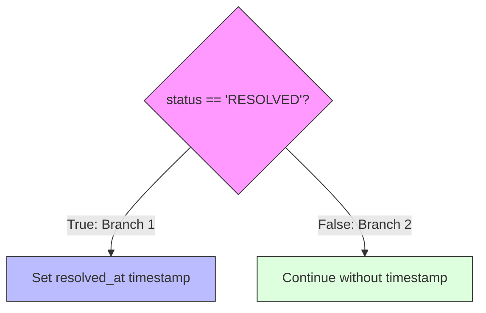

# Module 12: Code Coverage, pytest-cov & Quality Assurance Metrics

## 1. What It Is
**Code Coverage** is a quantitative measurement of the degree to which source code lines, statements, or decision branches are executed when an automated test suite runs. It is typically expressed as a percentage:

$$\text{Coverage Percentage} = \frac{\text{Executed Statements}}{\text{Total Statements}} \times 100$$

In Python, this is measured using `coverage.py` and the `pytest-cov` plugin.

## 2. Why It Exists
Developers often believe their test suites are thorough, only to discover in production that an `else` block, error handler, or edge-case validator was never once triggered during testing. Code coverage tools systematically scan the bytecode during test execution and report the exact un-executed lines of code.

## 3. Why Backend Engineers Use It
- **Identify Blind Spots**: Instantly highlights omitted error conditions or missing boundary tests.
- **CI/CD Quality Gates**: Build pipelines can automatically block and reject pull requests if test coverage drops below an agreed-upon threshold (e.g. 70% or 80%).
- **Confidence During Refactoring**: High coverage ensures that moving classes, rewriting algorithms, or updating dependencies will alert developers if an unexpected code path breaks.

## 4. Line Coverage vs. Branch Coverage



- **Statement / Line Coverage**: Measures whether a line was executed at least once. If a test tests only the `True` branch, statement coverage may report 80%, but the `False` branch was never evaluated!
- **Branch Coverage**: Measures whether every possible outcome of every boolean decision point (`if`, `elif`, `else`, ternary operators) was traversed by tests.

## 5. Configuration in `pyproject.toml`
Our project configures coverage directly in [pyproject.toml](file:///d:/week1_kpmg/case-management-backend/pyproject.toml):

```toml
[tool.coverage.run]
source = ["app"]
omit = ["tests/*", "app/__init__.py"]

[tool.coverage.report]
show_missing = true
fail_under = 70
exclude_lines = [
    "pragma: no cover",
    "if __name__ == .__main__.",
    "pass",
]
```
- `source = ["app"]`: Measures only our production application code (excludes third-party libraries and test fixtures).
- `show_missing = true`: Prints the exact line numbers that were not covered by tests.
- `fail_under = 70`: Enforces that if overall coverage drops below 70%, the test suite exits with code 1 (failing the CI/CD pipeline).

## 6. How to Run and Interpret Coverage Reports
Run the coverage report in your terminal:
```bash
python -m pytest -v --cov=app --cov-report=term-missing
```

### Reading the Terminal Report:
```text
Name                                  Stmts   Miss  Cover   Missing
-------------------------------------------------------------------
app\api\routes\cases.py                  44      0   100%
app\config.py                            16      0   100%
app\database\session.py                  27      4    85%   97-101
app\exceptions\handlers.py               37      2    95%   152-156
app\models\case.py                       63      0   100%
app\repositories\case_repository.py      70     12    83%   59-65, 137-143
app\schemas\case.py                      28      0   100%
app\services\case_service.py             43      0   100%
-------------------------------------------------------------------
TOTAL                                   390     19    95%
Required test coverage of 70.0% reached. Total coverage: 95.13%
```
- **Stmts**: Total executable Python statements in the module.
- **Miss**: Number of statements never executed during the test run.
- **Cover**: Execution percentage.
- **Missing**: Specific line numbers that need tests. (Lines 59-65 in `case_repository.py` represent rollback exception paths).

## 7. Goodhart's Law: Why 100% Coverage ≠ 0% Bugs
> *"When a measure becomes a target, it ceases to be a good measure."* — Goodhart's Law

**A test suite can have 100% line coverage and still have severe bugs!**
- You can execute a line of code without asserting its correctness:
  ```python
  def test_useless():
      service.create_case(...) # Covers the line, but has NO asserts! Bug is missed!
  ```
- Coverage tells you what code was *executed*, not whether the code satisfies business requirements, handles concurrency, or protects against race conditions.

## 8. Practical Exercises
1. Run the coverage command with an HTML report output:
   ```bash
   python -m pytest --cov=app --cov-report=html
   ```
   Open `htmlcov/index.html` in your web browser to visually inspect highlighted red lines (uncovered) and green lines (covered).
2. Inspect the "Missing" lines in `app/repositories/case_repository.py` (lines 59–65). What condition triggers those lines? *(Answer: Database transaction failure and rollback).*

## 9. Interview Questions & Model Answers
**Q: What is the difference between line coverage and branch coverage, and which is superior?**
*Answer:* Line coverage simply checks whether a given physical line of code was executed during a test run. Branch coverage checks whether every possible branch of control structures (if/else, switch, try/except) was executed. Branch coverage is far superior because a single line of code with a compound boolean condition (e.g., `if a and b:`) can have 100% line coverage while leaving half of the logical paths untested.

## 10. Short Self-Test
1. What does the `fail_under = 70` setting in `pyproject.toml` do? *(Answer: Fails the test command with an error if total test coverage falls below 70%).*
2. True or False: If a module achieves 100% test coverage, it is mathematically proven to be free of all software bugs. *(False).*
