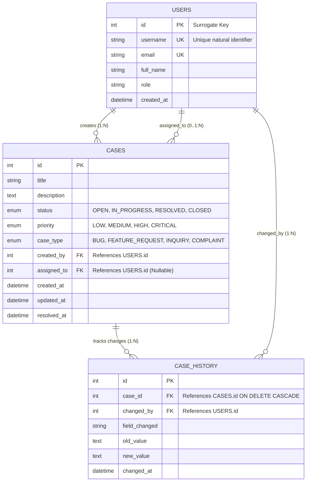

# Module 13: Relational Database Architecture & Normalization

## 1. What It Is
A **Relational Database Management System (RDBMS)** organizes data into structured two-dimensional grids called **tables** (relations), composed of **columns** (attributes with strict types) and **rows** (tuples/records). Relationships between entities are established through mathematical keys (Primary Keys and Foreign Keys).

## 2. Why It Exists
Before relational systems, early software stored records in hierarchical tree structures or flat files (CSV, JSON). These non-relational formats suffered from severe limitations:
- **Redundancy & Inconsistency**: Storing a user's address in 50 order records meant that when the user moved, updating 49 records left 1 record corrupted (an "update anomaly").
- **No Referential Integrity**: You could delete a customer while their orders remained orphaned in the system with non-existent owner IDs.
- **Unstructured Queries**: Searching required custom procedural loops across files rather than declarative queries.

## 3. Why Backend Engineers Use It
- **ACID Guarantees**: Guarantees that financial transfers, case updates, and audit records are never lost or partially written.
- **Declarative SQL**: Engineers describe *what* data they need, and the database's query planner optimizes *how* to retrieve it using indexes and algorithms.
- **Data Integrity Constraints**: Enforces uniqueness, non-nullability, foreign key existence, and value checks at the engine level.

## 4. Fundamental Building Blocks



### 1. Primary Keys (PK)
A column (or set of columns) that uniquely identifies each row in a table.
- **Natural Key**: An existing real-world attribute (e.g. Email or SSN). *Risk*: People change their emails, breaking foreign key references.
- **Surrogate Key**: An artificial, meaningless identifier (e.g. auto-incrementing integer `id INTEGER PRIMARY KEY` or UUIDv4). *Best Practice*: Always use surrogate primary keys for OLTP entities.

### 2. Foreign Keys (FK) & Referential Integrity
A foreign key points to the primary key of another table. It enforces referential integrity:
- **`ON DELETE RESTRICT`** *(default)*: Prevents deleting a User if they have existing Cases.
- **`ON DELETE CASCADE`**: When a Case is deleted, all its associated `case_history` rows are automatically deleted (as configured in `sql/schema.sql`).
- **`ON DELETE SET NULL`**: If an assigned user is deleted, set `assigned_to = NULL`.

## 5. Normalization: 1NF, 2NF, 3NF
Normalization is the systematic process of eliminating data redundancy and update anomalies:

| Normal Form | Rule | Anti-Pattern | Solution in Our Schema |
|---|---|---|---|
| **1NF (First Normal Form)** | Every column must contain atomic (indivisible) values; no repeating groups or arrays. | Storing tags as `"bug,p1,backend"` in a single text column. | Use individual rows or a normalized junction table. |
| **2NF (Second Normal Form)** | Must be in 1NF, and all non-key columns must depend on the *entire* primary key (no partial key dependencies). | In a table with composite PK `(user_id, case_id)`, storing `user_email` in that table. | Move `user_email` to the `users` table. |
| **3NF (Third Normal Form)** | Must be in 2NF, and no non-key column may depend on another non-key column (no *transitive dependencies*). | Storing `assigned_user_email` inside the `cases` table. | Store only `assigned_to` (the user's ID) and retrieve the email via SQL JOIN. |

## 6. Indexing Strategy: B-Trees & Query Speed
Without an index, the database must perform a **Full Table Scan** (reading every single row from disk, $O(N)$ time complexity).
With a **B-Tree Index**, lookups operate in $O(\log N)$ time:
- In [sql/schema.sql](file:///d:/week1_kpmg/case-management-backend/sql/schema.sql), we add indexes on frequently filtered columns:
  ```sql
  CREATE INDEX idx_cases_status ON cases(status);
  CREATE INDEX idx_cases_priority ON cases(priority);
  CREATE INDEX idx_cases_created_by ON cases(created_by);
  ```

## 7. SQLite vs. PostgreSQL: Architectural Comparison
| Feature | SQLite (Our Week 1 Engine) | PostgreSQL (Enterprise Cloud) |
|---|---|---|
| **Deployment Model** | Serverless, single local C-library file (`case_management.db`) | Client-Server network daemon (TCP port 5432) |
| **Setup Complexity** | Zero configuration; built into Python standard library | Requires PostgreSQL installation, user/role management, Docker |
| **Concurrency** | Single-writer, multiple-readers (File lock) | Multi-Version Concurrency Control (MVCC), thousands of concurrent writes |
| **SQL Compatibility** | Supports ANSI SQL: CTEs, Window Functions, Triggers, Indexes | Full enterprise features, JSONB, native Enums, geospatial (PostGIS) |

*Engineering Choice*: We use SQLite for Week 1 because it allows instant local and CI/CD reproduction with zero Docker/daemon overhead, while executing identical SQL JOINs, CTEs, window functions, and ACID transactions.

## 8. Practical Exercises
1. Open the database using SQLite CLI or Python and inspect the tables:
   ```bash
   python -c "import sqlite3; c = sqlite3.connect('case_management.db'); print(c.execute('SELECT name FROM sqlite_master WHERE type=\"table\"').fetchall())"
   ```
2. Explain why foreign key enforcement requires `PRAGMA foreign_keys=ON;` in SQLite. *(Answer: For backward compatibility with SQLite 2, foreign keys are disabled by default in SQLite unless explicitly activated per connection).*

## 9. Interview Questions & Model Answers
**Q: Explain the Third Normal Form (3NF) and why transactional backends aim for it.**
*Answer:* A table is in Third Normal Form (3NF) if it is in 2NF and has no transitive dependencies — meaning every non-prime attribute depends solely on the primary key, the whole primary key, and nothing but the primary key. Transactional (OLTP) backends target 3NF because it eliminates data redundancy, prevents insertion, update, and deletion anomalies, and guarantees that each business fact is stored in exactly one place.

## 10. Short Self-Test
1. What is the difference between a natural key and a surrogate key? *(Answer: A natural key has real-world meaning like email/SSN; a surrogate key is an arbitrary identifier generated by the system like an auto-incrementing integer or UUID).*
2. What index type is typically created by default on primary key columns? *(Answer: B-Tree index).*
