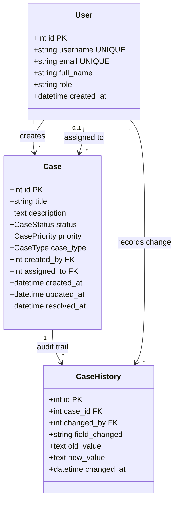

# Module 14: SQL Schema Design & Data Modeling

## 1. What It Is
**Schema Design** is the blueprint and structural specification of a database. It defines the names of tables, column data types, nullability rules, default values, uniqueness constraints, check constraints, foreign keys, and indexes.

## 2. Why It Exists
The database is the ultimate authority on system state. Code can be refactored, APIs can be versioned, but if the underlying database schema allows invalid or corrupt data (e.g. negative IDs, invalid status strings, orphaned foreign keys), the entire enterprise application will suffer from data corruption that requires expensive manual data repair.

## 3. The Case Management Domain Model



## 4. Deep Dive into Every Project Table

### Table 1: `users`
- **Purpose**: Represents system operators, analysts, managers, and administrators.
- **Why it exists**: Separating users from cases prevents duplicating names, emails, and roles across thousands of case rows.
- **Key Constraints**:
  - `username VARCHAR(50) NOT NULL UNIQUE`: Guarantees no two users can register with the same username.
  - `email VARCHAR(255) NOT NULL UNIQUE`: Enforces RFC email uniqueness.

### Table 2: `cases`
- **Purpose**: The central transactional entity of the application.
- **Why it exists**: Stores the lifecycle of an issue, incident, or inquiry.
- **Key Constraints**:
  - `status VARCHAR(20) NOT NULL DEFAULT 'OPEN' CHECK (status IN ('OPEN', 'IN_PROGRESS', 'RESOLVED', 'CLOSED'))`: Enforces a finite state machine directly in the database engine.
  - `priority ... CHECK (priority IN ('LOW', 'MEDIUM', 'HIGH', 'CRITICAL'))`: Prevents invalid priority classifications.
  - `FOREIGN KEY (created_by) REFERENCES users(id)`: Impossible to create a case attributed to a non-existent user.
  - `FOREIGN KEY (assigned_to) REFERENCES users(id)`: Nullable, representing unassigned cases.

### Table 3: `case_history` (Audit Trail)
- **Purpose**: Provides an append-only log of every mutation that occurs to a case.
- **Why it exists**:
  1. **Compliance**: Regulatory mandates (e.g. SOC 2, HIPAA) require an unalterable history of who modified which ticket and when.
  2. **Analytics**: Enables complex SQL calculations (e.g. time-in-state, SLA duration, reopen counts).
- **Key Constraints**:
  - `FOREIGN KEY (case_id) REFERENCES cases(id) ON DELETE CASCADE`: If a case is permanently purged, all historical audit logs are cleaned up automatically.

## 5. Bridging SQL and Python: SQLAlchemy ORM Mapping
In professional architectures, schema design is mirrored in Python using an Object-Relational Mapper (ORM). Compare the raw SQL in [sql/schema.sql](file:///d:/week1_kpmg/case-management-backend/sql/schema.sql) with the Python class in [app/models/case.py](file:///d:/week1_kpmg/case-management-backend/app/models/case.py):

```python
# app/models/case.py
class Case(Base):
    __tablename__ = "cases"

    id: int = Column(Integer, primary_key=True, autoincrement=True)
    title: str = Column(String(255), nullable=False)
    status: str = Column(Enum(CaseStatus), nullable=False, default=CaseStatus.OPEN)
    created_by: int = Column(Integer, ForeignKey("users.id"), nullable=False)
    assigned_to: int = Column(Integer, ForeignKey("users.id"), nullable=True)
    
    # ORM relationships allow convenient object navigation (e.g. my_case.creator.full_name)
    creator = relationship("User", back_populates="created_cases", foreign_keys=[created_by])
    assignee = relationship("User", back_populates="assigned_cases", foreign_keys=[assigned_to])
```

## 6. Common Schema Design Pitfalls
1. **Using generic `TEXT` for everything without constraints**: Leads to typos like `"Open"`, `"open"`, `"OPN"`, breaking aggregation queries.
2. **Missing indexes on foreign keys**: If `cases.created_by` has no index, querying "all cases created by user X" requires scanning the entire table.
3. **Storing timestamps without timezone awareness**: Storing local timestamps (e.g. PST or IST) without UTC standardization makes sorting across global teams impossible. Always store in UTC (`datetime('now')` or Python `datetime.now(timezone.utc)`).

## 7. Practical Exercises
1. Inspect [sql/schema.sql](file:///d:/week1_kpmg/case-management-backend/sql/schema.sql). Identify all `CHECK` constraints.
2. Execute a query that attempts to insert a case with `status = 'INVALID_STATUS'`. Verify that the database engine rejects the statement with a constraint failure.

## 8. Interview Questions & Model Answers
**Q: What is the purpose of an audit table (`case_history`), and why should it be append-only?**
*Answer:* An audit table records the delta of state changes over time (who changed what attribute, from what previous value, to what new value, and at what timestamp). It must be append-only (no `UPDATE` or `DELETE` operations permitted) to maintain tamper-proof integrity for compliance, security forensics, and time-series analytical reporting.

## 9. Short Self-Test
1. What does `ON DELETE CASCADE` do when applied to `case_history.case_id`? *(Answer: Automatically deletes all associated history rows if the parent case is deleted).*
2. Why should database timestamps always be recorded in UTC? *(Answer: To prevent ambiguity across timezones, daylight saving time shifts, and global server deployments).*
