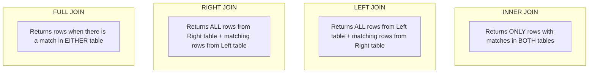

# Module 15: SQL JOIN Operations — Recombining Normalized Data

## 1. What It Is
A **SQL JOIN** is an operation that combines rows from two or more tables based on a related column between them (typically matching a Foreign Key in one table to a Primary Key in another).

## 2. Why It Exists
Because relational databases normalize data into separate tables to eliminate redundancy (see Module 13), real-world business queries almost always require reassembling that information. For example, a support manager doesn't just want to see `created_by = 4`; they want the creator's full name and email address. JOINs perform this reassembly declaratively in a single database query.

## 3. Why Backend Engineers Use It
- **Efficiency**: Performing joins in SQL is orders of magnitude faster than fetching raw records into Python and joining them in nested loops (avoiding the notorious "$N+1$ query problem").
- **Accurate Aggregations**: Enables slicing cases by department, user, or role in a single optimized query planner pass.

## 4. Visual Taxonomy of SQL JOINs



| Join Type | Behavior | Project Use Case |
|---|---|---|
| **INNER JOIN** | Keeps only rows where the join predicate evaluates to `TRUE` in both tables. | Cases with Creators (`cases.created_by = users.id`). Every case MUST have a creator. |
| **LEFT JOIN** | Keeps ALL rows from the left table. If no match exists in the right table, right columns return `NULL`. | Cases with Assignees (`cases.assigned_to = users.id`). Unassigned cases MUST still appear! |
| **SELF JOIN** | Joining a table to itself using distinct aliases. | Comparing consecutive audit entries or organizational hierarchy (manager/employee). |
| **CROSS JOIN** | Cartesian product of all rows from both tables ($N \times M$). | Generating matrix reports (all statuses $\times$ all priorities). |

## 5. Real Project SQL Examples (from `sql/queries.sql`)

### Example 1: The Critical Difference Between INNER and LEFT JOIN
If you run an `INNER JOIN` on `assigned_to`:
```sql
-- DANGEROUS: Drops unassigned cases!
SELECT c.id, c.title, u.full_name AS assignee
FROM cases c
INNER JOIN users u ON c.assigned_to = u.id;
```
**Bug**: If a case is new and unassigned (`assigned_to IS NULL`), the `INNER JOIN` eliminates it from the results! The dashboard shows 6 tickets instead of 8!

**The Correct Solution (LEFT JOIN)**:
```sql
SELECT
    c.id        AS case_id,
    c.title,
    c.status,
    COALESCE(u.full_name, 'UNASSIGNED') AS assignee_display
FROM cases c
LEFT JOIN users u ON c.assigned_to = u.id
ORDER BY c.priority DESC;
```

### Example 2: Joining the Same Table Multiple Times (Table Aliases)
A case has **two** distinct relationships to the `users` table: who created it, and who is currently assigned to it. We must join `users` twice with separate table aliases:

```sql
SELECT
    c.id        AS case_id,
    c.title,
    c.status,
    creator.full_name  AS created_by_name,
    assignee.full_name AS assigned_to_name
FROM cases c
INNER JOIN users creator   ON c.created_by  = creator.id
LEFT  JOIN users assignee  ON c.assigned_to = assignee.id
ORDER BY c.created_at DESC;
```

### Example 3: JOIN with Aggregation (`GROUP BY`)
Calculating the workload and performance of each team member:
```sql
SELECT
    u.full_name,
    u.role,
    COUNT(c.id) AS cases_created,
    SUM(CASE WHEN c.status = 'OPEN' THEN 1 ELSE 0 END) AS open_cases,
    SUM(CASE WHEN c.status = 'RESOLVED' THEN 1 ELSE 0 END) AS resolved_cases
FROM users u
LEFT JOIN cases c ON u.id = c.created_by
GROUP BY u.id, u.full_name, u.role
ORDER BY cases_created DESC;
```

## 6. The N+1 Query Problem in Backend Code
A classic junior backend developer mistake is executing queries in a loop:
```python
# =========================================================================
# THE N+1 ANTI-PATTERN IN PYTHON (AVOID THIS):
# =========================================================================
cases = db.query(Case).all() # 1 Query
for case in cases:
    # Executes 1 separate query FOR EVERY SINGLE ROW (N queries!)
    creator = db.query(User).filter(User.id == case.created_by).first()
    print(case.title, creator.full_name)
```
If you have 10,000 cases, this executes **10,001 SQL queries**, causing seconds of latency!
Using SQL JOINs or SQLAlchemy's `joinedload()`, it executes in **1 single query**.

## 7. Common Mistakes
1. **Ambiguous column names**: Writing `SELECT id, title FROM cases c JOIN users u ON ...`. Both tables have an `id` column! Always qualify columns: `c.id, u.id`.
2. **Filtering on the right table in the WHERE clause during a LEFT JOIN**:
   - `WHERE u.role = 'analyst'` converts your `LEFT JOIN` into an `INNER JOIN` because `NULL` rows are filtered out!
   - *Fix*: Place the filter inside the `ON` condition: `LEFT JOIN users u ON c.assigned_to = u.id AND u.role = 'analyst'`.

## 8. Practical Exercises
1. Execute query 1c from [sql/queries.sql](file:///d:/week1_kpmg/case-management-backend/sql/queries.sql) against the project database. Verify that unassigned cases display `NULL` for `assigned_to_name`.
2. Write a query that finds all users who have NEVER created a case. *(Hint: Use `LEFT JOIN` and `WHERE c.id IS NULL`)*.

## 9. Interview Questions & Model Answers
**Q: What is the difference between an INNER JOIN and a LEFT OUTER JOIN?**
*Answer:* An `INNER JOIN` returns only those rows where there is a matching value in both tables according to the join predicate; non-matching rows from both tables are discarded. A `LEFT OUTER JOIN` returns all rows from the left table, regardless of whether a matching row exists in the right table. Where no match exists, the right-side columns are filled with `NULL`.

## 10. Short Self-Test
1. If Table A has 5 rows and Table B has 10 rows, what is the maximum possible number of rows returned by a CROSS JOIN? *(Answer: $5 \times 10 = 50$ rows).*
2. When should you use a LEFT JOIN instead of an INNER JOIN when querying cases and assignees? *(Answer: Whenever a case might be unassigned, so that unassigned cases are not omitted from the results).*
