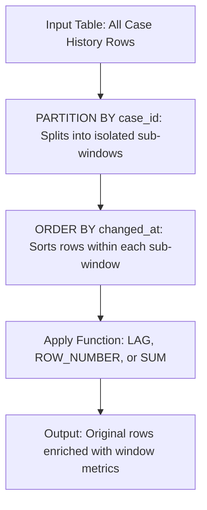

# Module 17: SQL Window Functions — Advanced Analytics Without Row Collapse

## 1. What It Is
A **Window Function** performs a calculation across a specified set of table rows related to the current row (called a "window"). Unlike standard aggregate functions (`SUM`, `AVG`, `COUNT`), a window function **does not collapse rows into a single summary row**. Every original row retains its individual identity while gaining an additional computed column.

## 2. Why It Exists
In traditional SQL, if you wanted to display individual employee salaries alongside their department's average salary, you had to perform an expensive `GROUP BY` subquery and join it back to the original table:
```sql
-- OLD, CLUNKY WAY (Requires a subquery and join):
SELECT e.name, e.dept, e.salary, d.dept_avg
FROM employees e
JOIN (SELECT dept, AVG(salary) AS dept_avg FROM employees GROUP BY dept) d ON e.dept = d.dept;
```
Window functions eliminate this entire subquery pattern with a clean, expressive syntax:
```sql
-- ELEGANT WINDOW FUNCTION WAY:
SELECT name, dept, salary, AVG(salary) OVER (PARTITION BY dept) AS dept_avg
FROM employees;
```

## 3. Why Backend Engineers Use It
- **Pagination & Top-N Filtering**: Selecting the top 3 most urgent cases per department using `ROW_NUMBER()`.
- **Time-Series & SLA Calculations**: Computing elapsed time between consecutive case status updates using `LAG()`.
- **Cumulative Running Totals**: Computing cumulative revenue or ticket volume progression using running `SUM()`.

## 4. Anatomy of the `OVER(...)` Clause

$$\text{FUNCTION}() \quad \mathbf{OVER} \quad (\mathbf{PARTITION\ BY}\ \text{col}\quad \mathbf{ORDER\ BY}\ \text{col}\quad [\text{FRAME}])$$



1. **`PARTITION BY`**: Divides the query result set into partitions (groups). The window function is calculated separately within each partition. If omitted, the entire result set is treated as one partition.
2. **`ORDER BY`**: Determines the logical order in which rows are processed within each partition.
3. **Framing Clause (`ROWS BETWEEN ...`)**: Defines the sliding boundaries of rows relative to the current row (e.g. `ROWS BETWEEN UNBOUNDED PRECEDING AND CURRENT ROW` for running totals).

## 5. Key Window Functions in Backend Engineering

### 1. Ranking: `ROW_NUMBER()` vs. `RANK()` vs. `DENSE_RANK()`
How they handle ties (e.g. two cases created at the exact same timestamp or priority):

| Function | Values for Tie (Scores: 100, 100, 90) | Description |
|---|---|---|
| `ROW_NUMBER()` | `1, 2, 3` | Strictly sequential; arbitrary tie-breaking. Ideal for pagination. |
| `RANK()` | `1, 1, 3` | Tied values share rank; subsequent rank numbers are skipped. |
| `DENSE_RANK()` | `1, 1, 2` | Tied values share rank; no rank numbers are skipped. |

### 2. Offset Functions: `LAG()` and `LEAD()`
- `LAG(column, offset)`: Accesses data from a previous row at a specified physical offset without a self-join.
- `LEAD(column, offset)`: Accesses data from a subsequent row ahead of the current row.

## 6. Real Project Examples (from `sql/queries.sql`)

### Example 1: Ranking Cases by Priority Within Status
```sql
SELECT
    id,
    title,
    status,
    priority,
    ROW_NUMBER() OVER (
        PARTITION BY status
        ORDER BY created_at ASC
    ) AS row_num_within_status,
    RANK() OVER (
        PARTITION BY status
        ORDER BY
            CASE priority
                WHEN 'CRITICAL' THEN 1
                WHEN 'HIGH' THEN 2
                WHEN 'MEDIUM' THEN 3
                WHEN 'LOW' THEN 4
            END
    ) AS priority_rank
FROM cases
ORDER BY status, priority_rank;
```

### Example 2: SLA Audit — Calculating Time Between Consecutive Changes via `LAG()`
To see how many hours elapsed between two state transitions in `case_history`:
```sql
SELECT
    ch.case_id,
    c.title,
    ch.field_changed,
    ch.old_value,
    ch.new_value,
    ch.changed_at,
    LAG(ch.changed_at) OVER (
        PARTITION BY ch.case_id
        ORDER BY ch.changed_at
    ) AS previous_change_at,
    ROUND(
        (JULIANDAY(ch.changed_at) - JULIANDAY(
            LAG(ch.changed_at) OVER (
                PARTITION BY ch.case_id
                ORDER BY ch.changed_at
            )
        )) * 24, 2
    ) AS hours_since_last_change
FROM case_history ch
INNER JOIN cases c ON ch.case_id = c.id
ORDER BY ch.case_id, ch.changed_at;
```

### Example 3: Running Cumulative Total of Changes
```sql
SELECT
    ch.case_id,
    c.title,
    ch.field_changed,
    ch.changed_at,
    COUNT(*) OVER (
        PARTITION BY ch.case_id
        ORDER BY ch.changed_at
        ROWS BETWEEN UNBOUNDED PRECEDING AND CURRENT ROW
    ) AS cumulative_change_count,
    COUNT(*) OVER (
        PARTITION BY ch.case_id
    ) AS total_changes_for_case
FROM case_history ch
INNER JOIN cases c ON ch.case_id = c.id
ORDER BY ch.case_id, ch.changed_at;
```

## 7. Common Mistakes
1. **Using Window Functions in the `WHERE` clause**:
   - `WHERE ROW_NUMBER() OVER (...) = 1` -> **Syntax Error!**
   - *Why*: Window functions execute *after* `WHERE`, `GROUP BY`, and `HAVING` filters are applied.
   - *Fix*: Wrap the window query in a CTE:
     ```sql
     WITH ranked_cases AS (
         SELECT *, ROW_NUMBER() OVER (PARTITION BY status ORDER BY created_at) AS rn FROM cases
     )
     SELECT * FROM ranked_cases WHERE rn = 1;
     ```
2. **Forgetting `ORDER BY` in offset functions**: `LAG()` and `LEAD()` require deterministic ordering to produce meaningful results.

## 8. Practical Exercises
1. Execute query 3c from [sql/queries.sql](file:///d:/week1_kpmg/case-management-backend/sql/queries.sql). Identify which case had the longest delay between status transitions.
2. Write a query using a CTE and `ROW_NUMBER()` that selects only the most recently updated case for each unique creator.

## 9. Interview Questions & Model Answers
**Q: How does a Window Function differ from a `GROUP BY` aggregation?**
*Answer:* A `GROUP BY` query collapses multiple rows into a single summary row, discarding individual row details unless they are part of the grouping key or wrapped in an aggregate function. A window function calculates an aggregate or ranking value across a defined set of rows ("window") but returns a result for **every individual row**, preserving all original row attributes.

## 10. Short Self-Test
1. Which window function allows you to inspect the value of a column from the previous row within a partition? *(Answer: `LAG()`).*
2. True or False: You can write `WHERE ROW_NUMBER() OVER (...) <= 10` directly in a WHERE clause. *(False — it must be enclosed within a CTE or subquery).*
