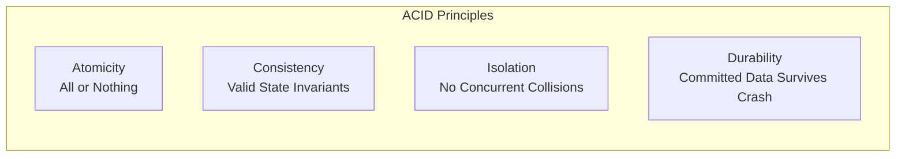

# Module 18: SQL Transactions, ACID Guarantees & Concurrency

## 1. What It Is
A **Database Transaction** is a logical unit of work comprising one or more database operations (reads, inserts, updates, deletes) executed against a relational database. A transaction is treated as a single indivisible step that either completes in its entirety or leaves the database completely unchanged.

## 2. Why It Exists
In multi-step business operations, failures happen at any moment:
- What if an application updates a case status from `OPEN` to `RESOLVED`, but the server's power cord is unplugged before it can insert the audit record into `case_history`?
- Without transactions, the system is left in a corrupted state: the ticket is marked resolved, but the compliance audit record is missing!
- Transactions guarantee that either **both** writes happen, or **neither** happens.

## 3. The ACID Guarantees



### A — Atomicity ("All or Nothing")
Every statement in the transaction must succeed. If a single statement fails (due to a constraint violation, network drop, or server crash), the entire transaction is **rolled back** to the state it was in before the transaction began.

### C — Consistency ("Preserving Invariants")
The database must transition from one legally valid state to another. All schema rules, foreign key references, uniqueness constraints, and `CHECK` constraints are verified before a transaction can commit.

### I — Isolation ("Invisible Intermediate States")
Concurrent transactions execute independently without interfering with one another. A transaction should not observe the half-finished, uncommitted changes of another running transaction.

### D — Durability ("Permanent Once Committed")
Once a transaction is successfully committed, its updates are guaranteed to survive any subsequent software crash, power outage, or operating system reboot (achieved via **Write-Ahead Logging / WAL**).

## 4. Transaction Syntax & Control Flow

| Command | Action |
|---|---|
| `BEGIN TRANSACTION;` | Demarcates the beginning of a transactional block |
| `COMMIT;` | Permanently applies all modifications made during the transaction to disk |
| `ROLLBACK;` | Aborts the transaction and reverts all changes back to the starting state |
| `SAVEPOINT <name>;` | Sets a rollback checkpoint within a larger transaction |
| `ROLLBACK TO SAVEPOINT <name>;` | Reverts only the operations executed after the named savepoint |

## 5. Real Project SQL Examples (from `sql/transaction_examples.sql`)

### Example 1: Atomic Case Assignment & Audit History Insert
```sql
BEGIN TRANSACTION;

-- Step 1: Update the case record
UPDATE cases
SET assigned_to = 3, updated_at = datetime('now')
WHERE id = 4;

-- Step 2: Record the audit entry
INSERT INTO case_history (case_id, changed_by, field_changed, old_value, new_value, changed_at)
VALUES (4, 1, 'assigned_to', NULL, '3', datetime('now'));

-- Both steps succeeded -> persist atomically:
COMMIT;
```

### Example 2: Savepoint for Conditional Partial Rollback
```sql
BEGIN TRANSACTION;

-- Safe baseline update:
UPDATE cases SET updated_at = datetime('now') WHERE id = 1;

-- Checkpoint before a speculative action:
SAVEPOINT before_risky_operation;

-- Speculative update on an ID that might not exist:
UPDATE cases SET priority = 'LOW' WHERE id = 999;

-- In application code, if 0 rows were affected:
-- ROLLBACK TO SAVEPOINT before_risky_operation;

-- Release savepoint and commit:
RELEASE SAVEPOINT before_risky_operation;
COMMIT;
```

## 6. How Transactions are Handled in Our Python Codebase
In [app/repositories/case_repository.py](file:///d:/week1_kpmg/case-management-backend/app/repositories/case_repository.py), notice the standard enterprise try/commit/rollback pattern:

```python
def create(self, db: Session, case: Case) -> Case:
    try:
        db.add(case)
        db.commit()          # Triggers SQL COMMIT
        db.refresh(case)     # Reads auto-generated ID from database
        return case
    except Exception as e:
        db.rollback()        # CRITICAL: Triggers SQL ROLLBACK on failure!
        logger.error("Failed to create case", extra={"error": str(e)})
        raise DatabaseError(f"Failed to create case: {e}") from e
```
**Why the `db.rollback()` is mandatory**: If an exception occurs (e.g. unique constraint violation) and you don't call `rollback()`, the SQLAlchemy session remains in an invalidated transaction state, causing all subsequent queries on that session to crash with `PendingRollbackError`!

## 7. Transaction Isolation Levels & Concurrency Anomalies
The SQL standard defines four isolation levels to balance performance against concurrency anomalies:

| Isolation Level | Dirty Read | Non-Repeatable Read | Phantom Read |
|---|---|---|---|
| **Read Uncommitted** | Possible | Possible | Possible |
| **Read Committed** *(PostgreSQL default)* | **Prevented** | Possible | Possible |
| **Repeatable Read** | **Prevented** | **Prevented** | Possible |
| **Serializable** *(Highest Isolation)* | **Prevented** | **Prevented** | **Prevented** |

- **Dirty Read**: Transaction A reads uncommitted data written by Transaction B. If B rolls back, A was working with phantom/fake data.
- **Non-Repeatable Read**: Transaction A reads a row. Transaction B updates that row and commits. Transaction A rereads the row and sees different data.
- **Phantom Read**: Transaction A queries rows matching a filter (`WHERE status = 'OPEN'`). Transaction B inserts a new `OPEN` case and commits. Transaction A re-executes the query and sees a new "phantom" row.

## 8. Common Mistakes
1. **Long-Running Transactions**:
   - Performing a slow HTTP call or waiting for user input inside an open database transaction.
   - *Why it fails*: Holds database row/table locks open, blocking all other connections and exhausting the connection pool.
2. **Missing Rollback in Catch Blocks**:
   - Catching an error without rolling back leaves the session dirty and database locks unreleased.

## 9. Practical Exercises
1. Open a terminal, start a transaction in SQLite, insert a case, and then issue `ROLLBACK;`. Query the table to verify that no trace of the inserted row exists.
2. Inspect `update()` in [app/repositories/case_repository.py](file:///d:/week1_kpmg/case-management-backend/app/repositories/case_repository.py). Confirm that both the case field update and the `case_history` insert happen inside the same transaction block before `db.commit()`.

## 10. Interview Questions & Model Answers
**Q: What is a Dirty Read, and which isolation level is required to prevent it?**
*Answer:* A Dirty Read occurs when Transaction A reads modifications made by concurrent Transaction B before Transaction B has committed. If Transaction B subsequently issues a `ROLLBACK`, the data read by Transaction A was invalid and never officially existed in the database. To prevent Dirty Reads, a database must run at least at the **Read Committed** isolation level.

## 11. Short Self-Test
1. Which letter in ACID guarantees that if a transaction encounters an error halfway through, all preceding operations in that block are undone? *(Answer: A for Atomicity).*
2. What SQL command creates a checkpoint inside a transaction that can be rolled back to without aborting the entire transaction? *(Answer: `SAVEPOINT <name>;`).*
