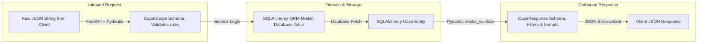

# Module 21: Request & Response Validation with Pydantic

## 1. What It Is
**Request Validation** is the process of inspecting incoming client data (headers, query parameters, path variables, and JSON request bodies) at the API boundary before any business logic or database queries execute. In FastAPI, this is powered by **Pydantic**, a data validation and settings management library based on Python type hints.

## 2. Why It Exists
Client data is inherently untrusted. Without automated boundary validation:
- Missing required fields cause crashes deep in service logic with unhandled `KeyError`.
- Malformed data types (e.g. passing `"abc"` where an integer user ID is expected) trigger database driver exceptions.
- Malicious or unbounded strings (e.g. a 50MB string for a `title` column) cause memory exhaustion or buffer overflows.

## 3. Why Backend Engineers Use It
- **Fail-Fast Boundary Defense**: Invalid requests are rejected at the edge of the server in microseconds with HTTP 422, shielding business logic and databases from unnecessary processing.
- **Data Coercion & Normalization**: Automatically converts incoming string numbers (`"42"`) into real Python integers (`42`) and ISO date strings into `datetime` objects.
- **Response Sanitization (Response Models)**: Ensures the server never accidentally leaks sensitive internal database fields (like password hashes or soft-delete flags) to API consumers.

## 4. How Pydantic Works: Schemas vs. ORM Models



### The Separation:
- **`app/models/case.py` (SQLAlchemy)**: Defines how data is stored in tables on disk.
- **`app/schemas/case.py` (Pydantic)**: Defines what data is allowed into the API, and what data is formatted out of the API.

## 5. Declarative Constraints with Pydantic `Field()`
In [app/schemas/case.py](file:///d:/week1_kpmg/case-management-backend/app/schemas/case.py), notice how declarative validation constraints are specified:

```python
class CaseCreate(BaseModel):
    title: str = Field(
        ...,                    # Ellipsis (...) means REQUIRED
        min_length=1,           # Cannot be empty string
        max_length=255,         # Prevents database varchar overflow
        description="Brief summary of the case",
        examples=["Login page returns 500 error"],
    )
    description: Optional[str] = Field(
        None,                   # None means OPTIONAL
        max_length=5000,
        description="Detailed description of the case",
    )
    priority: CasePriority = Field(
        CasePriority.MEDIUM,    # Enforces Enum values: LOW, MEDIUM, HIGH, CRITICAL
        description="Priority level",
    )
    created_by: int = Field(
        ...,
        gt=0,                   # Must be a positive integer > 0
        description="ID of the user creating the case",
    )
```

## 6. How Validation Errors are Formatted
When a client sends:
```json
{
  "title": "",
  "created_by": -5,
  "priority": "SUPER_URGENT"
}
```
FastAPI and our global handler in [app/exceptions/handlers.py](file:///d:/week1_kpmg/case-management-backend/app/exceptions/handlers.py) automatically generate a structured HTTP 422 response:

```json
{
  "error": {
    "code": "REQUEST_VALIDATION_ERROR",
    "message": "Request validation failed",
    "details": [
      {
        "field": "body -> title",
        "message": "String should have at least 1 character",
        "type": "string_too_short"
      },
      {
        "field": "body -> created_by",
        "message": "Input should be greater than 0",
        "type": "greater_than"
      },
      {
        "field": "body -> priority",
        "message": "Input should be 'LOW', 'MEDIUM', 'HIGH' or 'CRITICAL'",
        "type": "enum"
      }
    ]
  }
}
```

## 7. Response Validation: `from_attributes = True`
In Pydantic v2, setting `model_config = ConfigDict(from_attributes=True)` enables reading data directly from SQLAlchemy ORM model attributes:

```python
class CaseResponse(BaseModel):
    model_config = ConfigDict(from_attributes=True)

    id: int
    title: str
    description: Optional[str]
    status: CaseStatus
    priority: CasePriority
    case_type: CaseType
    created_by: int
    assigned_to: Optional[int]
    created_at: datetime
    updated_at: datetime
    resolved_at: Optional[datetime]
```
When `CaseResponse.model_validate(case_orm_obj)` is called, Pydantic reads `case_orm_obj.title`, `case_orm_obj.id`, etc., validates their types, and formats them for the JSON response.

## 8. Common Mistakes
1. **Using generic `dict` as request parameter**:
   - `def create_case(payload: dict):` -> Disables all schema validation, autocomplete, and OpenAPI documentation.
2. **Confusing Pydantic `Field` with SQLAlchemy `Column`**:
   - `Field` is for API DTO schemas; `Column` is for database ORM tables.
3. **Omitting `gt=0` for database primary key references**:
   - Permitting negative IDs (`created_by: -10`) will hit the database needlessly when they are mathematically impossible.

## 9. Practical Exercises
1. Locate `test_create_case_missing_required_title` and `test_create_case_invalid_title_length` in [tests/api/test_cases_api.py](file:///d:/week1_kpmg/case-management-backend/tests/api/test_cases_api.py). Run them and observe the 422 status assertions.
2. Add a `regex` validation to `UserCreate.username` in `app/schemas/case.py` requiring usernames to be lowercase alphanumeric (e.g. `^[a-z0-9_]+$`).

## 10. Interview Questions & Model Answers
**Q: How does FastAPI use Pydantic for both request validation and response filtering?**
*Answer:* For requests, FastAPI parses the raw HTTP body or parameters against the Pydantic request schema, coercing types and validating constraints (`min_length`, `gt`, regex, enums). If invalid, it immediately responds with an HTTP 422 JSON error. For responses, the declared `response_model` ensures that only the explicit attributes declared in the schema are serialized to the client, preventing accidental data leakage of sensitive database fields.

## 11. Short Self-Test
1. What HTTP status code is universally returned by FastAPI when a request fails Pydantic schema validation? *(Answer: HTTP 422 Unprocessable Entity).*
2. What does `ConfigDict(from_attributes=True)` allow Pydantic to do? *(Answer: It allows Pydantic to read data directly from Python object attributes, such as SQLAlchemy ORM model instances, rather than only from dictionaries).*
