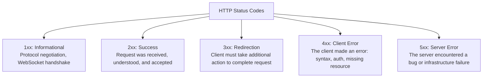
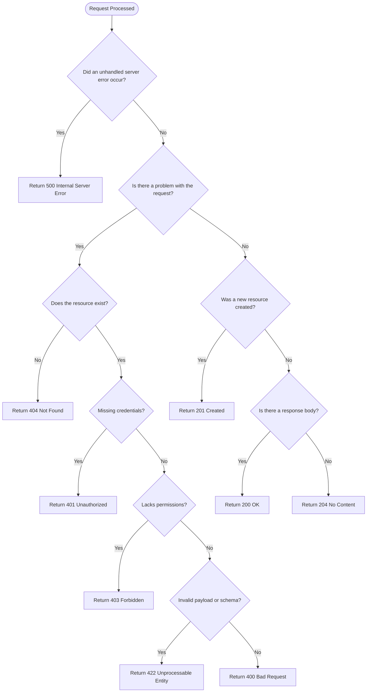

# Module 22: HTTP Status Codes & Decision Logic

## 1. What It Is
**HTTP Status Codes** are standardized 3-digit numerical codes returned by web servers to indicate the outcome of a client's request. Formally defined by the Internet Engineering Task Force (IETF) in RFC 9110, status codes convey machine-readable results to clients before the response body is even parsed.

## 2. Why It Exists
HTTP is designed for interoperability. If every server invented its own arbitrary status formats (e.g. returning HTTP 200 with `{"status": "failure"}` inside the body), every frontend, proxy, mobile app, and API gateway would have to write custom parsing code for every API on earth. Standard status codes allow infrastructure (load balancers, CDN caches, browser retry logic) to react automatically.

## 3. The Five Status Code Families



## 4. Master Reference for RESTful Backend Engineers

| Code | Name | Semantic Meaning in REST | Project Example |
|---|---|---|---|
| **200** | **OK** | Standard success for `GET`, `PUT`, `PATCH`. Resource returned in body. | `GET /api/v1/cases/1` |
| **201** | **Created** | New resource successfully created; `Location` header or created entity returned. | `POST /api/v1/cases` |
| **204** | **No Content** | Success, but no content to return (common for `DELETE`). | `DELETE /api/v1/cases/1` |
| **400** | **Bad Request** | Generic client error; malformed JSON or unparseable headers. | Sending raw non-JSON text to a JSON endpoint |
| **401** | **Unauthorized** | Missing or invalid authentication credentials (actually means *Unauthenticated*). | Missing bearer token |
| **403** | **Forbidden** | Client is authenticated, but lacks permissions (RBAC) for this resource. | Analyst trying to delete an Admin case |
| **404** | **Not Found** | Resource URI does not exist. | `GET /api/v1/cases/99999` |
| **409** | **Conflict** | Request conflicts with current server state (e.g. duplicate unique key). | Registering username that already exists |
| **422** | **Unprocessable Entity** | Syntactically valid JSON, but violates business or validation constraints. | Sending `title: ""` or invalid enum value |
| **500** | **Internal Server Error** | Unhandled exception or unexpected server-side bug. | Uncaught database driver crash |
| **503** | **Service Unavailable** | Server temporarily overloaded or down for maintenance. | Database connection pool exhausted |
| **504** | **Gateway Timeout** | Upstream dependency failed to respond in time. | Downstream microservice timeout |

## 5. The Status Code Decision Flowchart



## 6. The Cardinal Anti-Pattern: "200 OK with Error Body"
```json
// =========================================================================
// ANTI-PATTERN: NEVER RETURN 200 OK FOR AN ERROR
// =========================================================================
HTTP/1.1 200 OK
Content-Type: application/json

{
  "success": false,
  "error": "Case not found"
}
```
**Why this is catastrophic**:
- Frontend libraries (like Axios or Fetch) consider the request successful (`response.ok === true`).
- Automated monitoring tools (Datadog, CloudWatch) record a 0% error rate, masking production outages from the DevOps team!
- Always return the semantic HTTP status code (`404` or `422`).

## 7. Common Mistakes
1. **Confusing 401 and 403**:
   - `401 Unauthorized` = "I don't know who you are. Please log in."
   - `403 Forbidden` = "I know who you are, but you are not allowed to do this."
2. **Confusing 400 and 422**:
   - `400 Bad Request` = The JSON syntax itself is corrupted (missing curly brace).
   - `422 Unprocessable Entity` = The JSON is valid, but values fail business rules (`age: -5`).

## 8. Practical Exercises
1. Inspect the test suite in [tests/api/test_cases_api.py](file:///d:/week1_kpmg/case-management-backend/tests/api/test_cases_api.py). Identify which tests assert status code 200, 201, 404, and 422.
2. In your terminal, issue an update to a non-existent case using `curl` or PowerShell and verify that the response header returns `HTTP/1.1 404 Not Found`.

## 9. Interview Questions & Model Answers
**Q: What is the difference between HTTP 400 and HTTP 422?**
*Answer:* HTTP 400 (Bad Request) indicates that the server cannot understand the request due to malformed syntax (such as corrupted JSON formatting or invalid request headers). HTTP 422 (Unprocessable Entity) indicates that the request was syntactically correct and the JSON was successfully parsed, but the instructions or data were semantically invalid according to domain validation rules (such as missing required attributes, strings violating length limits, or invalid enum states).

## 10. Short Self-Test
1. Which HTTP status code should be returned after successfully creating a new case via `POST /api/v1/cases`? *(Answer: HTTP 201 Created).*
2. What status code indicates that a requested record ID does not exist in the database? *(Answer: HTTP 404 Not Found).*
