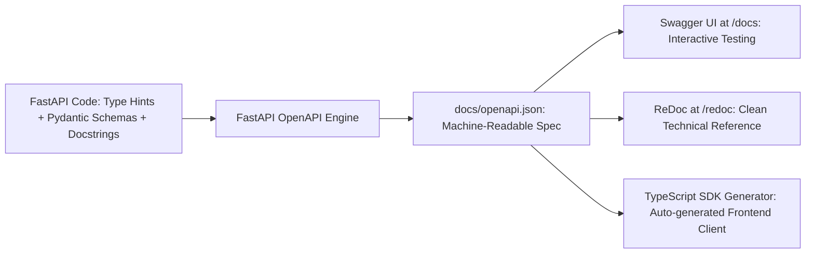

# Module 23: OpenAPI Specification & Interactive API Documentation

## 1. What It Is
The **OpenAPI Specification (OAS)** (formerly known as Swagger) is a broadly adopted, vendor-neutral standard for describing RESTful APIs. An OpenAPI document is a machine-readable JSON or YAML file that describes all endpoints, HTTP methods, input parameters, request headers, request bodies, response models, and security schemes supported by an API.

## 2. Why It Exists
Before OpenAPI, API documentation was manually typed into wikis or Word documents. This led to inevitable documentation rot:
- A developer updated a field name from `case_id` to `id` in code, but forgot to update the wiki.
- Frontend engineers built UI components against obsolete documentation, causing integration failures.
- Testing required manual copying of JSON payloads into Postman.

OpenAPI solves this by making the code the single source of truth for the API contract.

## 3. Why Backend Engineers Use It
- **Interactive Documentation**: Provides out-of-the-box browser interfaces (**Swagger UI** at `/docs` and **ReDoc** at `/redoc`) where developers can test endpoints interactively without Postman.
- **Client Code Generation**: Frontend and mobile teams can automatically generate typed TypeScript or Swift SDKs directly from the `openapi.json` file using tools like `openapi-generator`.
- **Contract-First Testing**: QA teams can validate that backend responses conform strictly to the declared JSON schema.

## 4. OpenAPI Architecture in FastAPI



## 5. How FastAPI Generates OpenAPI Automatically
In FastAPI, you do not write YAML or JSON by hand. FastAPI constructs the specification by inspecting:
1. **Route Decorators**: `@router.post("/cases", status_code=201, summary="...", tags=["Cases"])`
2. **Pydantic Schemas**: Reads field types, descriptions, examples, and validation bounds (`min_length=1`).
3. **Python Docstrings**: The docstring of a route function becomes the endpoint's formatted Markdown description in the UI.

### Project Example from `app/api/routes/cases.py`:
```python
@router.post(
    "/cases",
    response_model=CaseResponse,
    status_code=201,
    summary="Create a new case",
    description="Create a new case with the provided details. The creator must be an existing user.",
    tags=["Cases"],
)
def create_case(case_data: CaseCreate, db: Session = Depends(get_db)) -> CaseResponse:
    """
    Create a new case.
    - **title**: Brief summary (required, 1-255 chars)
    - **created_by**: ID of the creating user (required, must exist)
    """
    ...
```

## 6. Accessing Documentation in Our Project
When the backend is running locally (`uvicorn app.main:app --reload`):
- **Swagger UI**: Visit `http://127.0.0.1:8000/docs` (Interactive "Try it out" button).
- **ReDoc**: Visit `http://127.0.0.1:8000/redoc` (Clean, printable technical documentation).
- **Raw OpenAPI JSON**: Visit `http://127.0.0.1:8000/openapi.json` or inspect [docs/openapi.json](file:///d:/week1_kpmg/case-management-backend/docs/openapi.json) exported in the repository.

## 7. Common Mistakes
1. **Leaving endpoints untagged**: Without `tags=["Cases"]`, all routes are dumped into a messy "default" group in Swagger UI.
2. **Omitting `response_model`**: If you omit `response_model`, FastAPI cannot document the shape of the successful response in OpenAPI.
3. **Out-of-Sync Exported Files**: Exporting `openapi.json` to disk once and forgetting to regenerate it when code changes. (In production, generate it automatically during CI/CD).

## 8. Practical Exercises
1. Open [docs/openapi.json](file:///d:/week1_kpmg/case-management-backend/docs/openapi.json). Locate the definition for `CaseCreate` in `components/schemas`. Confirm that `title` includes `minLength: 1` and `maxLength: 255`.
2. Start the app locally and use the Swagger UI at `http://127.0.0.1:8000/docs` to execute a `GET /api/v1/cases` request directly from your browser.

## 9. Interview Questions & Model Answers
**Q: How does OpenAPI bridge the gap between backend engineers and frontend/client engineers?**
*Answer:* OpenAPI provides a formal, machine-readable contract between backend and frontend teams. It eliminates ambiguous documentation by generating live interactive UIs (Swagger UI) directly from code type hints. Crucially, frontend teams can use OpenAPI generators to produce strongly typed client SDKs (e.g. in TypeScript) with full autocomplete, preventing integration bugs before backend code is even deployed.

## 10. Short Self-Test
1. What URL path does FastAPI use by default to serve the interactive Swagger UI? *(Answer: `/docs`).*
2. What method on the FastAPI application object exports the full OpenAPI dictionary? *(Answer: `app.openapi()`).*
