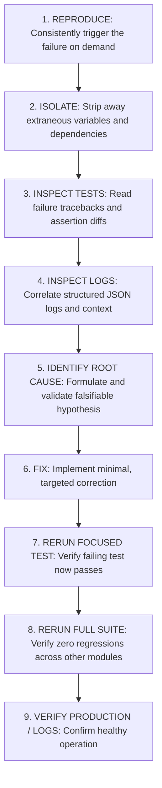

# Module 26: Systematic Debugging Methodology & Root Cause Analysis

## 1. What It Is
**Systematic Debugging** is the scientific, hypothesis-driven method of identifying, isolating, explaining, and correcting defective behavior in software systems using empirical evidence (structured logs, test assertions, tracebacks) rather than random guesswork.

## 2. Why It Exists
Junior developers frequently practice "Shotgun Debugging" or "Trial-and-Error":
- They see an error, guess a fix, randomly change lines of code, and rerun the server.
- If it doesn't work, they add more random changes.
- **The Result**: They introduce secondary bugs, destroy working code, waste hours, and never understand *why* the defect happened in the first place.

Professional engineers treat debugging like a medical or forensic diagnosis: gather evidence first, form a hypothesis, isolate variables, prove the cause, apply a minimal targeted fix, and verify.

## 3. Why Backend Engineers Use It
- **Mean Time to Resolution (MTTR)**: Systematic debugging resolves high-severity production outages in minutes instead of hours.
- **Regression Prevention**: By writing a failing test *before* applying the fix, the bug is permanently prevented from ever recurring.
- **System Understanding**: Every resolved bug deepens the engineer's mental model of runtime concurrency, data constraints, and edge cases.

## 4. The 9-Step Industry Standard Debugging Workflow



### Step 1: Reproduce
You cannot fix what you cannot reproduce. Find the exact inputs, database state, HTTP payload, or CLI command that consistently triggers the defect.

### Step 2: Isolate
Strip away unrelated complexity. If an API request fails, can you reproduce it using a minimal Python test script or unit test without the live HTTP server?

### Step 3: Inspect Test Failures
Read the traceback from the bottom up! Python tracebacks show the exact file and line number where execution failed, along with local variable states.

### Step 4: Inspect Structured Logs
Check the JSON logs emitted right before the crash. What was `case_id`? What was the operation? Was there a warning or database constraint error logged milliseconds earlier?

### Step 5: Formulate Hypothesis
State clearly: *"I believe the endpoint is returning 422 because the client sent an empty string for title, and Field(min_length=1) rejected it."*

### Step 6: Fix
Apply the simplest, cleanest code change that resolves the root cause. Avoid changing unrelated files in the same commit.

### Step 7: Rerun Focused Test
Execute only the single test reproducing the bug:
```bash
python -m pytest tests/api/test_cases_api.py -k "test_specific_bug" -v
```

### Step 8: Rerun Full Suite
Ensure the fix did not break anything else:
```bash
python -m pytest -v
```

### Step 9: Audit and Document
Commit the fix with an explanatory commit message explaining the root cause and resolution.

## 5. Interpreting Python Tracebacks
When Python crashes, it prints a traceback:
```text
Traceback (most recent call last):
  File "D:\week1_kpmg\case-management-backend\app\api\routes\cases.py", line 65, in get_case
    case = case_service.get_case(db, case_id)
  File "D:\week1_kpmg\case-management-backend\app\services\case_service.py", line 68, in get_case
    return self.case_repo.get_by_id(db, case_id)
  File "D:\week1_kpmg\case-management-backend\app\repositories\case_repository.py", line 74, in get_by_id
    raise CaseNotFoundError(case_id)
app.exceptions.CaseNotFoundError: Case with id 999 not found
```
- **Rule**: Start at the very **bottom line** to see the actual exception type and message (`CaseNotFoundError`).
- Read upward to trace the call stack: `cases.py` called `case_service.py`, which called `case_repository.py`.

## 6. Practical Exercises
Step through the 6 real-world debugging scenarios in [learning/debugging-lab.md](file:///d:/week1_kpmg/case-management-backend/learning/debugging-lab.md).

## 7. Interview Questions & Model Answers
**Q: Walk me through your step-by-step process when a production API endpoint starts returning HTTP 500 errors.**
*Answer:* 
1. First, I inspect our centralized structured logging platform (e.g. Datadog/CloudWatch) and filter for `level == 'ERROR'` and HTTP 500 responses, identifying the exception type, stack trace, and request correlation IDs.
2. Second, I look at recent deployments or database migrations to see what changed recently.
3. Third, I reproduce the error locally or in a staging environment using the exact request payload identified from the logs.
4. Fourth, I write an automated unit or API test reproducing the failure.
5. Fifth, I implement the fix to resolve the root cause, verify the new test passes, ensure the entire test suite remains green, and deploy the fix with proper monitoring.

## 8. Short Self-Test
1. Why should you write a failing test before fixing a reported bug? *(Answer: To prove you have accurately reproduced the defect and to permanently guard against future regressions).*
2. Where in a Python traceback should you look first to identify the error type and error message? *(Answer: The very last / bottom line of the traceback).*
