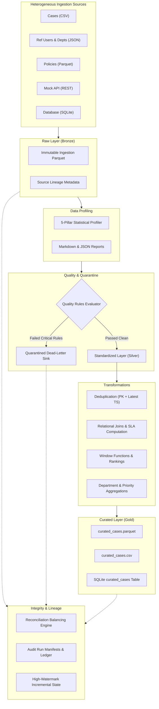

# Week 2 Curriculum Overview: Enterprise Data Pipelines & Quality Engineering

Welcome to **Week 2 of the FDE Readiness Program**. Having mastered backend engineering, transactional databases, REST APIs, and automated testing in Week 1, you now step into the world of **Enterprise Data Engineering**.

In production organizations (such as global consulting firms, financial institutions, and tech giants), operational backends generate millions of transaction records, case updates, and audit trails every hour. To extract business intelligence, enforce regulatory compliance, and feed downstream AI/analytics systems, we must construct **robust, automated, and fault-tolerant Data Pipelines**.

---

## 1. Week 2 Learning Objectives

By the end of Week 2, you will be able to:
1. **Ingest Heterogeneous Data**: Build production-grade source readers for CSV, JSON, Parquet, Relational Databases (SQLite/PostgreSQL), and REST APIs with graceful failure recovery.
2. **Profile Raw Data Statistically**: Analyze incoming datasets across 5 fundamental quality pillars: Completeness, Uniqueness, Validity, Distribution, and Referential Integrity.
3. **Enforce Schemas & Data Contracts**: Formalize type contracts between data producers and consumers to prevent silent downstream pipeline failures.
4. **Implement Complex Transformations**: Cleanse, standardize, deduplicate, join, rank via analytical window functions, and compute business aggregations.
5. **Enforce Data Quality Rules & Quarantine**: Isolate malformed or non-compliant records into a dead-letter quarantine layer without halting the entire pipeline.
6. **Balance Source-to-Target Reconciliation**: Mathematically verify that every single input record is accounted for (`Source == Valid + Quarantined`, `Curated == Valid - Duplicates`).
7. **Architect Medallion Data Layers**: Structure data into Raw (Bronze), Standardized (Silver), and Curated (Gold) storage tiers.
8. **Master Incremental Processing & Idempotency**: Design high-watermark delta ingestion and guarantee that running a pipeline multiple times produces identical, duplicate-free results.
9. **Capture Audit Manifests & Lineage**: Maintain automated JSON/JSONL execution ledgers and track data provenance from source to analytics mart.
10. **Containerize with Docker**: Package the pipeline into reproducible, multi-stage Docker containers for cloud execution.

---

## 2. Five-Day Curriculum Roadmap

```
  DAY 1: Sources & Profiling          DAY 2: Contracts & Quality          DAY 3: Transformations & Medallion
  ┌─────────────────────────┐         ┌─────────────────────────┐         ┌─────────────────────────┐
  │ • CSV, JSON, Parquet    │ ──────> │ • Data Contracts        │ ──────> │ • Standardization       │
  │ • Relational DBs & APIs │         │ • Quality Rules Engine  │         │ • Joins & Windows       │
  │ • 5-Pillar Profiler     │         │ • Quarantine Dead-Letter│         │ • Raw/Silver/Gold Layers│
  └─────────────────────────┘         └─────────────────────────┘         └─────────────────────────┘
                                                                                      │
                                                                                      ▼
  DAY 5: Docker & Production Readiness    DAY 4: Reconciliation & Orchestration
  ┌─────────────────────────┐         ┌─────────────────────────┐
  │ • Multi-Stage Dockerfile│ <────── │ • Math Reconciliation   │
  │ • Volume Mounts & CLI   │         │ • Incremental Watermark │
  │ • Capstone Review & Def │         │ • Idempotency & Audit   │
  └─────────────────────────┘         └─────────────────────────┘
```

| Day | Focus Area | Core Competencies | Deliverables |
|:---:|---|---|---|
| **Day 1** | Ingestion & Profiling | Heterogeneous readers, streaming cursors, statistical distributions | `pipeline/sources/`, `pipeline/profiling/` |
| **Day 2** | Contracts & Quality | Schema validation, Pydantic/Contract rules, quarantine sink | `pipeline/schemas/`, `pipeline/validation/`, `pipeline/quarantine/` |
| **Day 3** | Transformations & Medallion | Deduplication, relational joins, window ranking, 3-tier medallion layers | `pipeline/transformations/`, `pipeline/layers/` |
| **Day 4** | Integrity & Orchestration | Reconciliation balancing, high-watermark delta, rerun safety, audit ledgers | `pipeline/reconciliation/`, `pipeline/orchestration/`, `pipeline/audit/` |
| **Day 5** | Containerization & Review | Dockerfile packaging, bind mounts, CLI execution, test suite verification | `Dockerfile`, `pipeline/cli.py`, 68+ tests |

---

## 3. High-Level Architecture

The enterprise data pipeline constructed in this project extends the Week 1 Case Management backend. It ingests case logs, employee references, and regulatory SLA policies, processing them through a 10-stage orchestrated workflow:



---

## 4. How to Navigate This Learning Material

1. **Study Modules (`learning/week2/01-*.md` to `36-*.md`)**: Read each conceptual guide. Each module explains the theory, production architecture, common traps, and concrete Python/SQL implementations.
2. **Execute Practical Labs (`learning/week2/labs/lab-*.md`)**: Perform hands-on exercises in your terminal to solidify your skills.
3. **Examine Project Code (`pipeline/`)**: Every concept taught in the guides is fully implemented and tested in the active workspace.
4. **Self-Assessment & Interview Prep**: Test your knowledge using `learning/week2/week2-self-assessment.md` and review the 50 enterprise interview questions in `learning/week2/week2-interview-questions.md`.
